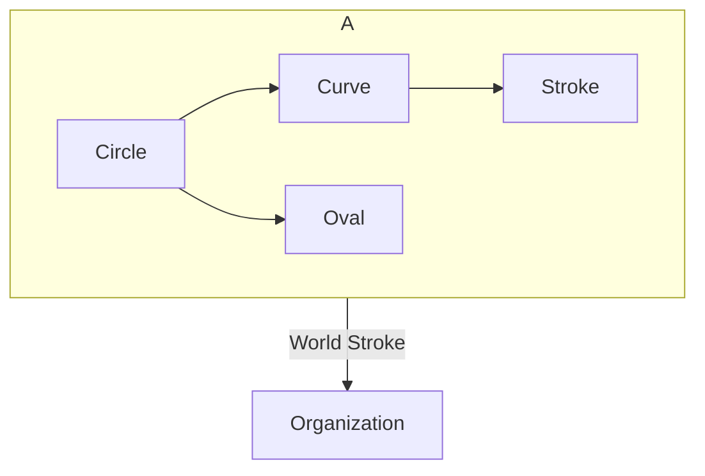


## Tổ Chức Đột Quỵ Toàn Cầu Hướng Dẫn và Kế Hoạch Hành Động: Lộ Trình Chăm Sóc Bệnh Nhân Đột Quỵ Chất Lượng Cao

## GIỚI THIỆU VÀ TỔNG QUAN

Các tác giả: Lindsay MP , Norrving B, Furie KL, Donnan G, Langhorne P , Davis S Thay Mặt Ủy Ban Cố Vấn về Hướng Dẫn và Chất Lượng của Dịch Vụ Chăm Sóc Bệnh Nhân Đột Quỵ Toàn Cầu,

Nhóm Làm Việc về Các Hướng Dẫn Chăm Sóc Bệnh Nhân Đột Quỵ Toàn Cầu, và Nhóm Làm Việc về Chất Lượng của Dịch Vụ Chăm Sóc Bệnh Nhân Đột Quỵ Toàn Cầu.

## LỘ TRÌNH CHĂM SÓC BỆNH NHÂN ĐỘT QUỴ CHẤT LƯỢNG CAO

## MỤC TIÊU:

Lộ Trình về Cung Cấp Dịch Vụ Chăm Sóc Bệnh Nhân Đột Quỵ Chất Lượng Cao WSO là một nguồn lực thực hiện đi kèm với Hướng Dẫn và Kế Hoạch Hành Động về các Dịch Vụ Chăm Sóc Bệnh Nhân Đột Quỵ Toàn Cầu WSO .  Lộ trình này cung cấp khung làm việc cho việc thực hiện, theo dõi và đánh giá các dịch vụ chăm sóc bệnh nhân đột quỵ toàn cầu.

Lộ trình cung cấp sự chuẩn hóa và tính nhất quán cho việc lựa chọn các khuyến nghị dựa trên bằng chứng, phương pháp thực hiện trong thực hành lâm sàng, và việc tính toán các biện pháp thực hiện để tạo nên một môi trường cải thiện chất lượng không ngừng.

## ĐỐI TƯỢNG MỤC TIÊU:

Lộ trình này dùng để hướng dẫn các nhân viên chăm sóc sức khỏe tại địa phương và các nhóm chăm sóc lâm sàng cho bệnh nhân đột quỵ trong việc xây dựng hệ thống chăm sóc bệnh nhân đột quỵ và thực hiện nhiều nhất có thể các thành phần đã được xác định trong suốt quy trình chăm sóc bệnh nhân đột quỵ liên tục. Trọng tâm của lộ trình là về các quá trình chăm sóc và tác động đến kết quả về tình trạng sức khỏe của bệnh nhân. Có một điều được công nhận đó là không phải mọi khu vực đều có khả năng cung cấp tất cả những thành phần chăm sóc bệnh nhân đột quỵ chất lượng; do đó các khuyến nghị và các chỉ số hiệu suất thực hiện có tính đến những gì có thể thực hiện được trong ba mức độ tiếp cận dịch vụ.

Lộ trình có thể được sử dụng bởi các cơ quan y tế địa phương, trong khu vực hoặc cấp quốc gia và các nhà cung cấp dịch vụ làm nền tảng của khung đánh giá bệnh đột quỵ của riêng họ.

Chính phủ và các nhà tài trợ nên sử dụng các hướng dẫn này và kế hoạch hành động để rà soát các dịch vụ hiện tại và xác định những nơi không có dịch vụ. Các nhóm này sau đó có thể ưu tiên khoảng trống dịch vụ và tìm kiếm các giải pháp nhằm cải thiện khả năng tiếp cận với các dịch vụ.

Bác sĩ lâm sàng và các nhân viên chăm sóc sức khỏe khác nên sử dụng hướng dẫn này và lộ trình để kiểm tra kỹ việc cung cấp dịch vụ chăm sóc tại địa phương, khả năng tiếp cận dịch vụ chăm sóc và sự hỗ trợ liên tục để đạt được mục tiêu phục hồi.

Lộ trình này cũng cung cấp hướng dẫn có giá trị tới các chương trình đang phát triển về bệnh đột quỵ , giúp đảm bảo rằng tất cả các yếu tố chính được xác định ở đây đều được xem xét kể từ giai đoạn đầu phát triển.

## ĐỊNH DẠNG:

Lộ trình được sắp xếp theo dịch vụ chăm sóc liên tục bắt đầu từ khi khởi phát biến cố đột quỵ cho đến giai đoạn cấp tính (khoa cấp cứu và chăm sóc bệnh nhân nội trú), phục hồi chức năng sau đột quỵ, phòng ngừa đột quỵ tái phát và kết thúc bằng việc tái hòa nhập cộng đồng và phục hồi lâu dài.

Mỗi mục trình bày một phần của quá trình chăm sóc liên tục và giúp người dùng rà soát và đánh giá các yếu tố cấu trúc và các dịch vụ sẵn có cho việc chăm sóc bệnh đột quỵ; các khuyến nghị thực hành tốt nhất cốt lõi dựa trên bằng chứng liên quan tới các quá trình chăm sóc sẵn sàng hoạt động; và, một danh sách các chỉ số chất lượng chính để theo dõi các cấp độ chăm sóc được cung cấp và tác động đến bệnh nhân và kết quả kinh tế.

## CÁCH SỬ DỤNG:

Người sử dụng Lộ Trình này nên:

1. Rà soát các mục liên quan tới giai đoạn của các dịch vụ chăm sóc bệnh đột quỵ;
2. Hoàn thành một bản đánh giá các nguồn lực và các dịch vụ hiện tại, các khuyến nghị hiện tại có sẵn, và các phương thức thu thập dữ liệu hiện tại và khả năng tiếp cận; sau đó
3. Xây dựng một kế hoạch thực hiện để đảm bảo rằng những yếu tố cốt lõi này đã được tối ưu hóa và các yếu tố bổ sung đã được thêm vào để cải thiện dịch vụ chăm sóc bệnh đột quỵ mà họ cung cấp.

## THỰC HIỆN:

1. Nguồn lực thực hành bản cứng
2. Ứng dụng/nguồn lực tương tác điện tử nơi người dùng có thể nhập những yếu tố mà họ có sẵn từ một danh sách kiểm tra chính và chương trình xác nhận cấp độ, các khuyến nghị và biện pháp thực hiện hiện tại.

## PHẦN I: GIỚI THIỆU VÀ TỔNG QUAN

Đột quỵ là nguyên nhân hàng đầu dẫn đến tử vong và khuyết tật trên toàn thế giới. Hệ thống chăm sóc bệnh nhân đột quỵ, các phương pháp tích hợp để cung cấp dịch vụ chăm sóc bệnh nhân đột quỵ, và sự sẵn có các nguồn lực phục vụ việc chăm sóc bệnh nhân đột quỵ có sự khác nhau đáng kể giữa các khu vực địa lý, gây nên rủ ro về dịch vụ chăm sóc không tối ưu. Tổ Chức Y Tế Thế Giới đã cam kết nỗ lực trong việc giảm thiểu đáng kể những tác nhân gây bệnh và tỷ lệ tử vong do mắc các bệnh không truyền nhiễm tới năm 2025. Có thể giảm thiểu đáng kể tỷ lệ tử vong và sự hoành hành của bệnh tật do đột quỵ gây ra thông qua việc chăm sóc bệnh nhân đột quỵ có tổ chức, bao gồm việc thực hiện các hướng dẫn thực hành lâm sàng dựa trên bằng chứng và việc áp dụng triết lý và chương trình cải thiện chất lượng không ngừng.

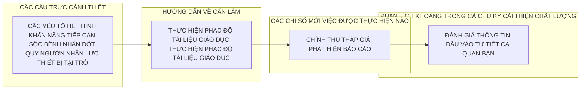


Năm 2014, Tổ Chức Đột Quỵ Thế Giới (WSO) đã lần đầu phát hành Hướng Dẫn và Kế Hoạch Hành Động về Dịch Vụ Chăm Sóc Bệnh Nhân Đột Quỵ Toàn Cầu 1  nhằm hỗ trợ những nỗ lực và tiến bộ của mọi khu vực trong việc cải thiện dịch vụ chăm sóc và tình trạng sức khỏe cho các bệnh nhân đột quỵ. Mục đích của lộ trình này là mọi khu vực sử dụng nó như một phương tiện để tiến hành việc tự đánh giá các hoạt động chăm sóc bệnh nhân đột quỵ hiện tại, sau đó áp dụng những phát hiện để cung cấp thông tin cho các nỗ lực ra quyết định và ủng hộ để phát triển sâu rộng hơn các dịch vụ chăm sóc bệnh nhân đột quỵ nhằm đạt được các dịch vụ tốt nhất có thể trong phạm vi giới hạn về địa lý và khả năng tiếp cận nguồn lực. Một số thành phần được nêu trong Kế Hoạch Hành Động cho Dịch Vụ Chăm Sóc Bệnh Nhân Đột Quỵ Toàn Cầu nhằm thúc đẩy và hỗ trợ những nỗ lực cải thiện việc chăm sóc bệnh nhân đột quỵ. Thứ nhất, một mô hình đã được xây dựng để phân loại tính sẵn có của các dịch vụ chăm sóc bệnh nhân đột quỵ toàn cầu thành ba cấp độ: khả năng tiếp cận các dịch vụ chăm sóc sức khỏe tối thiểu , khả năng tiếp cận các dịch vụ chăm sóc bệnh nhân đột quỵ cấp thiết , và khả năng tiếp cận các dịch vụ chăm sóc bệnh nhân đột quỵ cao cấp (Hình 1). Kế Hoạch Hành Động cũng bao gồm một khung dịch vụ chăm sóc bệnh nhân đột quỵ trong đó mô tả dịch vụ chăm sóc bệnh nhân đột quỵ liên tục đã được đề cập trong Kế Hoạch Hành Động và các yếu tố cốt lõi trong mỗi giai đoạn của quá trình chăm sóc liên tục.  Các khuyến nghị thực hành tốt nhất cụ thể về việc chăm sóc bệnh nhân đột quỵ sau đó đã được cung cấp cho mỗi yếu tố cốt lõi, nơi cũng bao gồm các chỉ số chất lượng chính, phù hợp và liên quan.

1. Lindsay P , Furie KL, Davis SM, Donnan GA, Norrving B. World Stroke Organization global stroke services guidelines and action plan (Hướng dẫn và kế hoạch hành động về các dịch vụ chăm sóc bệnh nhân đột quỵ toàn cầu của Tổ Chức Đột Quỵ Thế Giới). Tạp Chí Đột Quỵ Quốc Tế. Tháng Mười năm 2014; 9 (Phát Hành Bổ Sung A100):4-13.

## Mục Tiêu của Hướng Dẫn và Lộ Trình cho Kế Hoạch Hành Động về Chăm Sóc Bệnh Nhân Đột Quỵ Toàn Cầu

Hướng dẫn lộ trình này cung cấp khung làm việc cho việc thực hiện, theo dõi và đánh giá các dịch vụ chăm sóc bệnh nhân đột quỵ toàn cầu. Hướng dẫn cung cấp sự chuẩn hóa và tính nhất quán cho việc lựa chọn các khuyến nghị dựa trên bằng chứng, các phương pháp thực hiện trong thực hành lâm sàng, và việc tính toán các biện pháp thực hiện nhằm tạo ra một môi trường cải thiện chất lượng không ngừng. Lộ trình được sắp xếp theo dịch vụ chăm sóc liên tục bắt đầu từ khi khởi phát biến cố đột quỵ đến giai đoạn siêu cấp tính, chăm sóc bệnh nhân nội trú đột quỵ cấp tính, phục hồi chức năng sau đột quỵ, phòng ngừa đột quỵ tái phát và kết thúc bằng việc tái hòa nhập cộng đồng và phục hồi lâu dài. Các giai đoạn của việc chăm sóc có thể không kín đáo và nhiều hoạt động được mô tả trong mỗi giai đoạn có thể diễn ra đồng thời, ví dụ như bắt đầu trị liệu phòng ngừa trong khi đang tiến hành phục hồi chức năng.

Hình 1. Các cấp độ năng lực cung cấp dịch vụ chăm sóc sức khỏe cho công tác chăm sóc bệnh nhân đột quỵ

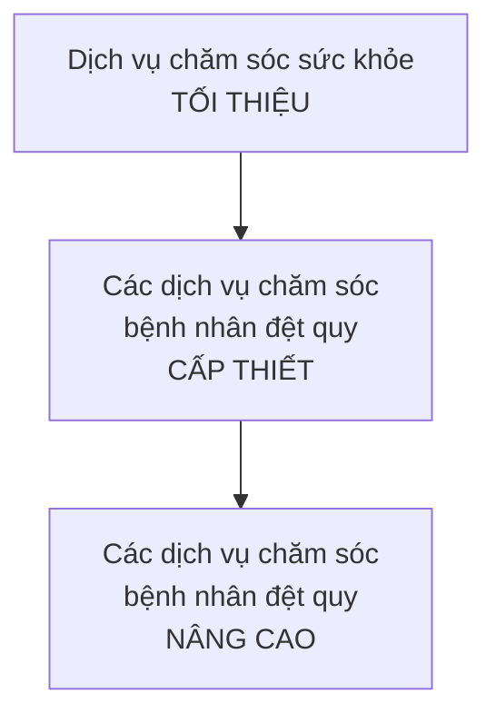


Đối Tượng Mục Tiêu: Trọng tâm của lộ trình là về các quá trình chăm sóc và tác động đến kết quả về tình trạng sức khỏe của bệnh nhân. Lộ trình có thể được sử dụng bởi các cơ quan y tế tại địa phương, trong khu vực hoặc cấp quốc gia và các nhà cung cấp dịch vụ làm nền tảng cho khung đánh giá bệnh đột quỵ của riêng họ. Chính phủ và các nhà tài trợ có thể sử dụng các hướng dẫn và kế hoạch hành động này để rà soát các dịch vụ hiện tại, và xác định các khoảng trống dịch vụ.  Các nhóm này sau đó có thể ưu tiên khoảng trống dịch vụ và tìm kiếm các giải pháp nhằm cải thiện khả năng tiếp cận với các dịch vụ. Bác sĩ lâm sàng và các nhân viên chăm sóc sức khỏe khác nên sử dụng các hướng dẫn này và lộ trình để kiểm tra kỹ việc cung cấp dịch vụ chăm sóc tại địa phương, khả năng tiếp cận dịch vụ chăm sóc và sự hỗ trợ liên tục để đạt được mục tiêu phục hồi. Lộ trình này cũng cung cấp hướng dẫn có giá trị tới các chương trình đang phát triển, giúp đảm bảo rằng tất cả các yếu tố chính được xác định ở đây đều được xem xét kể từ giai đoạn đầu phát triển.

Liên kết tới các nguồn lực từ các nước trên thế giới đã được ghi trong phần phụ lục và danh sách tham khảo. Đối với tất cả các nhóm làm việc nhằm cải thiện dịch vụ chăm sóc bệnh nhân đột quỵ, lợi ích của việc am hiểu và sử dụng các công cụ hiện có đó là cho phép dành nhiều thời gian hơn vào việc cải thiện hệ thống và dành ít thời gian hơn vào việc liên tục nỗ lực khi có thể áp dụng các tài liệu hợp lệ đã có sẵn để đáp ứng các nhu cầu của địa phương.

## Khung Dịch Vụ Chăm Sóc Bệnh Nhân Đột Quỵ Toàn Cầu cho Các Yếu Tố Cốt Lõi của Việc Chăm Sóc Bệnh Nhân Đột Quỵ Trong Suốt Quá Trình Chăm Sóc Liên Tục

Mục tiêu của Khung Dịch Vụ Chăm Sóc Bệnh Nhân Đột Quỵ Toàn Cầu WSO là cung cấp một lộ trình với mục đích hướng dẫn các nhân viên chăm sóc sức khỏe tại địa phương và các nhóm chăm sóc bệnh nhân đột quỵ lâm sàng trong việc thiết lập hệ thống chăm sóc bệnh nhân đột quỵ và thực hiện nhiều nhất có thể các thành phần đã được xác định trong suốt quá trình chăm sóc bệnh nhân đột quỵ liên tục. Khung Làm Việc được minh họa trong Hình 2.

Khung Dịch Vụ Chăm Sóc Bệnh Nhân Đột Quỵ Toàn Cầu WSO tập trung vào quá trình chăm sóc toàn diện bắt đầu từ khi xuất hiện các dấu hiệu và các triệu chứng đột quỵ cho tới giai đoạn phục hồi chức năng và tái hòa nhập cộng đồng.   Các khía cạnh quản lý bệnh đột quỵ chung gồm nhận biết, đánh giá, chẩn đoán, can thiệp, ngăn chặn, giáo dục, công nghệ và đo lường. Những hoạt động này được áp dụng liên tục trong suốt các giai đoạn nhận biết bệnh đột quỵ, chăm sóc tình trạng cấp tính và ngăn ngừa các biến chứng, phục hồi, phòng ngừa đột quỵ tái phát, tái hòa nhập cộng đồng và phục hồi lâu dài.^

Trong mỗi giai đoạn của quá trình chăm sóc và phục hồi, một số vấn đề chính được xác định và được xem xét là liên quan nhất để tối ưu hóa việc quản lý chăm sóc bệnh nhân đột quỵ toàn cầu. Mặc dù việc phòng ngừa sơ cấp các tác nhân gây bệnh về mạch máu được cho là một thành phần tối quan trọng của các dịch vụ chăm sóc sức khỏe, nhưng việc phòng ngừa sơ cấp không phải là trọng tâm của khung làm việc hay Kế Hoạch Hành Động này. ^ Tuy nhiên, khung làm việc này và Kế Hoạch Hành Động hỗ trợ lại tập trung vào các dịch vụ phòng ngừa thứ cấp trong đó giải quyết các khái niệm phòng ngừa tương tự (như lối sống, chứng tăng huyết áp, rung tâm nhĩ và rối loạn mỡ máu).

## Điều Chỉnh Hướng Dẫn và Kế Hoạch Hành Động về Chăm Sóc Bệnh Nhân Đột Quỵ Toàn Cầu WSO để Áp Dụng tại Địa Phương

Những kiểm nghiệm đột quỵ trên khắp thế giới đã nhiều lần cho thấy rằng vẫn tồn tại một khoảng cách lớn giữa những gì bằng chứng chứng minh là thực hành tốt nhất trong chăm sóc đột quỵ và dịch vụ chăm sóc thực sự đã được thực hiện trong thực tế. Mục tiêu của các hướng dẫn về Chăm Sóc Bệnh Nhân Đột Quỵ Toàn Cầu WSO bao gồm đẩy mạnh việc áp dụng bằng chứng vào thực tiễn, hỗ trợ việc đưa ra quyết định lâm sàng, vạch rõ những phương thức trị liệu hiệu quả, và tạo tác động lên chính sách công (Kastner và các cộng sự năm 2011).

Hướng dẫn về chăm sóc bệnh nhân đột quỵ toàn cầu WSO bao gồm một tập hợp cốt lõi các khuyến nghị về chăm sóc bệnh nhân đột quỵ và các chỉ số chất lượng chính đã được thiết lập thông qua quá trình rà soát và thích ứng nghiêm ngặt (Lindsay và các cộng sự; IJS năm 2014).  Chúng bao gồm:

- Các yếu tố nguồn lực hệ thống cần thiết để cung cấp dịch vụ chăm sóc bệnh nhân đột quỵ và thực hiện các khuyến nghị.
- Các khuyến nghịthực hành tốt nhất dựa trên bằng chứng cho việc chăm sóc bệnh nhân đột quỵ 2 có thể áp dụng được cho quá trình chăm sóc bệnh nhân đột quỵ liên tục. Với mỗi một khuyến nghị sẽ có một chỉ báo cấp độ năng lực cung cấp dịch vụ mà tại đó thực sự có thể thực hiện các khuyến nghị này.
- Các chỉ số chất lượng chính (các biện pháp thực hiện chính) giúp xác định dịch vụ chăm sóc nào đang được cung cấp, phạm vi thực hiện, và chất lượng của dịch vụ chăm sóc đó. Những chỉ số này có thể được xem là nền tảng cho những nỗ lực cải thiện chất lượng liên tục.
- Các chỉ sốtheo dõi chất lượng cấp hệ thống cũng được cung cấp nhằm trợ giúp việc thay đổi hệ thống và những nỗ lực cải thiện chất lượng liên tục.

2. Với các khuyến nghị được xem là có thể áp dụng được tại nơi chỉ có các dịch vụ chăm sóc sức khỏe ở mức độ tối thiểu, như tại các vùng sâu vùng xa và không có các dịch vụ chăm sóc bệnh nhân đột quỵ có tổ chức (loại 1), các nhân viên y tế địa phương được kỳ vọng có thể áp dụng được những khuyến nghị này và cung cấp một phần kiến thức và đào tạo ở một số mức độ cho các gia đình có người sống sót sau đột quỵ để họ có thể chăm sóc bệnh nhân đột quỵ tốt hơn.

## LỘ TRÌNH CHĂM SÓC BỆNH NHÂN ĐỘT QUỴ CHẤT LƯỢNG CAO

```mermaid
flowchart TD
    A[NHẬN BIẾT NHANH CÁC TRIỆU CHỨNG ĐỐT QUY]
    A --> B{CHUP CẮT LỐP (ICT) CÓ SẴN TẠI CHỐT?}
    B -- Có --> C[CHUP CT NGÀY]
    B -- Không --> D[KHÔNG]

    C -->|Danh Giá Khoa & Quản Lý Đột Quy Siêu Cấp Tỉnh Ban Đầu| E[CHẨM SÓC TRƯỚC KHI ĐẾN BỆNH VIỆN CẦU]
    D -->|Danh Giá Khoa và Chăm Sóc Siêu Cấp Tỉnh Ban Đầu| F[SỬ DỤNG CÔNG NGHỆ (cơ bản phù hợp)]

    E --> E1["- Hành Ngoại Thần Kinh\n  - Phòng Thám Chẩn Đoán\n  - Chỉ Định Phương Thức Hồi Phục\n  - Giai Biến Phương Cách Cấp Tinh\n  - Phẫu Thuật Thần Kinh\n  - Nhận Cầu Về Tâm"]
    E --> E2["- Đơn Vi Chăm Sóc Bệnh Nhân Đột Quy\n  - Đơn Vi Giai Biến Bệnh Và Phục Hồi Sớm\n  - Đơn Vi Chăm Sóc Giữa\n  - Chăm Sóc Giam Nhẹ\n  - Ngã Nhả Bệnh Chứng"]
    E --> E3["- Kiểm Soát Huyết Áp\n  - Đặt Thiết Bị Hỗ Trợ Hô Hấp\n  - Kiểm Soát Máu\n  - Đặt Thiết Bị Cho Bệnh Nhân Hấp Dùng Máy Chấn\n  - Các Thuốc Tối Đa\n  - Điện Soát Đường"]
    E --> E4["- Khai Nangg Cư Động\n  - Khai Nangg Nhận Thuốc\n  - Khai Nangg và Sử Dụng Máy\n  - Cao Tiêu\n  - Chăm Sóc Kết Hợp Của Cửa Sổ Sống Hàng Ngày"]
    E --> E5["- Đơn Soát Sức Bệnh Đột Đề\n  - Đơn Chỉnh Sửa Bệnh Tại Nhà/Được Hô Trợ\n  - Đơn Căn Địch Vụ Chăm Sóc Y Tế Đang Tăng Hành\n  - Giai Tri và Tuong Xã HôI\n  - Cách Nhim Hô Trợ\n  - Cao Nhim Hô Trợ\n  - Luật Hộ Trợ Chăm Sóc Ngành Cao"]

    F --> F1["- Đơn Vi Chăm Sóc Bệnh Nhân Đột Quy\n  - Đơn Vi Giai Biến Bệnh Và Phục Hồi Sớm\n  - Đơn Vi Chăm Sóc Giữa\n  - Chăm Sóc Giam Nhẹ\n  - Ngã Nhả Bệnh Chứng"]
    F --> F2["- Kiểm Soát Huyết Áp\n  - Đặt Thiết Bị Hỗ Trợ Hô Hấp\n  - Kiểm Soát Máu\n  - Đặt Thiết Bị Cho Bệnh Nhân Hấp Dùng Máy Chấn\n  - Các Thuốc Tối Đa\n  - Điện Soát Đường"]
    F --> F3["- Khai Nangg Cư Động\n  - Khai Nangg Nhận Thuốc\n  - Khai Nangg và Sử Dụng Máy\n  - Cao Tiêu\n  - Chăm Sóc Kết Hợp Của Cửa Sổ Sống Hàng Ngày"]
    F --> F4["- Đơn Soát Sức Bệnh Đột Đề\n  - Đơn Chỉnh Sửa Bệnh Tại Nhà/Được Hô Trợ\n  - Đơn Căn Địch Vụ Chăm Sóc Y Tế Đang Tăng Hành\n  - Giai Tri và Tuong Xã HôI\n  - Cách Nhim Hô Trợ\n  - Cao Nhim Hô Trợ\n  - Luật Hộ Trợ Chăm Sóc Ngành Cao"]
```


Hình 2. Khung Dịch Vụ Chăm Sóc Bệnh Nhân Đột Quỵ Toàn Cầu

Hướng Dẫn Chăm Sóc Bệnh Nhân Đột Quỵ Toàn Cầu WSO xác định dịch vụ chăm sóc lý tưởng cho các bệnh nhân đột quỵ thông qua dịch vụ chăm sóc toàn diện.  Hướng dẫn này nêu bật các chủ đề có mức độ bằng chứng về hiệu quả cao nhất hoặc được coi là các yếu tố thúc đẩy chính của hệ thống. Chúng tôi thừa nhận rằng người dùng Hướng Dẫn và Kế Hoạch Hành Động về Chăm Sóc Bệnh Nhân Đột Quỵ WSO có lẽ chỉ có thể thực hiện được một số khuyến nghị, và/hoặc chỉ làm việc trong một số giai đoạn của dịch vụ chăm sóc bệnh nhân đột quỵ liên tục (như đã được xác định trong khung làm việc ở trên) tại một thời điểm.

Hình 3 bên dưới mô tả các bước cần thực hiện khi bất kì nhóm làm việc nào tại địa phương, trong khu vực hoặc cấp quốc gia áp dụng và/hoặc điều chỉnh Hướng Dẫn về Chăm Sóc Bệnh Nhân Đột Quỵ WSO để sử dụng tại địa phương. Sau đó là các mô tả chi tiết hơn cho từng bước. Cần cân nhắc thực tiễn theo nơi có thể thực hiện cho từng bước. Phần này cũng cung cấp liên kết đến các nguồn tài nguyên hữu ích nếu cần thêm thông tin chi tiết. Ở những nơi có nguồn lực hạn chế, có thể sửa đổi hoặc bỏ qua hoàn toàn một số bước. Điều quan trọng là cân nhắc những lợi ích và rủi ro khi thực hiện các bước này. Ví dụ, trong khi thiết lập nhóm làm việc, có thể quyết định đơn giản hóa bước này; tuy nhiên, lý tưởng nhất vẫn nên bao gồm bao gồm đại diện từ nhiều ngành khác nhau.

Các hướng dẫn cần được điều chỉnh cho phù hợp với việc sử dụng tại địa phương bởi một nhóm người có chuyên môn sâu rộng liên quan tới chủ đề hướng dẫn đang được thiết lập. Cách thức nhóm làm việc cùng nhau có thể có tác động đáng kể đến kết quả của quá trình. Với việc chăm sóc bệnh nhân đột quỵ, các chuyên gia chăm sóc sức khỏe trong các ngành sau đây cần được xem xét tham gia thiết lập hướng dẫn: y khoa (khoa thần kinh, nội khoa, cấp cứu, chăm sóc chính, và khoa phục hồi chức năng), điều dưỡng, phục hồi chức năng (vật lý trị liệu, trị liệu chức năng, nhà nghiên cứu bệnh học ngôn ngữ-âm ngữ, trợ lý phục hồi chức năng), công tác xã hội, tâm lý học và dược phẩm. Các ngành và những người đứng đầu hệ thống khác cũng có thể có liên quan, tùy thuộc vào (các) giai đoạn liên tục được bao gồm trong hướng dẫn. Điều quan trọng là cũng cần tính đến những người đã sống sót sau đột quỵ, thành viên trong gia đình và những người chăm sóc không chính thức như một phần trong nhóm.

Hình 3. Các bước để điều chỉnh hướng dẫn và kế hoạch hành động chăm sóc bệnh nhân đột quỵ toàn cầu để áp dụng tại địa phương.

| Thiết lập nhiệm vụ làm việc | Đảm bảo các bên liên quan chính là những người đại diện  | 
| --- | --- | 
| Xác định phạm vi và chủ đề | Xác định các giai đoạn áp dụng của dự án với các yêu cầu  | 
| Tìm kiếm bằng chứng tốt nhất | Xem xét và lựa chọn hồ sơ thẩm tra hợp tác để quốc gia đồng góp cho  | 
| Đánh giá và Tổng Hợp bằng chứng | Tuân thủ các quá trình thể thống để đánh giá chất lượng và độ tin cậy của bằng chứng mới  | 
| Chọn lựa các khả năng và điều chỉnh theo yêu cầu cho phù hợp với hoàn cảnh tại địa phương  | Phải rõ ràng và sẵn sàng cho thể  | 
| TƯ VẤN VÀ ĐÁNH GIÁ BỂN NGOÀI | Đánh giá bên ngoài của các chủ đề không tham gia vào quá trình phát triển và điều chỉnh cần đáp ứng  | 
| Phổ biến và Thực hiện | Cung cấp các công cụ hỗ trợ thực hiện  | 
| Chỉn Lược Dành Giá | Xác định các chỉ số chất lượng chính để đánh giá thực hiện và tác động  |


| Thiết lập nhómlàm việc                                                                       | • Đảmbảo các bên liên quan chính là những người đại diện • Tìm kiếm các chuyên gia từ các khu vực có thẩm quyền khác                                                                                                                                                                             |
|----------------------------------------------------------------------------------------------|--------------------------------------------------------------------------------------------------------------------------------------------------------------------------------------------------------------------------------------------------------------------------------------------------|
| Xác định phạmvi và chủ đề                                                                    | • Xác định các giai đoạn áp dụng của dịch vụ chăm sóc bệnh nhân đột quỵ toàn diện • Chọn các chủ đề chính cần được giải quyết trong hướng dẫn dành cho địa phương của quý vị                                                                                                                     |
| Tìm kiếm bằng chứng tốt nhất                                                                 | • Xem xét và lựa chọn hướng dẫn thích hợp từ các quốc gia đóng góp cho Hướng Dẫn Chăm Sóc Bệnh Nhân Đột QuỵWSOlàm cơ sở cho phát triển địa phương • Sử dụng rà soát bằng chứng có sẵn từ các hướng dẫn toàn cầu hiện có • Tiến hành tìm kiếm bằng chứng để xác định thêm các bằng chứng cập nhật |
| Đánh Giá vàTổng Hợp bằng chứng                                                               | • Tuân thủ các quá trình hệ thống để đánh giá chất lượng và độ tin cậy của bằng chứng mới                                                                                                                                                                                                        |
| Chọn lựa các khuyến nghị và điều chỉnh theo yêu cầu cho phù hợp với hoàn cảnh tại địa phương | • Phải rõ ràng và súc tích nhất có thể. • Bao gồmcác nội dung quan trọng để bao gồmphạmvi (Phụ Lục Một) • Liên kết bằng chứng với các khuyến nghị                                                                                                                                                |
| TưVấn và Đánh Giá Bên Ngoài                                                                  | • Bao gồmcác cuộc thảo luận với người dùng cuối, các nhà lãnh đạo hệ thống và các nhà tài trợ • Đánh giá bên ngoài bởi các chuyên gia không tham gia vào quá trình phát triển và điều chỉnh ban đầu                                                                                              |
| Phổ Biến vàThực Hiện                                                                         | • Cung cấp các công cụ hỗ trợ thực hiện • Cung cấp giáo dục và đào tạo kỹ năng cho tất cả những người tham gia vào việc cung cấp dịch vụ chăm sóc                                                                                                                                                |
| Chiến Lược Đánh Giá                                                                          | • Xác định các chỉ số chất lượng chính để đánh giá việc thực hiện và tác động lên kết quả về tình trạng sức khỏe của bệnh nhân • Cơ chế thu thập dữ liệu thông qua quá trình đăng ký hoặc kiểm toán thường xuyên                                                                                 |

Xem Phụ Lục 1 để biết thêm thông tin chi tiết về mỗi bước của quá trình điều chỉnh hướng dẫn này

## PHẦN II: TỔNG QUAN KHUNG CUNG CẤP DỊCH VỤ CHĂM SÓC BỆNH NHÂN ĐỘT QUỴ WSO

Hướng Dẫn và Kế Hoạch Hành Động về Chăm Sóc Bệnh Nhân Đột Quỵ Toàn Cầu được trình bày trong Lộ Trình này trong một mô hình cải thiện chất lượng.  Mỗi mục trình bày một phần của quá trình chăm sóc liên tục và giúp người dùng rà soát và đánh giá các yếu tố cấu trúc và các dịch vụ chăm sóc bệnh nhân đột quỵ có sẵn; các khuyến nghị thực hành tốt nhất cốt lõi có bằng chứng liên quan đến các quá trình chăm sóc sẵn sàng thực hiện, dựa trên cấp độ của dịch vụ có sẵn; và, một danh sách các chỉ số chất lượng chính để theo dõi mức độ dịch vụ chăm sóc được cung cấp và tác động đến bệnh nhân và hệ quả kinh tế.  Những mô tả thêm về mỗi yếu tố này của lộ trình được cung cấp bên dưới.

Người dùng Lộ Trình này cần rà soát các mục liên quan đến giai đoạn dịch vụ chăm sóc bệnh nhân đột quỵ (cấp độ hệ thống, siêu cấp tính, bệnh nhân nội trú cấp tính, phòng ngừa đột quỵ tái phát, phục hồi sau đột quỵ, tái hòa nhập cộng đồng); hoàn thành bản đánh giá các dịch vụ và các nguồn lực hiện tại, các khuyến nghị hiện tại có sẵn, và phương pháp thu thập và khả năng tiếp cận dữ liệu hiện tại; sau đó, thiết lập một kế hoạch thực hiện để đảm bảo các yếu tố cốt lõi này được tối ưu hóa và các yếu tố bổ sung được thêm vào nhằm cải thiện các dịch vụ chăm sóc bệnh nhân đột quỵ mà họ cung cấp.

Cần chú ý rằng các khuyến nghị và các chỉ số được cung cấp ở đây biểu trưng cho các yếu tố cốt lõi cơ bản cần thiết nhằm cung cấp dịch vụ chăm sóc bệnh nhân đột quỵ tối ưu. Các cấp độ của dịch vụ chăm sóc bệnh nhân đột quỵ cao cấp và cấp thiết được xây dựng dựa trên và bao gồm tất cả các yếu tố được liệt kê cho cấp độ trước đó của dịch vụ và các dịch vụ bổ sung.  Nhờ có các nguồn lực và kiến thức chuyên môn, các nhà cung cấp dịch vụ chăm sóc bệnh nhân đột quỵ và các hệ thống cần mở rộng dựa trên những yếu tố này để tạo nên tập hợp các khuyến nghị lớn hơn trong khu vực của họ nhằm gia tăng tính toàn diện cho dịch vụ chăm sóc bệnh nhân đột quỵ dựa trên bằng chứng và quá trình giám sát. Các khuyến nghị bổ sung cho mỗi phần của quá trình chăm sóc liên tục và nhiều khuyến nghị chuyên sâu hơn cũng như các chỉ số chất lượng đều sẵn có trong các bản hướng dẫn được phát hành gần đây trên toàn thế giới. Một danh sách các hướng dẫn chất lượng cao đã được rà soát trong quá trình thiết lập Hướng Dẫn và Kế Hoạch Hành Động về Chăm Sóc Bệnh Nhân Đột Quỵ Toàn Cầu WSO cũng được cung cấp trong danh sách tham khảo.

## Yếu Tố Thứ Nhất: Xác Định Cấp Độ Cung Cấp Dịch Vụ và Năng Lực Hiện Tại (Tự Đánh Giá)

Các mô hình cung cấp dịch vụ chăm sóc bệnh nhân đột quỵ có sự khác nhau đáng kể giữa các khu vực, và phụ thuộc vào tính sẵn có của các nguồn lực, bao gồm nguồn nhân lực, khả năng tiếp cận các cơ sở chăm sóc sức khỏe, khả năng tiếp cận các dịch vụ chẩn đoán và dịch vụ phòng thí nghiệm, khả năng tiếp cận với dược phẩm, và khả năng tiếp cận với giao thông.

Tính sẵn có các nguồn lực tác động đến phạm vi có thể cung cấp dịch vụ chăm sóc bệnh nhân đột quỵ toàn diện trong suốt quá trình chăm sóc liên tục từ giai đoạn kiểm soát bệnh đột quỵ cấp tính, đến giai đoạn phục hồi sau đột quỵ, phòng ngừa đột quỵ tái phát, tái hòa nhập cộng đồng và phục hồi lâu dài. Yếu tố đầu tiên này liệt kê các nguồn lực cốt lõi có khả năng đạt được tại mỗi cấp độ dịch vụ từ tối thiểu đến cấp thiết và cao cấp. Các nguồn lực được cung cấp trong một danh sách kiểm tra mà mỗi nhóm thiết lập dịch vụ chăm sóc bệnh nhân đột quỵ cần sử dụng để đánh giá năng lực nguồn lực của nhóm và xác định các yếu tố bổ sung tiềm năng để thực hiện.

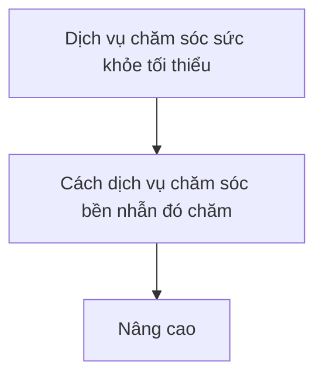


## LỘ TRÌNH CHĂM SÓC BỆNH NHÂN ĐỘT QUỴ CHẤT LƯỢNG CAO

Ba cấp độ sẵn có của dịch vụ chăm sóc bệnh nhân đột quỵ đã được thiết lập như một phần quan trọng của khung làm việc này với mục tiêu thiết lập Kế Hoạch Hành Động cho Dịch Vụ Chăm Sóc Bệnh Nhân Đột Quỵ Toàn Cầu WSO và các thành phần của nó. Bằng việc hoàn thiện tự đánh giá, mỗi nhóm sẽ hiểu được dịch vụ của họ được phân loại ở cấp độ nào. Việc này đem đến cơ hội xây dựng các mục tiêu và kế hoạch nhằm đạt được cấp độ dịch vụ cao hơn trong khả năng nguồn lực.

Mặc dù không phải tất cả các thành phần cốt lõi của dịch vụ chăm sóc bệnh nhân đột quỵ đều có sẵn hoặc dễ tiếp cận, nhưng tất cả các khu vực được khuyến khích sử dụng Kế Hoạch Hành Động này để xác định mục tiêu của họ cho việc cung cấp dịch vụ chăm sóc bệnh nhân đột quỵ, và sau đó thiết lập một chiến lược để đạt được các mục tiêu đó theo thời gian. Tại các quốc gia có mức thu nhập thấp và trung bình, đã nhận thấy phạm vi khả năng tiếp cận rộng lớn tới một số các dịch vụ chăm sóc sức khỏe trong các dịch vụ chăm sóc sức khỏe cơ bản nhất. Các mô hình này trải dài từ các lần đến thăm của nhân viên chăm sóc sức khỏe định kỳ tới các cộng đồng nhỏ hơn/ở nông thôn đến các dịch vụ cơ bản có tổ chức trong các cộng đồng lớn hơn, và các dịch vụ toàn diện hơn sẵn có tại các thành phố. Mặc dù không phải tất cả các thành phần cốt lõi của dịch vụ chăm sóc bệnh nhân đột

## Yếu Tố Thứ Hai: Các Khuyến Nghị Chính về Chăm Sóc Bệnh Nhân Đột Quỵ

Các Hướng Dẫn Thực Hành Tốt Nhất là các khuyến nghị cho việc thực hành hoặc các quyết định chính sách được chứng minh bằng các bằng chứng đầy đủ chất lượng cao. Các hướng dẫn mô tả các thực hành chăm sóc sức khỏe , các biện pháp can thiệp, và các quá trình hiệu quả nhất được quyết định qua bằng chứng nghiên cứu và trong một số trường hợp, là qua ý kiến của chuyên gia, và sự nhất trí. Các hướng dẫn thực hành tốt nhất có thể theo hình thức các khuyến nghị thực hành lâm sàng/thực hành tốt nhất hoặc các hướng dẫn chính sách.

Thông qua quá trình Delphi gồm nhiều vòng, một tập hợp cốt lõi các khuyến nghị về chăm sóc bệnh nhân đột quỵ đã được xác định và được xem xét là hợp lý để được thực hiện trong cấp độ các mô hình dịch vụ chăm sóc bệnh nhân đột quỵ tối thiểu, cấp thiết và cao cấp. Các khuyến nghị này nhấn mạnh vào thực tế rằng thậm chí tại các khu vực với nguồn lực tối thiểu thì vẫn có thể thực hiện được một số việc nhằm cải thiện dịch vụ chăm sóc và kết quả cho các bệnh nhân đột quỵ. Các khuyến nghị này được xây dựng trong một mô hình đang phát triển. Điều này có nghĩa rằng tại cấp độ dịch vụ tối thiểu, vẫn cần thực hiện một tập hợp cốt lõi các khuyến nghị. Và tại cấp độ thiết yếu, cũng cần thực hiện mọi khuyến nghị tại cấp độ tối thiểu CỘNG VỚI các khuyến nghị bổ sung được xác định là hợp lý tại cấp độ thiết yếu. Tương tự như vậy với việc thực hiện ở cấp độ dịch vụ chăm sóc bệnh nhân đột quỵ cao cấp, mọi khuyến nghị được liệt kê cho các dịch vụ chăm sóc bệnh nhân đột quỵ tối thiểu và cấp thiết cần được thực hiện cộng với các khuyến nghị bổ sung cho năng lực cung cấp dịch vụ chăm sóc bệnh nhân đột quỵ cao cấp.

## LỘ TRÌNH CHĂM SÓC BỆNH NHÂN ĐỘT QUỴ CHẤT LƯỢNG CAO

## Cấp Độ Bằng Chứng:

Mọi khuyến nghị trong hướng dẫn này được trình bày cùng với các cấp độ bằng chứng phản ánh độ tin cậy của nghiên cứu sẵn có nhằm hỗ trợ khuyến nghị kể từ tháng Mười năm 2015.  Các khuyến nghị và các cấp độ bằng chứng này sẽ được rà soát hằng năm và được điều chỉnh nếu cần thiết để phản ánh các phát hiện nghiên cứu mới tìm thấy. Các cấp độ bằng chứng được cung cấp dựa trên các phát hiện từ các nghiên cứu cụ thể; do đó, chúng có tính đặc trưng cho một nhóm dân số được nghiên cứu và có thể không áp dụng được cho tất cả các khu vực, chúng có thể không phản ánh được các hệ thống tại địa phương, và các nhà cung cấp dịch vụ chăm sóc bệnh nhân đột quỵ tại địa phương cần xác định sự liên quan với nhóm dân số của họ.

| Bảng độ |
|:-------:|
|   A     |


các khuyến nghị được hỗ trợ bằng các bằng chứng đáng tin cậy từ các rà soát hệ thống, phân tích tổng hợp, và/hoặc nhiều thử nghiệm có đối chứng và được chọn ngẫu nhiên có các phát hiện nhất quán;

| B  | báng cấp độ |
| :--- | :---: |


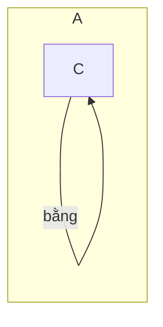


các khuyến nghị được hỗ trợ bằng các bằng chứng có mức độ vừa phải từ các thử nghiệm có đối chứng và được chọn ngẫu nhiên đơn lẻ, nhiều thử nghiệm có các phát hiện nhất quán, các nghiên cứu quan sát quy mô lớn và/hoặc các nghiên cứu tình huống lớn có đối chứng;

các khuyến nghị được hỗ trợ bằng các bằng chứng thiếu tin cậy từ các nghiên cứu quan sát nhỏ và các nghiên cứu tình huống có đối chứng; hoặc chúng dựa trên ý kiến chuyên gia và/hoặc sự nhất trí của nhóm. Các khuyến nghị dựa trên rất ít bằng chứng này được cung cấp khi chúng được xem xét là các yếu tố chính của dịch vụ chăm sóc bệnh nhân đột quỵ, như việc lấy được kết quả chụp CT để xác nhận chẩn đoán.

## Yếu Tố Thứ Ba: Các Chỉ Số Chính về Chất Lượng Chăm Sóc Bệnh Nhân Đột Quỵ

Đánh giá việc cung cấp dịch vụ chăm sóc cho bệnh nhân đột quỵ là một phần thiết yếu của bất kỳ hệ thống chăm sóc bệnh nhân đột quỵ có tổ chức nào, dù lớn hay nhỏ.   Cần sớm đưa ra xem xét đánh giá trong quy trình lập kế hoạch để thiết lập các cơ chế thu thập dữ liệu là một phần của dịch vụ chăm sóc bệnh nhân đột quỵ và kế hoạch thực hiện hướng dẫn.

Là một phần của Hướng Dẫn và Kế Hoạch Hành Động về Chăm Sóc Bệnh Nhân Đột Quỵ Toàn Cầu WSO, các quy tắc Phân Loại Quốc Tế về Bệnh Tật đã được lựa chọn để xác định các trường hợp đột quỵ phù hợp để đưa vào chiến lược đo lường hiệu suất chăm sóc bệnh nhân đột quỵ.  Những nội dung này đã được định nghĩa và nêu ra trong Phụ Lục 2. Sau đó, xác định tập hợp các biện pháp thực hiện cốt lõi song hành cùng quá trình lựa chọn các khuyến nghị thực hành tốt cốt lõi.  Cung cấp các chỉ số chính về chất lượng chăm sóc bệnh nhân đột quỵ trong lộ trình này để tăng cường sự tập trung, nhất quán và chuẩn hóa về đo lường chất lượng dịch vụ chăm sóc bệnh nhân đột giữa các khu vực có thẩm quyền.  Trong thời gian này, hy vọng thông tin này có thể được sử dụng để phát triển các ngưỡng chuẩn toàn cầu cho việc cung cấp các dịch vụ chăm sóc bệnh nhân đột quỵ ở mức độ chăm sóc tối thiểu, cấp thiết và cao cấp, và góp phần thúc đẩy nỗ lực cải thiện dịch vụ chăm sóc bệnh nhân đột quỵ toàn cầu thông qua việc ra quyết định sáng suốt và lập kế hoạch hệ thống.

Để xây dựng các chỉ số chất lượng chiến lược về đánh giá dịch vụ chăm sóc bệnh nhân đột quỵ tại địa phương hiệu quả, cần phải giải quyết một số yếu tố:

- Định nghĩa các khái niệm về trường hợp đột quỵ
- Xác định các tiêu chí thu nhận và loại trừ cho nhóm đối tượng bệnh nhân mục tiêu quan tâm (loại đột quỵ, tuổi tác, giới tính, hoàn cảnh, giai đoạn chăm sóc, v.v.)
- Xác định các chỉ số chất lượng chính từ danh sách WSO bên dưới, và thêm các chỉ số bổ sung để bao quát đầy đủ phạm vi dịch vụ được cung cấp và trách nhiệm giải trình
- Xác định các yếu tố về dữ liệu cần thiết và phương pháp để đảm bảo mọi yếu tố cần thiết được thu thập để tính toán các chỉ số chất lượng đã được xác định
- Thiết lập nơi lưu trữ và phương thức thu thập thông tin (người sẽ ghi chép lại dữ liệu, thời gian, địa điểm, bằng cách nào và trên bệnh nhân nào)
- Xác định các khung thời gian để thu thập, phân tích và báo cáo dữ liệu
- Xác định cấu trúc và định dạng báo cáo (nên xem xét các thẻ báo cáo theo bảng trực tuyến nếu có thể)
- Thiết lập kế hoạch phổ biến và thông báo các kết quả từ việc phân tích dữ liệu tới tất cả các nhà cung cấp, người ra quyết định và nhóm đối tượng bệnh nhân ở mọi cấp độ

## Định Nghĩa Chất Lượng

Tiêu chuẩn chăm sóc: là cơ sở để so sánh trong việcđo lường hoặc đánh giá năng lực, chất lượng, nội dung hoặc phạm vi của một đối tượng hoạt động cụ thể. Nếu không có bằng chứng, có thể thông báo các tiêu chuẩn theo ý kiến chuyên gia. Các tiêu chuẩn có thể được coi là những yêu cầu cơ bản của nghề chăm sóc sức khoẻ và thường được xác định trong các chính sách, thủ tục và tiêu chuẩn của các tài liệu thực hành. Các tiêu chuẩn chăm sóc chỉ rõ những đặc điểm tối thiểu có thể chấp nhận được của những yếu tố cấu thành nên dịch vụ chăm sóc có chất lượng.

Các tiêu chuẩn này chỉ rõ việc quản lý thích hợp dựa trên các bằng chứng khoa học rõ ràng và sự hợp tác giữa các chuyên gia chăm sóc sức khoẻ khi tham gia điều trị một tình trạng nhất định. Các tiêu chuẩn chăm sóc mô tả mức độ trung bình và thận trọng nhà cung cấp dịch vụ cần thực hành tại một cộng đồng nhất định và những người thực hiện có chuyên môn tương tự sẽ quản lý dịch vụ chăm sóc của bệnh nhân trong cùng một trường hợp hoặc các trường hợp tương tự như thế nào.

Chỉ Số Chất Lượng: Một thước đo khách quan về chất lượng của dịch vụ chăm sóc sức khoẻ đã được phát triển nhằm hỗ trợ quá trình tự đánh giá và cải thiện chất lượng ở cấp độ nhà cung cấp, bệnh viện hoặc hệ thống (Nhóm thực hiện nhiệm vụ Đo Lường Chất Lượng ACC/AHA).

Ngưỡng chuẩn: là mức hiệu quả thực hiện được công nhận là tiêu chuẩn xuất sắc trong một quy trình chăm sóc hoặc kết quả cụ thể và được sử dụng để so sánh giữa các nhóm. Ngưỡng chuẩn cung cấp các giá trị chuẩn để đo lường, so sánh, hoặc đánh giá nội dung. Có thể xác định các ngưỡng chuẩn thông qua một số kỹ thuật, bao gồm: các nghiên cứu đã được kiểm chứng và các phương pháp thống kê; xác định những người thực hiện có kết quả cao nhất; và hoạt động trước đây của tổ chức của những người thực hiện đó.

Mục tiêu: là mức độ hiệu quả thực hiện mà một tổ chức muốn đạt được trong một khoảng thời gian nhất định. Đây thường là một giá trị giữa mức hiệu quả thực hiện hiện tại và ngưỡng chuẩn, nhưng có thể bằng hoặc lớn hơn ngưỡng chuẩn. Các giá trị mục tiêu có tính đến các nguồn lực và khó khăn liên quan đến việc đáp ứng tiêu chuẩn chăm sóc.

Ngưỡng giới hạn: là mức chấp nhận tối thiểu về hiệu quả thực hiện. Các xếp hạng hiệu quả thực hiện thấp hơn ngưỡng giới hạn được coi là hiệu quả thực hiện kém và sẽ cần hành động khắc phục.

** Các xếp hạng hiệu quả thực hiện ngoài ngưỡng -hoặc là  trên hoặc thấp hơn theo quy định của biện pháp cụ thể - được coi là hiệu quả thực hiện kém

## LỘ TRÌNH CHĂM SÓC BỆNH NHÂN ĐỘT QUỴ CHẤT LƯỢNG CAO

## LỜI CẢM ƠN

## Ủy Ban về Chất Lượng và Hướng Dẫn cho Dịch Vụ Chăm Sóc Bệnh Nhân Đột Quỵ Toàn Cầu WSO:

Bác sĩ Patrice Lindsay, Chủ Tịch (Canada) Bác sĩ Karen Furie (Hoa Kỳ) Bác sĩ Bo Norrving (Thụy Điển) Bác sĩ Stephen Davis (Úc, Chủ Tịch, WSO) Bác sĩ Erin Lalor (Úc) Bác sĩ Anthony Rudd (Anh) Bác sĩ Jose Ferro (Bồ Đào Nha) Bác sĩ Man Mohan Mehndiratta (Ấn Độ) Bác sĩ James Jowi (Kenya) Giáo sư Shinichiro Uchiyama (Nhật Bản) Bác sĩ Geoffrey Donnan (Úc), Thành viên mặc nhiên.

## Nhóm Làm Việc về Các Hướng Dẫn Chăm Sóc Bệnh Nhân Đột Quỵ Toàn Cầu:

Bác sĩ Karen Furie, Chủ Tịch (Hoa Kỳ) Ngài Kelvin Hill (Úc) Bác sĩ Anthony Rudd (Vương Quốc Anh) Bác sĩ Peter Langhorne (Scotland) Bác sĩ Gord Gubitz (Canada) Bác sĩ Alan Barber (New Zealand) Bác sĩ Disya Ratanakorn (Thái Lan) Bác sĩ Sheila Martins (Brazil) Bác sĩ Pamela Duncan (Hoa Kỳ) Bác sĩ Foad Abd-Allah (Châu Phi)

Bác sĩ Patrice Lindsay (Canada).

## Nhóm Làm Việc Chất Lượng Toàn Cầu:

Chủ Tịch, Bác Sĩ Bo Norrving (Thụy Điển)

Bà Alex Hoffman (Anh) Bác sĩ Peter Heuschmann (Đức) Bác sĩ Michael Hill (Canada) Bác sĩ Matthew Reeves (Hoa Kỳ) Bác sĩ Dominique Cadillac (Úc) Bác sĩ Liping Liu (Trung Quốc) Bác sĩ Kameshwar Prasad (Ấn Độ) Bác sĩ Valery Feigin (New Zealand) Bác sĩ Sheila Martins (Brazil) Bác sĩ Patrice Lindsay (Canada)

Chúng tôi cũng xin gửi lời cảm ơn chân thành tới tất cả các thành viên Ban Giám Đốc của Tổ Chức Đột Quỵ Thế Giới vì những rà soát và phản hồi cho Kế Hoạch Hành Động trong suốt mỗi giai đoạn thiết lập.

## Tuyên Bố Xung Đột Quyền Lợi:

MP Lindsay: Không có; K. Furie: Không có; S. Davis: Không có; G. Donnan: Không có; B. Norrving: Không có.

## LỘ TRÌNH CHĂM SÓC BỆNH NHÂN ĐỘT QUỴ CHẤT LƯỢNG CAO

Lộ Trình thực hiện Các Hướng Dẫn và Kế Hoạch Hành Động về Chăm Sóc Bệnh Nhân Đột Quỵ Toàn Cầu WSO bao gồm một số mô-đun mà cùng đề cập đến toàn bộ quá trình chăm sóc bệnh nhân đột quỵ liên tục. Các môđun dưới đây luôn sẵn có cho quý vị sử dụng như là một phần của việc lên kế hoạch, tự đánh giá và thực hiện các dịch vụ chăm sóc bệnh nhân đột quỵ. Mỗi mô-đun của Lộ Trình bao gồm danh sách kiểm tra các dịch vụ và nguồn lực liên quan, các khuyến nghị thực hành tốt nhất cho dịch vụ chăm sóc bệnh nhân đột quỵ hiện hành và các chỉ số chất lượng chính quan trọng. Một số mô-đun trong Lộ Trình bao gồm các yếu tố bổ sung và thông tin mở rộng cho các yếu tố trong Hướng Dẫn và Kế Hoạch Hành Động về Chăm Sóc Bệnh Nhân Đột Quỵ Toàn Cầu WSO nhằm mục đích sử dụng thực tế sau này tại mọi địa diểm.

Người dùng các công cụ này được khuyến nghị nên rà soát tất cả các mô-đun trong Lộ Trình.

| Category     | Item           | Price |
|--------------|----------------|-------|
| Fruits       | Apples         | 1.20  |
| Fruits       | Bananas        | 0.80  |
| Vegetables   | Carrots        | 0.50  |
| Vegetables   | Broccoli       | 1.50  |


## Các mô-đun có sẵn dưới đây như một phần của Lộ Trình Chăm Sóc Bệnh Nhân Đột Quỵ Chất Lượng WSO:

## Giới Thiệu và Tổng Quan

1. Phát Triển Hệ Thống Chăm Sóc Bệnh Nhân Đột Quỵ
2. Chăm Sóc Tiền Nhập Viện và Chăm Sóc Cấp Cứu
3. Chăm Sóc Bệnh Nhân Nội Trú Đột Quỵ Cấp Tính
4. Phòng Ngừa Đột Quỵ Thứ Phát
5. Phục Hồi Chức Năng cho Bệnh Nhân Đột Quỵ
6. Tái Hòa Nhập Cộng Đồng và Phục Hồi Lâu Dài

## Tổ Chức Đột Quỵ Thế Giới- Hướng Dẫn Thực Hành Lâm Sàng

http://www.world-stroke.org

Các hướng dẫn về Hướng Dẫn Thực Hành Lâm Sàng được khuyến nghị bởi ủy ban phụ trợ về Chất Lượng và Hướng Dẫn WSO. Các Hướng Dẫn về Bệnh Đột Quỵ Quốc Tế WSO năm 2012; Bản phát hành hướng dẫn của Viện Thần Kinh Học Hoa Kỳ. Hướng Dẫn Dựa Trên Bằng Chứng: Phòng ngừa đột quỵ trong rung nhĩ không do bệnh van tim. Bản tóm tắt các Hướng Dẫn Dựa Trên Bằng Chứng cho BÁC SĨ LÂM SÀNG. Bản tóm tắt các Hướng Dẫn Dựa Trên Bằng Chứng cho CHA MẸ và GIA ĐÌNH Xem thêm thông tin tại: https://www.aan.com/Guidelines/Home/ByTopic?topicId=20

Nguồn lực từ Hiệp Hội Tim và Đột Quỵ cho các nhà cung cấp dịch vụ chăm sóc sức khỏe. Hành Động vì một Cộng Đồng Ưu Việt và Dịch Vụ Chăm Sóc Bệnh Nhân Đột Quỵ Dài Hạn (TACLS). Phiên bản tiếng Pháp: Agir en vue de soins optimaux communautaires et de longue durée de l'AVC.

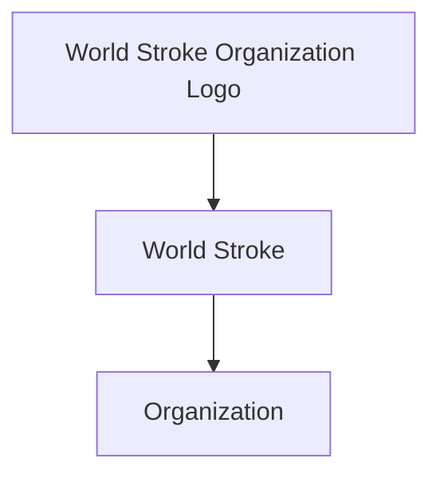


## Tổ Chức Đột Quỵ Toàn Cầu Hướng Dẫn và Kế Hoạch Hành Động: Lộ Trình Chăm Sóc Bệnh Nhân Đột Quỵ Chất Lượng Cao

## PHÁT TRIỂN HỆ THỐNG CHĂM SÓC BỆNH NHÂN ĐỘT QUỴ

Các tác giả: Lindsay MP , Norrving B, Furie KL, Donnan G, Langhorne P , Davis S Nhân Đột Quỵ Toàn Cầu,

Nhóm Làm Việc về Các Hướng Dẫn Chăm Sóc Bệnh Nhân Đột Quỵ Toàn Cầu, Cầu.

Thay Mặt Ủy Ban Cố Vấn về Hướng Dẫn và Chất Lượng của Dịch Vụ Chăm Sóc Bệnh và Nhóm Làm Việc về Chất Lượng của Dịch Vụ Chăm Sóc Bệnh Nhân Đột Quỵ Toàn

Hướng Dẫn và Kế Hoạch Hành Động về Dịch Vụ Chăm Sóc Bệnh Nhân Đột Quỵ Toàn Cầu:

Đạt Được và Theo Dõi Dịch Vụ Chăm Sóc Bệnh Nhân Đột Quỵ Chất Lượng Cao

PHÁT TRIỂN HỆ THỐNG CHĂM SÓC BỆNH NHÂN ĐỘT QUỴ

14

## LỘ TRÌNH CHĂM SÓC BỆNH NHÂN ĐỘT QUỴ CHẤT LƯỢNG CAO

## THIẾT LẬP VÀ GIÁM SÁT HỆ THỐNG Y TẾ

Mục này đề cập đến sự công nhận của công chúng về bệnh đột quỵ và cả việc thiết lập hệ thống y tế. Mục này xét đến tất cả các giai đoạn và địa điểm chăm sóc bệnh nhân đột quỵ.

Danh Sách Kiểm Tra Năng Lực Dịch Vụ Y Tế cho Dịch Vụ Chăm Sóc cho Bệnh Nhân Đột Quỵ^

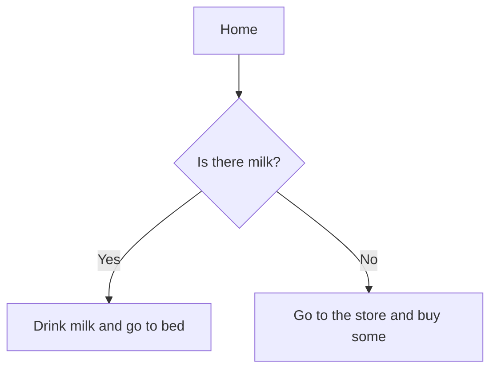


Vui lòng hoàn thành các thông tin sau để xác định rõ các dịch vụ chăm sóc cho bệnh nhân đột quỵ mà quý vị đang triển khai hoặc đánh giá.

| KHUVỰC:   | DANHSÁCHKIỂMTRATỔCHỨCHOÀNTHIỆN:   | NGƯỜI LIÊN HỆ CHÍNH:   |
|-----------|-----------------------------------|------------------------|

## PHẠM VI DỊCH VỤ:

- Đánh Giá Cấp Tỉnh/Tiểu Bang/Quốc Gia
- Đánh giá của Khu Vực/Địa Phương
- Bệnh viện đô thị lớn với dịch vụ chăm sóc bệnh nhân đột quỵ cao cấp (dịch vụ chăm sóc bệnh nhân đột quỵ toàn diện)
- Các bệnh viện cộng đồng cung cấp sự tiếp cận đối với một số dịch vụ chăm sóc bệnh nhân đột quỵ
- Cộng đồng có phòng khám y tế là dịch vụ chăm sóc sức khỏe duy nhất
- Cộng đồng nông thôn có nhân viên y tế đến thăm khám

## MỤC ĐÍCH CỦA ĐÁNH GIÁ/NHẬN XÉT NÀY:

Hoàn thành bởi nhóm địa phương

## LỘ TRÌNH CHĂM SÓC BỆNH NHÂN ĐỘT QUỴ CHẤT LƯỢNG CAO

| **Dịch Vụ Chăm Sóc Sức Khỏe** | **Cách Dịch Vụ Chăm Sóc Bệnh Nhân Đột Quý Cấp Thiết (thông số dịch vụ dược liệu trông mắc định giá)** | **Cách Dịch Vụ Chăm Sóc Bệnh Nhân Đột Quý Cấp Cao (Người dùng dịch vụ bệnh nhân đụt quý)** |
|------------------------------|-----------------------------------------------------------------------------------------------------|---------------------------------------------------------------|
| **Có thể cung cấp dịch vụ chăm sóc tại cơ sở dịa phương mà không có sự phơi hợp của các khu vực dịa lý xác định** | **Dịch vụ chăm sóc bệnh nhân đột quý** phơi hợp giới hạn được cung cấp trong các khu vực dịa lý xác định | **Dịch vụ chăm sóc bệnh nhân đột quý** phơi hợp dịa dược cung cấp trong các khu vực dịa lý xác định |
| **Không thể tiếp cận các dịch vụ chăm sóc tại bệnh viện ở địa điểm này do điều kiện quý siều cấp** | **Các chứng trình dạo tảo với đụt quý** | **Các chứng trình dạo tảo với đụt quý** |
| **Tiếp cận với các bác sĩ rãnh hạn chế** | **Tiếp cận các dịch với chẩn đoán cơ bản** | **Tiếp cận các dịch với chẩn đoán cơ bản** |
| **Các cáp chủng trình phát triển kỹ** | **Tiếp cận các dịch với các phương pháp điều** | **Tiếp cận các dịch với các phương pháp điều** |
| **Thay đổi mực độ tối tại viên** | **Dịch vụ chăm sóc sức khỏe** (y tài hộ nhân viên) | **Dịch vụ chăm sóc sức khỏe** (y tài hộ nhân viên) |
| | **Tập huấn cơ bản về khám sáng lộc** | **Tập huấn cơ bản về khám sáng lộc** |
| | **Rời loan chức năng với kiểm soát chức khổ nước và kiểm soát nhiết độ** | **Rời loan chức năng với kiểm soát chức khổ nước và kiểm soát nhiết độ** |
| | **Thay đổi mực độ tối tại viên** | **Thay đổi mực độ tối tại viên** |
| | **Chăm sóc sức khỏe nhân dột quý** (mắc dù không phải là chủng môn đo lường) | **Chăm sóc sức khỏe nhân dột quý** (mắc dù không phải là chủng môn đo lường) |
| | **Tiếp cận với liệu pháp làm huyết** | **Tiếp cận với liệu pháp làm huyết** |
| | **Tiếp cận tiện ích TP4 tận trung qua** | **Tiếp cận tiện ích TP4 tận trung qua** |
| | **Tiếp cận các dịch viên cột của nhôm** | **Tiếp cận các dịch viên cột của nhôm** |
| | **Tiếp cận các dịch với chẩn đoán cơ bản** | **Tiếp cận các dịch với chẩn đoán cơ bản** |
| | **Xét nghiệm máu trong phòng thí nghiệm (CBC, chất điện phân, urê, đường glucose, INR, PT)** | **Xét nghiệm máu trong phòng thí nghiệm (CBC, chất điện phân, urê, đường glucose, INR, PT)** |
| | **Điện ảnh động (12 đạo trinh)** | **Điện ảnh động (12 đạo trinh)** |
| | **Chụp cắt lớp CT nào và hệ máy** | **Chụp cắt lớp CT nào và hệ máy** |
| | **Năng Lực chụp CT Mạch Máu** | **Năng Lực chụp CT Mạch Máu** |
| | **Siêu âm tim** | **Siêu âm tim** |
| | **Siêu âm Doppler** | **Siêu âm Doppler** |
| | **Máy đo nhịp tim Holter** | **Máy đo nhịp tim Holter** |
| | **Sự tiếp cận hạn chế với các dịch vụ y tế** | **Sự tiếp cận hạn chế với các dịch vụ y tế** |
| | **Đạo tạo các dịch lâm việc trần xe cấp** | **Đạo tạo các dịch lâm việc trần xe cấp** |
| | **Làm việc với các thể đồng cụy** | **Làm việc với các thể đồng cụy** |
| | **Thường đc xc định hình độ cụy là một trường hợp cấp cứu kình uu tiên vấn chuyển cao, cần các chẩn** | **Thường đc xc định hình độ cụy là một trường hợp cấp cứu kình uu tiên vấn chuyển cao, cần các chẩn** |
| | **Chuyên lúc và cơ thế thập đũ liệu** | **Chuyên lúc và cơ thế thập đũ liệu** |
| | **Sơ đồ kỹ bệnh nhân nói trột quy cấp tinh** | **Sơ đồ kỹ bệnh nhân nói trột quy cấp tinh** |
| | **Độ tấu cấp cao được hơp lý ở** | **Độ tấu cấp cao được hơp lý ở** |
| | **Sơ đồ kỹ phòng chống đụt quý** | **Sơ đồ kỹ phòng chống đụt quý** |
| | **Cơ sở dữ liệu phức hợp dịa đột** | **Cơ sở dữ liệu phức hợp dịa đột** |
| | **Tiếp các cách dịch vụ chẩn đoán cao cấp** | **Tiếp các cách dịch vụ chẩn đoán cao cấp** |
| | **Chụp Công Hụng Tử (MRI)** | **Chụp Công Hụng Tử (MRI)** |
| | **Năng Lực chụp MR Mạch Máu** | **Năng Lực chụp MR Mạch Máu** |
| | **Chụp CT Tối Máu** | **Chụp CT Tối Máu** |
| | **Các thiết bị theo ECG kéo dài** | **Các thiết bị theo ECG kéo dài** |


| A. Các DịchVụ và Nguồn Lực ChămSóc Bệnh Nhân Đột Quỵ Sẵn Có Vuilòngxemlạitừngdịchvụtrongcácdanhsáchnàyvàđánhdấuvàotấtcảcácdịchvụvànguồnlựcmàquývịhiệncóvàcósẵnđểcungcấp dịchvụchămsócbệnh nhân đột quỵ. Sau khi hoàn tất, hãy xemxét các câu trả lời của quý vị để xác định loại dịch vụ chămsóc bệnh nhân đột quỵ nào màquývịhiện có.                                                                                                                                                                                                                                                                                                         | A. Các DịchVụ và Nguồn Lực ChămSóc Bệnh Nhân Đột Quỵ Sẵn Có Vuilòngxemlạitừngdịchvụtrongcácdanhsáchnàyvàđánhdấuvàotấtcảcácdịchvụvànguồnlựcmàquývịhiệncóvàcósẵnđểcungcấp dịchvụchămsócbệnh nhân đột quỵ. Sau khi hoàn tất, hãy xemxét các câu trả lời của quý vị để xác định loại dịch vụ chămsóc bệnh nhân đột quỵ nào màquývịhiện có.                                                                                                                                                                                                                                                                                                                                                                                                                                                                                                                                                                                                                                                                                                                                                                                                                                                                                                                                                                                                                                     | A. Các DịchVụ và Nguồn Lực ChămSóc Bệnh Nhân Đột Quỵ Sẵn Có Vuilòngxemlạitừngdịchvụtrongcácdanhsáchnàyvàđánhdấuvàotấtcảcácdịchvụvànguồnlựcmàquývịhiệncóvàcósẵnđểcungcấp dịchvụchămsócbệnh nhân đột quỵ. Sau khi hoàn tất, hãy xemxét các câu trả lời của quý vị để xác định loại dịch vụ chămsóc bệnh nhân đột quỵ nào màquývịhiện có.                                                                                                                                                                                                                                                                                                                                                                                                                                                                                                                                                                                                                                                                                                                                                                                                                                                                                                     |
|------------------------------------------------------------------------------------------------------------------------------------------------------------------------------------------------------------------------------------------------------------------------------------------------------------------------------------------------------------------------------------------------------------------------------------------------------------------------------------------------------------------------------------------------------------------------------------------------------------------------------------------------|----------------------------------------------------------------------------------------------------------------------------------------------------------------------------------------------------------------------------------------------------------------------------------------------------------------------------------------------------------------------------------------------------------------------------------------------------------------------------------------------------------------------------------------------------------------------------------------------------------------------------------------------------------------------------------------------------------------------------------------------------------------------------------------------------------------------------------------------------------------------------------------------------------------------------------------------------------------------------------------------------------------------------------------------------------------------------------------------------------------------------------------------------------------------------------------------------------------------------------------------------------------------------------------------------------------------------------------------------------------------------|--------------------------------------------------------------------------------------------------------------------------------------------------------------------------------------------------------------------------------------------------------------------------------------------------------------------------------------------------------------------------------------------------------------------------------------------------------------------------------------------------------------------------------------------------------------------------------------------------------------------------------------------------------------------------------------------------------------------------------------------------------------------------------------------------------------------------------------------------------------------------------------------------------------------------------------------------------------------------------------------------------------------------------------------------------------------------------------------------------------------------------------------------------------------------------------------------------------------------------------------|
| DịchVụ ChămSóc Sức Khỏe Tối Thiểu                                                                                                                                                                                                                                                                                                                                                                                                                                                                                                                                                                                                              | Các DịchVụ ChămSóc Bệnh Nhân Đột Quỵ CấpThiết (Ngoài các dịch vụ được liệt kê trong mục Dịch vụ chăm sóc bệnh nhân đột quỵ tối                                                                                                                                                                                                                                                                                                                                                                                                                                                                                                                                                                                                                                                                                                                                                                                                                                                                                                                                                                                                                                                                                                                                                                                                                                             | Các DịchVụ ChămSóc Bệnh Nhân Đột Quỵ Cao Cấp (Ngoài các dịch vụ được liệt kê trong mục Các dịch vụ chăm sóc bệnh nhân đột quỵ                                                                                                                                                                                                                                                                                                                                                                                                                                                                                                                                                                                                                                                                                                                                                                                                                                                                                                                                                                                                                                                                                                              |
| Có thể cung cấp dịch vụ chăm sóc tại cộng đồng địa phương màkhông có sự phối hợp giữa các khu vực địa lý xác định Không được tiếp cận các dịch vụ chẩn đoán hoặc chăm sóc tại bệnh viện để điều trị đột quỵ siêu cấp tính Tiếp cận với các bác sỹ rất hạn chế • Cung cấp chương trình phát triển kỹ năng đánh giá • Tập huấn cơ bản về khám sàng lọc rối loạn chức năng nuốt và kiểm soát chứng khó nuốt; và kiểm soát nhiệt độ Thay đổi mức độ tiếp cận tới nhân viên chăm sóc sức khỏe (y tá hoặc nhân viên công tác giáo dân) • Tập huấn cơ bản về khám sàng lọc rối loạn chức năng nuốt và kiểm soát chứng khó nuốt; và kiểm soát nhiệt độ | Dịch vụ chăm sóc bệnh nhân đột quỵ phối hợp giới hạn được cung cấp trong các khu vực địa lý rời rạc Các chương trình đào tạo về đột quỵ cho tất cả các cấp của các nhà cung cấp dịch vụ chăm sóc sức khỏe Tiếp cận các dịch vụ chẩn đoán cơ bản Sự tiếp cận hạn chế với các dịch vụ y tế cấp cứu Tiếp cận với các y tá và đánh giá về điều dưỡng thông qua chương trình đào tạo về chăm sóc bệnh nhân đột quỵ Tiếp cận với các bác sĩ có chuyênmôn đột quỵ (mặc dù không phải là chuyên gia về đột quỵ) Tiếp cận với liệu pháp làm tan huyết khối cấp tính bằng tPA được truyền qua đường tĩnh mạch • tPA (Alteplase) được truyền qua đường tĩnh mạch Tiếp cận các thành viên cốt lõi của nhóm đột quỵ liên ngành (MD, RN, PT, OT) Tiếp cận các dịch vụ chẩn đoán cơ bản • Xét nghiệm máu trong phòng thí nghiệm (CBC, chất điện phân, urê, đường glucose, INR, PT) • Điện tâm đồ (12 đạo trình) • Chụp Cắt Lớp (CT) não và hệ mạch máu • Năng Lực chụp CT Mạch Máu (CTA) • Siêu âmtim • Siêu âmDoppler • Máy đo nhịp tim Holter Sự tiếp cận hạn chế với các dịch vụ y tế cấp cứu • Đào tạo các đội làm việc trên xe cấp cứu để nhận biết các dấu hiệu đột quỵ bằng cách sử dụng thuật ngữ gợi nhớ FAST • Làm việc với các hệ thống cứu thương để xác định đột quỵ như là một trường hợp cấp cứu cần mức ưu tiên vận chuyển cao, ngoài các chấn thương và nguy cơ sản khoa | Dịch vụ chăm sóc bệnh nhân đột quỵ phối hợp đầy đủ được cung cấp trong các khu vực địa lý riêng biệt • Các dịch vụ chăm sóc bệnh nhân đột quỵ cao cấp được hợp lý hóa thành một số trung tâm nhỏ hơn • Lộ trình cho bệnh nhân đột quỵ xác định hướng di chuyển của bệnh nhân đột quỵ trong khu vực tới các cấp dịch vụ cao hơn và thấp hơn theo yêu cầu • Hệ thống giới thiệu phối hợp • Cung cấp tư vấn về đột quỵ từ xa tới các trung tâm nhỏ hơn và hẻo lánh hơn • Có thoả thuận bỏ qua xe cứu thương • Có thoả thuận hồi hương để chuyển bệnh nhân trở về cộng đồng tại nơi sinh sống • Bản in tài liệu giáo dục về bệnh nhân đột quỵ Các chương trình đào tạo về đột quỵ cho tất cả các cấp của các nhà cung cấp dịch vụ chăm sóc sức khỏe Chiến lược và cơ chế thu thập dữ liệu • Sổ đăng ký bệnh nhân nội trú đột quỵ cấp tính • Cơ sở dữ liệu bệnh nhân nội trú đột quỵ cấp tính (địa phương hoặc khu vực) • Sổ đăng ký phòng chống đột quỵ • Cơ sở dữ liệu phòng chống đột quỵ • Sổ đăng ký phục hồi sau đột quỵ • Cơ sở dữ liệu phục hồi sau đột quỵ (địa phương hoặc khu vực) Tiếp cận các dịch vụ chẩn đoán cao cấp • Chụp Cộng HưởngTừ (MRI) • Năng Lực chụp MRMạch Máu • Chụp CTTưới Máu • Các thiết bị theo dõi ECG kéo dài |

## LỘ TRÌNH CHĂM SÓC BỆNH NHÂN ĐỘT QUỴ CHẤT LƯỢNG CAO

| **Dịch Vụ Chăm Sóc Sức Khỏe** | **Cách Đích (Người có dịch vụ được liệt kê trong mục Dịch vụ chăm sóc nhân đốt quy) ** | **Cách Đích (Người chăm sóc dịch vụ được liệt kê trong mục Cách dịch vu chăm sóc nhân đốt quy) ** |
| --- | --- | --- |
| Tiếp cận với các tà và đánh giá về điều dưỡng sức khỏe nhân đốt tạo và điều dưỡng sức khỏe bản đầu | Tiếp cận với các bác sĩ có chuyên môn dột quy cấp tính, phòng ngừa đốt quy và hoắc phục hồi chức năng sau đốt quy:  <br> - Nhà thân kinh hóc  <br> - Bác sĩ giải phẫu thần kinh  <br> - Bác sĩ nội trú  <br> - Bác sĩ chân dơn hình ảnh nào/ si cẩn thiệp  <br> - Bác sĩ lão khoa  <br> - Bác sĩ xúy chuyển chăm sóc cho bệnh nhân nguy kịch  <br> - Bác sĩ tim mạch  <br> - Y Khoa Cấp Cứu  <br> - Bác sĩ Da khoa/Gia đình/Chăm sóc chinh  <br> - Chương trình phát triển và duy trì năng lực loi long chăm sóc bệnh nhân đốt quy | Tiếp cận với các bác sĩ có chuyên môn dột quy cấp tính, phòng ngừa đốt quy và hoắc phục hồi chức năng sau đốt quy:  <br> - Nhà thân kinh hóc  <br> - Bác sĩ giải phẫu thần kinh  <br> - Bác sĩ nội trú  <br> - Bác sĩ chân dơn hình ảnh nào/ si cẩn thiệp  <br> - Bác sĩ lão khoa  <br> - Bác sĩ xúy chuyển chăm sóc cho bệnh nhân nguy kịch  <br> - Bác sĩ tim mạch  <br> - Y Khoa Cấp Cứu  <br> - Bác sĩ Da khoa/Gia đình/Chăm sóc chinh  <br> - Chương trình phát triển và duy trì năng lực loi long chăm sóc bệnh nhân đốt quy |
| Tiếp cận với các bác sĩ có chuyên môn dột quy (Bác sĩ Da khoa/Gia đình/Chăm sóc chinh) | Tiếp cận với các chuyên gia về đốt quy thông qua phương thức điện từ dot quy từ xa, và chup Xquang viên thong | Tiếp cận với các chuyên gia về đốt quy thông qua phương thức điện từ dot quy từ xa, và chup Xquang viên thong |
| Tiếp cận với liệu pháp làm tan huyết đọng cấp tinh pháp TPA được truyền qua đường tinh mạch | Tiếp cận với các chuyên gia về đốt quy cấp cao si nhôm dot quy cấp tính liên ngân:  <br> - Bác sĩ Sức Khỏe Nhân Đốt Quy  <br> - Trị lý điều dưỡng  <br> - Được sĩ  <br> - Nhân viên hỗ/trợ lý trường hợp  <br> - Nhóm Chăm Sóc/Quản Lý Nhóm  <br> - Nhà về lý trị  <br> - Nhà Trị Liệu Chúc Năng Vạn Động  <br> - Nhà Trị Liệu Ngôn Ngữ | Tiếp cận với các chuyên gia về đốt quy cấp cao si nhôm dot quy cấp tính liên ngân:  <br> - Bác sĩ Sức Khỏe Nhân Đốt Quy  <br> - Trị lý điều dưỡng  <br> - Được sĩ  <br> - Nhân viên hỗ/trợ lý trường hợp  <br> - Nhóm Chăm Sóc/Quản Lý Nhóm  <br> - Nhà về lý trị  <br> - Nhà Trị Liệu Chúc Năng Vạn Động  <br> - Nhà Trị Liệu Ngôn Ngữ |
| Các phần độ đề đánh giá và chăn đoán nhanh bệnh nhân đốt quy | | |
| Giáo dục, đào tạo kỳ năng và thu hiệu tham gia vào việc lập kế hoạch chăm sóc đối với bệnh nhân và gia đình | | |
| Lập kế hoạch xuất viện | | |
| Dịch vụ chăm sóc bệnh nhân đốt quy phải hợp giới hạn được cấp trong các khu vực dịa lý rõ rạc | | |
| Các chương trình đào tạo và các chương trình dạy cách cấp của các cấp cho tất cả các cấp của nhân cung cấp dịch vụ chăm sóc sức khỏe | | |


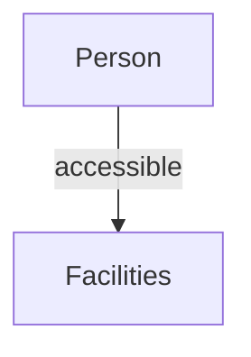


## LỘ TRÌNH CHĂM SÓC BỆNH NHÂN ĐỘT QUỴ CHẤT LƯỢNG CAO

## B. Các Khuyến Nghị Chính về Chăm Sóc Bệnh Nhân Đột quỵ

Đối với mỗi khuyến nghị thực hành tốt, đánh dấu để cho biết liệu các thực hành mô tả có sẵn là một phần của dịch vụ chăm sóc định kỳ; trong quá trình triển khai thực hiện; không được thực hiện, nghĩa là dịch vụ/nguồn lực có thể có sẵn nhưng hiện tại không phải là một phần của dịch vụ chăm sóc bệnh nhân đột quỵ trong các dịch vụ của quý vị; hoặc, các dịch vụ/nguồn lực/thiết bị không có sẵn tại các cơ sở của quý vị, do đó không thể thực hiện.

| HệThốngYTế và Nhận Biết Đột Quỵ Các Khuyến Nghị Chính DựaTrên Các Bằng Chứng                                                  | Cấp Độ Năng Lực DịchVụYTế Áp Dụng để ChămSóc Bệnh Nhân Đột Quỵ   | Cấp Độ Năng Lực DịchVụYTế Áp Dụng để ChămSóc Bệnh Nhân Đột Quỵ   | Cấp Độ Năng Lực DịchVụYTế Áp Dụng để ChămSóc Bệnh Nhân Đột Quỵ   | Bằng Chứng HỗTrợ                             | Tự Đánh Giá                                            |
|-------------------------------------------------------------------------------------------------------------------------------|------------------------------------------------------------------|------------------------------------------------------------------|------------------------------------------------------------------|----------------------------------------------|--------------------------------------------------------|
|                                                                                                                               | Tối thiểu                                                        | Cấp thiết                                                        | Cao cấp                                                          |                                              |                                                        |
| A. HệThống Nhận Biết và Phản Ứng với Đột Quỵ                                                                                  | A. HệThống Nhận Biết và Phản Ứng với Đột Quỵ                     | A. HệThống Nhận Biết và Phản Ứng với Đột Quỵ                     | A. HệThống Nhận Biết và Phản Ứng với Đột Quỵ                     | A. HệThống Nhận Biết và Phản Ứng với Đột Quỵ | A. HệThống Nhận Biết và Phản Ứng với Đột Quỵ           |
| 1. Tất cả mọi người trong cộng đồng cần có khả năng nhận biết dấu hiệu và triệu chứng của đột quỵ (ví dụ FAST)                |                                                                  |                                                                  |                                                                  | Cấp độ bằng chứng: C                         | Có sẵn Đang được hoàn tất Không thực hiện Không có sẵn |
| 2. Tất cả các nhân viên chăm sóc sức khỏe cần được đào tạo để nhận biết được các dấu hiệu và triệu chứng cảnh báo của đột quỵ |                                                                  |                                                                  |                                                                  | Cấp độ bằng chứng: C                         | Có sẵn Đang được hoàn tất Không thực hiện Không có sẵn |
| 3. Mọi khu vực địa lý cần có một số điện thoại hoặc hệ thống liên lạc khẩn cấp tại chỗ, ví dụ như 9-1-1                       |                                                                  |                                                                  |                                                                  | Cấp độ bằng chứng: C                         | Có sẵn Đang được hoàn tất Không thực hiện Không có sẵn |
| 4. Cần có sẵn phác đồ tại trung tâm liên lạc khẩn cấp để huy động nhân viên EMS trả lời một cuộc gọi khẩn cấp về đột quỵ      |                                                                  |                                                                  |                                                                  | Cấp độ bằng chứng: B                         | Có sẵn Đang được hoàn tất Không thực hiện Không có sẵn |

Các khuyến nghị nào là những ưu tiên hàng đầu để thực hiện của quý vị?

Các bước tiếp theo để quý vị bắt đầu phát triển và thực hiện những thực hành tốt này là gì?

## LỘ TRÌNH CHĂM SÓC BỆNH NHÂN ĐỘT QUỴ CHẤT LƯỢNG CAO

## C. Các Chỉ Số Chính về Chất Lượng Chăm Sóc Bệnh Nhân Đột Quỵ

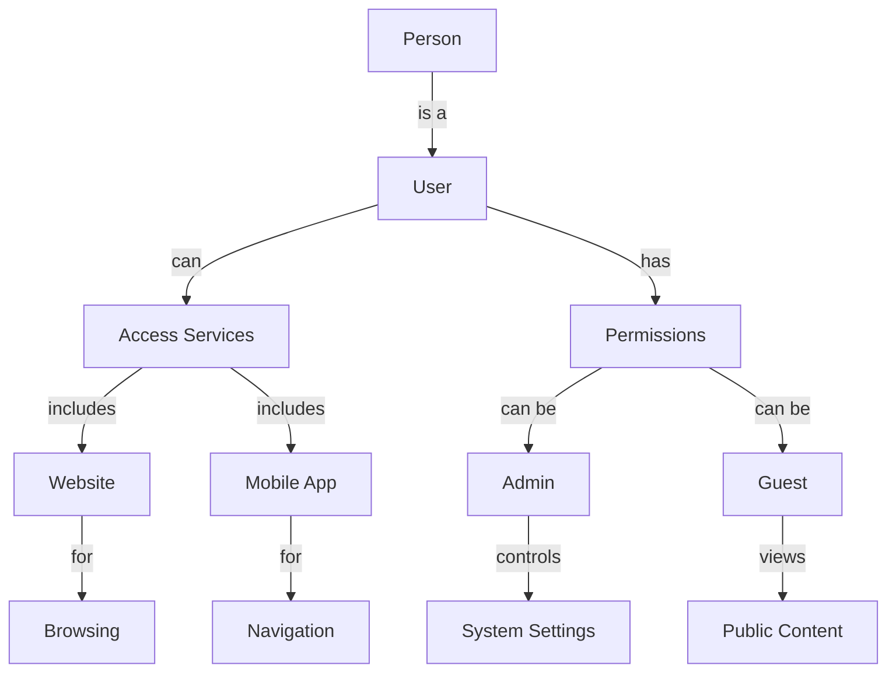


Đối với mỗi chỉ số chất lượng, hãy ghi chú về tình trạng liệu rằng dữ liệu đang được thu thập tích cực và thường xuyên; hoặc, đang được hoàn tất quá trình thu thập dữ liệu để có được chỉ số; hoặc, có thể có dữ liệu nhưng hiện tại không được thu thập; hoặc, không hề có dữ liệu cho chỉ số này nên không thể thu thập hoặc báo cáo. Hãy đánh dấu vào ô thích hợp nhất cho mỗi chỉ số.

| Các Biện PhápThực Hiện                                                                                                                                                                                                                                                         | Tử số                                                                                                                                                                                                                                                                                                                                     | Mẫusố                                                                                                                                                                     | Tự Đánh Giá                                                                               |
|--------------------------------------------------------------------------------------------------------------------------------------------------------------------------------------------------------------------------------------------------------------------------------|-------------------------------------------------------------------------------------------------------------------------------------------------------------------------------------------------------------------------------------------------------------------------------------------------------------------------------------------|---------------------------------------------------------------------------------------------------------------------------------------------------------------------------|-------------------------------------------------------------------------------------------|
| Giám Sát HệThốngYTế                                                                                                                                                                                                                                                            | Giám Sát HệThốngYTế                                                                                                                                                                                                                                                                                                                       | Giám Sát HệThốngYTế                                                                                                                                                       | Giám Sát HệThốngYTế                                                                       |
| 1. Tỷ lệ mắc đột quỵ được điều chỉnh theo độ tuổi và giới tính trong cộng đồng dân cư.                                                                                                                                                                                         | Tổng số các trường hợp đột quỵ trong một cộng đồng dân cư (được phân tầng theo loại đột quỵ).                                                                                                                                                                                                                                             | Tổng dân số dựa trên thông tin điều tra dân số trong một khung thời gian nhất định.                                                                                       | Dữ liệu được thu thập Đang được hoàn tất Dữ liệu không được thu thập Dữ liệu không có sẵn |
| 2.a Tỷ lệ thịnh hành của các tác nhân gây nên đột quỵ trong cộng đồng dân cư.                                                                                                                                                                                                  | Tổng số người trong một cộng đồng dân cư báo cáo hoặc được ghi nhận có một hoặc nhiều hơn một tác nhân gây nên đột quỵ (huyết áp cao, hàm lượng cholesterol cao, bệnh tiểu đường, chứng rung tâm nhĩ, tiền sử gia đình, lối sống ít hoạt động, béo phì hoặc thừa cân, v.v.) (được phân tầng theo loại đột quỵ và loại tác nhân gây bệnh). | Tổng dân số dựa trên thông tin điều tra dân số trong một khung thời gian nhất định.                                                                                       | Dữ liệu được thu thập Đang được hoàn tất Dữ liệu không được thu thập Dữ liệu không có sẵn |
| 2.b Tỷ lệ thịnh hành của các tác nhân gây nên bệnh về mạch máu trong cộng đồng dân cư.                                                                                                                                                                                         | Tổng số người trong một cộng đồng dân cư báo cáo hoặc được ghi nhận có một hoặc nhiều hơn một tác nhân gây nên các bệnh về mạch máu (huyết áp cao, hàm lượng cholesterol cao, bệnh tiểu đường, chứng rung tâm nhĩ v.v.) (được phân tầng theo loại đột quỵ và loại tác nhân gây bệnh).                                                     | Tổng dân số dựa trên thông tin điều tra dân số trong một khung thời gian nhất định.                                                                                       | Dữ liệu được thu thập Đang được hoàn tất Dữ liệu không được thu thập Dữ liệu không có sẵn |
| 2.c Phần trăm số người thực hiện đánh giá về nguy cơ mắc bệnh về mạch máu xem người nào có các tác nhân gây nên đột quỵ.                                                                                                                                                       | Số người trong một cộng đồng dân cư được ghi nhận có một hoặc nhiều hơn một tác nhân gây bệnh về mạch máu đã được xác định sau khi đánh giá rủi ro                                                                                                                                                                                        | Tổng dân số dựa trên thông tin điều tra dân số trong một khung thời gian nhất định, trong đó nhóm dân số này trải qua quá trình đánh giá nguy cơ mắc các bệnh về mạch máu | Dữ liệu được thu thập Đang được hoàn tất Dữ liệu không được thu thập Dữ liệu không có sẵn |
| 3. Tỷ lệ tử vong của các bệnh nhân đột quỵ phân chia theo kiểu đột quỵ, điều chỉnh theo tuổi tác, giới tính, các biến chứng và độ nghiêm trọng của đột quỵ. Công tác đo lường cần được thực hiện tổng thể tại bệnh viện, tại thời điểm 7 ngày, 30 ngày và một năm sau đột quỵ. | Số người bị đột quỵ hoặc bị TIA tử vong tại bệnh viện trong vòng 7 ngày, 30 ngày, và trong vòng một năm sau khi khởi phát triệu chứng đột quỵ theo danh mục.                                                                                                                                                                              | Tổng số trường hợp bị đột quỵ.                                                                                                                                            | Dữ liệu được thu thập Đang được hoàn tất Dữ liệu không được thu thập Dữ liệu không có sẵn |
| 4. Tỷ lệ tái phát đột quỵ trong vòng 3 tháng và một năm sau lần mắc đột quỵ ban đầu hoặc tai biến mạch máu não.                                                                                                                                                                | Số người bị đột quỵ màphải tái nhập viện do một lần đột quỵ hoặc TIA mới trong vòng 90 ngày sau khi khởi phát triệu chứng đột quỵ theo danh mục.                                                                                                                                                                                          | Tất cả bệnh nhân đột quỵ và TIA vẫn sống sót khi ra viện sau khi bị đột quỵ theo danh mục.                                                                                | Có sẵn Đang được hoàn tất Không thực hiện Không có sẵn                                    |
| 5. Trạng thái chức năng đo được bằng cách sử dụngThang Điểm Rankin sửa đổi tại thời điểm 3 tháng và một năm sau đột quỵ hoặc tai biến mạch máu nãomà phải nhập viện để chăm sóc cấp tính.                                                                                      | Phân bố theo tần suất thang điểm Rankin sửa đổi cho mỗi bệnh nhân khi ra viện sau khi được chăm sóc cấp tính và tại thời điểm 90 ngày sau khi khởi phát đột quỵ. [(Chúng tôi sẽ sử dụng dữ liệu để phân loại MRS 0-2, MRS 0-5 hoặc MRS 0-6.)]                                                                                             | Tất cả bệnh nhân đột quỵ và TIA đều được tiếp nhận vào bệnh viện chăm sóc nội trú cấp tính, và xuất viện tiếp tục sinh sống                                               | Dữ liệu được thu thập Đang được hoàn tất Dữ liệu không được thu thập Dữ liệu không có sẵn |

## LỘ TRÌNH CHĂM SÓC BỆNH NHÂN ĐỘT QUỴ CHẤT LƯỢNG CAO

<!-- <|START|> Mapping: Image 17 → file: output/04_Global_Stroke_Guidelines_and_Action_Plan_All_in_one_Vietnamese/04_Global_Stroke_Guidelines_and_Action_Plan_All_in_one_Vietnamese_artifacts/image_000016_6d85780f1ab802f3f79324d90d0fadc0dfacf80c31b16d4739fe707f5be100c9.png -->

<!-- <|END|> Mapping: Image 17 → file: output/04_Global_Stroke_Guidelines_and_Action_Plan_All_in_one_Vietnamese/04_Global_Stroke_Guidelines_and_Action_Plan_All_in_one_Vietnamese_artifacts/image_000016_6d85780f1ab802f3f79324d90d0fadc0dfacf80c31b16d4739fe707f5be100c9.png -->


| **Task** | **Assigned To** | **Due Date** |
|----------|-----------------|--------------|
| Write report | Alice | 2024-10-15 |
| Design logo | Bob | 2024-11-01 |
| Develop website | Charlie | 2024-12-01 |


<!-- <|START|> Mapping: Image 19 → file: output/04_Global_Stroke_Guidelines_and_Action_Plan_All_in_one_Vietnamese/04_Global_Stroke_Guidelines_and_Action_Plan_All_in_one_Vietnamese_artifacts/image_000018_642fc84639a9dc2083dadad79d0fc9d85f3ae2f7b30fb2e1e3c032bb6d039827.png -->

<!-- <|END|> Mapping: Image 19 → file: output/04_Global_Stroke_Guidelines_and_Action_Plan_All_in_one_Vietnamese/04_Global_Stroke_Guidelines_and_Action_Plan_All_in_one_Vietnamese_artifacts/image_000018_642fc84639a9dc2083dadad79d0fc9d85f3ae2f7b30fb2e1e3c032bb6d039827.png -->


|                                                       | Các Biện PhápThực Hiện                                                                                                                                                                                                         |                                                                                                                                                                                                                                | Tử số                                                                                                                                                                                                                                                                       | Mẫusố                                                                                                                                                                                                                                                                       | Tự Đánh Giá                                                                               |
|-------------------------------------------------------|--------------------------------------------------------------------------------------------------------------------------------------------------------------------------------------------------------------------------------|--------------------------------------------------------------------------------------------------------------------------------------------------------------------------------------------------------------------------------|-----------------------------------------------------------------------------------------------------------------------------------------------------------------------------------------------------------------------------------------------------------------------------|-----------------------------------------------------------------------------------------------------------------------------------------------------------------------------------------------------------------------------------------------------------------------------|-------------------------------------------------------------------------------------------|
| 6.                                                    | Quốc gia/khu vực có sẵn thuốc làm tan huyết khối cấp tính có khả năng tiếp cận được để sử dụng cho bệnh nhân đột quỵ.                                                                                                          | Quốc gia/khu vực có sẵn thuốc làm tan huyết khối cấp tính có khả năng tiếp cận được để sử dụng cho bệnh nhân đột quỵ.                                                                                                          | Danh sách môtả các cơ sở cung cấp các trị liệu làm tan huyết khối cấp tính cho bệnh nhân đột quỵ trong một khu vực.                                                                                                                                                         | Danh sách môtả các cơ sở cung cấp các trị liệu làm tan huyết khối cấp tính cho bệnh nhân đột quỵ trong một khu vực.                                                                                                                                                         | Có sẵn Đang được hoàn tất Không thực hiện Không có sẵn                                    |
| 7.                                                    | Quốc gia/khu vực có sẵn một hệ thống phối hợp dành cho việc chăm sóc bệnh nhân đột quỵ, liên kết các bệnh nhân đột quỵ với việc tiếp cận các dịch vụ chẩn đoán thiết yếu và kiến thức chuyên mônvề chăm sóc bệnh nhân đột quỵ. | Quốc gia/khu vực có sẵn một hệ thống phối hợp dành cho việc chăm sóc bệnh nhân đột quỵ, liên kết các bệnh nhân đột quỵ với việc tiếp cận các dịch vụ chẩn đoán thiết yếu và kiến thức chuyên mônvề chăm sóc bệnh nhân đột quỵ. | Danh sách môtả các khu vực với các hệ thống chăm sóc bệnh nhân đột quỵ đã được thiết lập dành cho bệnh nhân đột quỵ (cần xác định và môtả các yếu tố cốt lõi của hệ thống chăm sóc bệnh nhân đột quỵ - xem Bước Một Danh Sách KiểmTra Các DịchVụ Chăm Sóc Bệnh Nhân Đột Quỵ | Danh sách môtả các khu vực với các hệ thống chăm sóc bệnh nhân đột quỵ đã được thiết lập dành cho bệnh nhân đột quỵ (cần xác định và môtả các yếu tố cốt lõi của hệ thống chăm sóc bệnh nhân đột quỵ - xem Bước Một Danh Sách KiểmTra Các DịchVụ Chăm Sóc Bệnh Nhân Đột Quỵ | Dữ liệu được thu thập Đang được hoàn tất Dữ liệu không được thu thập Dữ liệu không có sẵn |
| 8.                                                    | Quốc gia/khu vực/cơ sở đã thực hiện các hướng dẫn thực hành lâm sàng dựa trên bằng chứng cho việc chăm sóc bệnh nhân đột quỵ.                                                                                                  | Quốc gia/khu vực/cơ sở đã thực hiện các hướng dẫn thực hành lâm sàng dựa trên bằng chứng cho việc chăm sóc bệnh nhân đột quỵ.                                                                                                  | Danh sách môtả mỗi bệnh viện trong một khu vực cung cấp dịch vụ chăm sóc bệnh nhân đột quỵ, và xem liệu có sẵn các hướng dẫn thực hành lâm sàng và được thực hiện chính thức trên các bệnh nhân đột quỵ theo một phương pháp hệ                                             | Danh sách môtả mỗi bệnh viện trong một khu vực cung cấp dịch vụ chăm sóc bệnh nhân đột quỵ, và xem liệu có sẵn các hướng dẫn thực hành lâm sàng và được thực hiện chính thức trên các bệnh nhân đột quỵ theo một phương pháp hệ                                             | Dữ liệu được thu thập Đang được hoàn tất Dữ liệu không được thu thập Dữ liệu không có sẵn |
| 9.                                                    | Quốc gia/khu vực/cơ sở đã thu thập dữ liệu bằng cách sử dụng hệ thống lập mã9hoặc 10 của Phân Loại QuốcTế về BệnhTật (ICD).                                                                                                    | Quốc gia/khu vực/cơ sở đã thu thập dữ liệu bằng cách sử dụng hệ thống lập mã9hoặc 10 của Phân Loại QuốcTế về BệnhTật (ICD).                                                                                                    | Danh sách môtả các khu vực thu thập dữ liệu về các bệnh nhân đột quỵ theo một phương pháp hệ thống bằng cách sử dụng phương thức IDC9 hoặc 10. Bao gồmcác thông tin về phần trăm các cơ sở và bệnh nhân trong các cơ sở có dữ liệu được thu thập thường xuyên.              | Danh sách môtả các khu vực thu thập dữ liệu về các bệnh nhân đột quỵ theo một phương pháp hệ thống bằng cách sử dụng phương thức IDC9 hoặc 10. Bao gồmcác thông tin về phần trăm các cơ sở và bệnh nhân trong các cơ sở có dữ liệu được thu thập thường xuyên.              | Dữ liệu được thu thập Đang được hoàn tất Dữ liệu không được thu thập Dữ liệu không có sẵn |
| 10.                                                   | Quốc gia/khu vực tham gia vào sổ đăng ký chất lượng hoặc các kiểm tra lâm sàng thường xuyên và chuẩn hóa cho công tác theo dõi việc chăm sóc bệnh nhân đột quỵ.                                                                | Quốc gia/khu vực tham gia vào sổ đăng ký chất lượng hoặc các kiểm tra lâm sàng thường xuyên và chuẩn hóa cho công tác theo dõi việc chăm sóc bệnh nhân đột quỵ.                                                                | Danh sách môtả mỗi cơ sở trong một khu vực cung cấp dịch vụ chăm sóc bệnh nhân đột quỵ, và xem liệu việc thu thập dữ liệu thường xuyên và chuẩn hóa có diễn ra trên mỗi bệnh nhân đột quỵ và TIA theo một phương pháp hệ thống hay không.                                   | Danh sách môtả mỗi cơ sở trong một khu vực cung cấp dịch vụ chăm sóc bệnh nhân đột quỵ, và xem liệu việc thu thập dữ liệu thường xuyên và chuẩn hóa có diễn ra trên mỗi bệnh nhân đột quỵ và TIA theo một phương pháp hệ thống hay không.                                   | Dữ liệu được thu thập Đang được hoàn tất Dữ liệu không được thu thập Dữ liệu không có sẵn |
| A. HệThống Nhận Biết và Ứng Phó với HiệnTượng Đột Quỵ | A. HệThống Nhận Biết và Ứng Phó với HiệnTượng Đột Quỵ                                                                                                                                                                          | A. HệThống Nhận Biết và Ứng Phó với HiệnTượng Đột Quỵ                                                                                                                                                                          | A. HệThống Nhận Biết và Ứng Phó với HiệnTượng Đột Quỵ                                                                                                                                                                                                                       | A. HệThống Nhận Biết và Ứng Phó với HiệnTượng Đột Quỵ                                                                                                                                                                                                                       | A. HệThống Nhận Biết và Ứng Phó với HiệnTượng Đột Quỵ                                     |
| 1.                                                    | Tính sẵn có của các dịch vụ y tế cơ bản trong một khu vực                                                                                                                                                                      | Tính sẵn có của các dịch vụ y tế cơ bản trong một khu vực                                                                                                                                                                      | Số lượng môtả và dữ liệu tỷ lệ theo đầu người về các dịch vụ y tế hiện tại đang sẵn có được dựa trên danh sách kiểm tra Bước Một                                                                                                                                            | Số lượng môtả và dữ liệu tỷ lệ theo đầu người về các dịch vụ y tế hiện tại đang sẵn có được dựa trên danh sách kiểm tra Bước Một                                                                                                                                            | Dữ liệu được thu thập Đang được hoàn tất Dữ liệu không được thu thập Dữ liệu không có sẵn |
| 2.                                                    | Tính sẵn có của các phòng thí nghiệm chẩn đoán và hình ảnh trong khu vực                                                                                                                                                       | Tính sẵn có của các phòng thí nghiệm chẩn đoán và hình ảnh trong khu vực                                                                                                                                                       | Số lượng môtả và dữ liệu tỷ lệ theo đầu người về các dịch vụ chẩn đoán hình ảnh hiện tại đang sẵn có được dựa trên danh sách                                                                                                                                                | Một                                                                                                                                                                                                                                                                         | Dữ liệu được thu thập Đang được hoàn tất Dữ liệu không được thu thập Dữ liệu không có sẵn |
| 3.                                                    | Tính sẵn có của các cơ sở bệnh viện nội trú trong khu vực                                                                                                                                                                      | Số bệnh viện chăm sóc cấp tính (công lập và tư nhân) - bao gồmsố lượng và sau đó tính                                                                                                                                          | người                                                                                                                                                                                                                                                                       | Tổng dân số của khu vực theo nghiên cứu                                                                                                                                                                                                                                     | Dữ liệu được thu thập Đang được hoàn tất Dữ liệu không được thu thập Dữ liệu không có sẵn |
| 4.                                                    | Tính sẵn có và cấp độ đào tạo cho nhân viên chăm sóc sức khỏe và chuyên gia chăm sóc sức khoẻ trong khu vực                                                                                                                    | Số lượng - phân chia theo số người tham gia đào tạo và loại hình đào tạo được cung cấp                                                                                                                                         | Số lượng - phân chia theo số người tham gia đào tạo và loại hình đào tạo được cung cấp                                                                                                                                                                                      | Tất cả các nhà cung cấp dịch vụ chăm sóc sức khỏe hoạt động trong khu dân cư có bệnh nhân bị đột quỵ được chỉ định.                                                                                                                                                         | Dữ liệu được thu thập Đang được hoàn tất Dữ liệu không được thu thập Dữ liệu không có sẵn |
| 5.                                                    | Tính sẵn có của các liệu pháp dược đột quỵ có liên quan trong khu vực                                                                                                                                                          | Tính sẵn có của các liệu pháp dược đột quỵ có liên quan trong khu vực                                                                                                                                                          | Tạo danh sách các liệu pháp có thể có dựa trên danh sách kiểm tra các dịch vụ chăm sóc bệnh nhân đột quỵ, sau đó đếm tần                                                                                                                                                    | mỗi liệu pháp.                                                                                                                                                                                                                                                              | Dữ liệu được thu thập Đang được hoàn tất Dữ liệu không được thu thập Dữ liệu không có sẵn |

## LỘ TRÌNH CHĂM SÓC BỆNH NHÂN ĐỘT QUỴ CHẤT LƯỢNG CAO

Các chỉ tiêu nào là ưu tiên hàng đầu của chúng tôi?

Ai sẽ thu thập dữ liệu?

Làm cách nào để thu thập dữ liệu (điện tử, trên giấy, v.v.)?

Dữ liệu sẽ được phân tích như thế nào? Khi nào? Tần suất là như thế nào?

Ai sẽ nhận được kết quả?

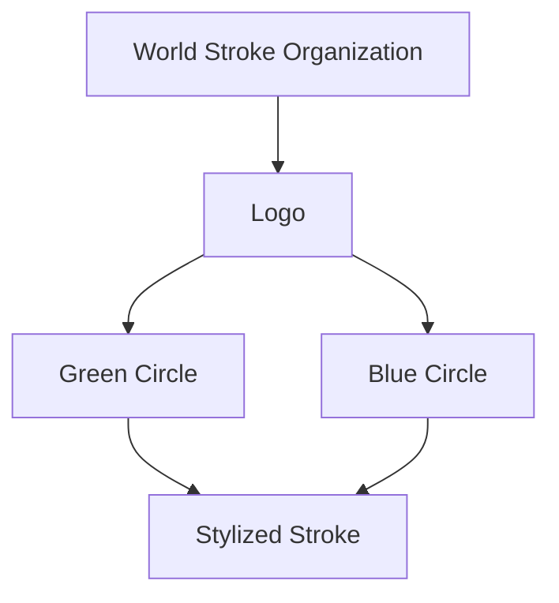


## Tổ Chức Đột Quỵ Toàn Cầu Hướng Dẫn và Kế Hoạch Hành Động: Lộ Trình Chăm Sóc Bệnh Nhân Đột Quỵ Chất Lượng Cao

## CHĂM SÓC TIỀN NHẬP VIỆN VÀ CHĂM SÓC CẤP CỨU

Các tác giả: Lindsay MP , Norrving B, Furie KL, Donnan G, Langhorne P , Davis S Nhân Đột Quỵ Toàn Cầu,

Nhóm Làm Việc về Các Hướng Dẫn Chăm Sóc Bệnh Nhân Đột Quỵ Toàn Cầu, Cầu.

Thay Mặt Ủy Ban Cố Vấn về Hướng Dẫn và Chất Lượng của Dịch Vụ Chăm Sóc Bệnh và Nhóm Làm Việc về Chất Lượng của Dịch Vụ Chăm Sóc Bệnh Nhân Đột Quỵ Toàn

Hướng Dẫn và Kế Hoạch Hành Động về Dịch Vụ Chăm Sóc Bệnh Nhân Đột Quỵ Toàn Cầu:

Đạt Được và Theo Dõi Dịch Vụ Chăm Sóc Bệnh Nhân Đột Quỵ Chất Lượng Cao

CHĂM SÓC TIỀN NHẬP VIỆN VÀ CHĂM SÓC CẤP CỨU

22

## CHĂM SÓC TIỀN NHẬP VIỆN VÀ CHĂM SÓC CẤP CỨU

Phần này tập trung vào những giờ đầu tiên sau khi bị đột quỵ.  Điều này bao gồm đánh giá, chẩn đoán và kiểm soát đột quỵ sớm ngay từ lần đầu khởi phát các triệu chứng đột quỵ trong suốt 24 đến 48 giờ đầu tiên, khi bệnh nhân trở nên ổn định về mặt y tế. Mục tiêu chăm sóc trong giai đoạn này là để chẩn đoán loại đột quỵ (thiếu máu cục bộ hoặc xuất huyết), và bắt đầu các phương pháp điều trị nhạy cảm với thời gian để giảm thiểu tác động của đột quỵ và ngăn ngừa tình trạng tiếp tục tổn thương.  Tốt nhất dịch vụ chăm sóc bệnh nhân đột quỵ siêu cấp tính nên bao gồm các nhà cung cấp dịch vụ chăm sóc sức khoẻ có chuyên môn về chăm sóc đột quỵ, và diễn ra tại phòng khám hoặc phòng cấp cứu, nhưng có thể diễn ra ở những môi trường khác dựa trên nguồn lực và cơ sở vật chất sẵn có.

Danh Sách Kiểm Tra Năng Lực Dịch Vụ Y Tế cho Dịch Vụ Chăm Sóc cho Bệnh Nhân Đột Quỵ^

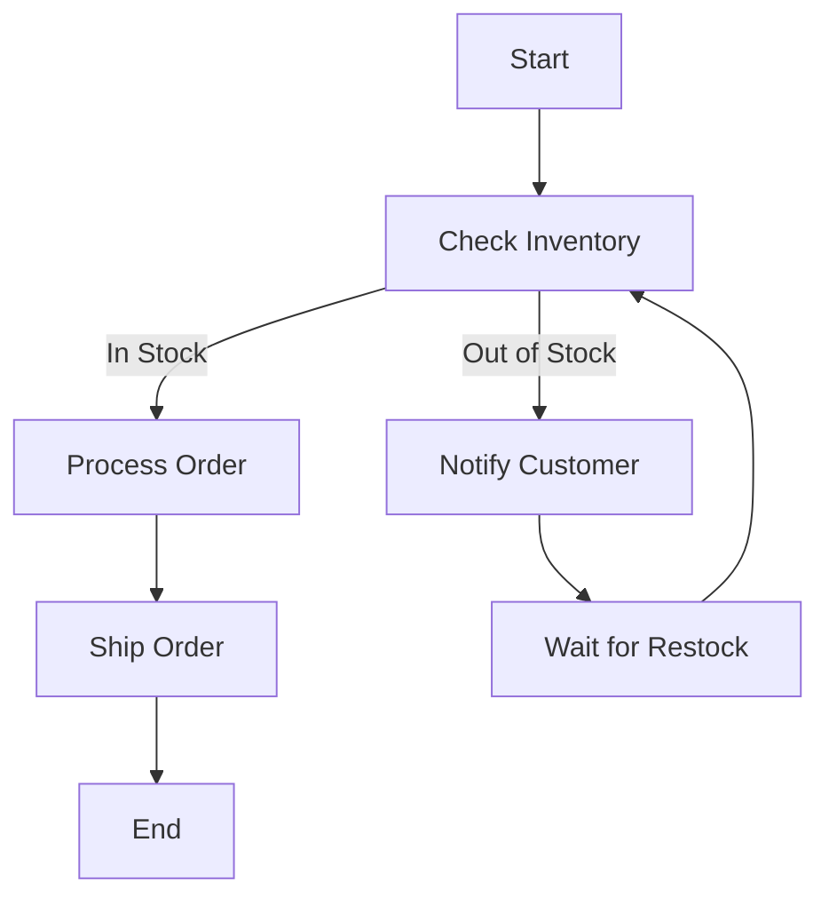


Vui lòng hoàn thành các thông tin sau để xác định rõ các dịch vụ chăm sóc cho bệnh nhân đột quỵ mà quý vị đang triển khai hoặc đánh giá.

| KHUVỰC:   | DANHSÁCHKIỂMTRATỔCHỨCHOÀNTHIỆN:   | NGƯỜI LIÊN HỆ CHÍNH:   |
|-----------|-----------------------------------|------------------------|

KHU VỰC:

DANH SÁCH KIỂM TRA TỔ CHỨC HOÀN THIỆN:                             NGƯỜI LIÊN HỆ CHÍNH:

## PHẠM VI DỊCH VỤ:

MỤC ĐÍCH CỦA ĐÁNH GIÁ/NHẬN XÉT NÀY:

Hoàn thành bởi nhóm địa phương

- [ ] Đánh Giá Cấp Tỉnh/Tiểu Bang/Quốc Gia

- [ ] Đánh giá của Khu Vực/Địa Phương

- Bệnh viện đô thị lớn với dịch vụ chăm sóc bệnh nhân đột quỵ cao cấp (dịch vụ chăm sóc bệnh nhân đột quỵ toàn diện)

- Các bệnh viện cộng đồng cung cấp sự tiếp cận đối với một số dịch vụ chăm sóc bệnh nhân đột quỵ

- Cộng đồng có phòng khám y tế là dịch vụ chăm sóc sức khỏe duy nhất

- Cộng đồng nông thôn có nhân viên y tế đến thăm khám

## LỘ TRÌNH CHĂM SÓC BỆNH NHÂN ĐỘT QUỴ CHẤT LƯỢNG CAO

| Dịch Vụ Chăm Sóc Sức Khỏe Tổng Thể | Cách Dịch Vụ Chăm Sóc Bệnh Nhân Đột Quý Cấp Thiết (Người cách dịch vụ được điền trực tiếp vào lưới) | Cách Dịch Vụ Chăm Sóc Bệnh Nhân Đột Quý Cấp Cấp (Người cách dịch vụ được điền trực tiếp vào lưới và cập nhật) |
|-----------------------------------|-------------------------------------------------------------------------------------------------------------|----------------------------------------------------------------------------------------------------------------|
| ✅ Có thể cung cấp dịch vụ chăm sóc tại cộng đồng (đa phương mã không có sự phối hợp giữa các khu vực địa lý xác định) | ✅ Tiếp cận các dịch vụ chăn dòan cao bán <br> - Xét nghiệm (BCH, máu trong phòng thí nghiệm glucose, INR, PT) <br> - Điện tâm đồ (12 dẫn điện tâm đồ) <br> - Chụp Cát Lộp (CT) nào và hệ máy <br> - Năng lượng CT Mạch Máu (CTA) <br> - Siêu âm tim <br> - Siêu âm Doppler <br> - Màu dò nhịp tim Holter | ✅ Tiếp cận các dịch vụ chăn dòan cao cấp <br> - Chụp Cóng Hưởng Tự (MRI) <br> - Năng Lượng Hưởng Tự Màu <br> - Chụp CT Tự Hiệu Màu <br> - Cách tiếp và đọc ECG kèo dài <br> - Đột quý với bệnh sởi có chứng mỏi <br> - Bác sĩ gây phát thân kinh <br> - Bác sĩ chẩn đoán hình ảnh não/ bác sĩ can thiệp <br> - Bác sĩ xây dựng chăm sóc cho bệnh nhân nguy kịch <br> - Làm việc với các chủng loại thương được xác định đúng nhu là trình thường hợp cấp cứu cần mức tiêu chuẩn chứng cao, ngõi các chẩn đống và nguy cơ san khóa <br> - Được chuyển qua tầm định giá đến vè chăm sóc bệnh nhân đột quý <br> - Địa điểm chăm sóc ban đầu <br> - Địa điểm chăm sóc cấp tính <br> - Y tế được đậu ta ngày cao <br> - Chuyển viện điều dưỡng |
| ❌ Không thể tiếp cận các dịch vụ chăm dòan hóa học chẩn đoán hoặc dịch vụ chăm sóc tại bệnh viện để điều trị đột quý siêu cấp | ✅ Tiếp cận các dịch vụ chăm sóc hỗ trợ <br> - Bác sĩ Đa khoa/Gia đình/Chăm sóc chính <br> - Nhân sự chăm sóc <br> - Bác sĩ giải phẫu thần kinh <br> - Bác sĩ nội khoa <br> - Bác sĩ tim mạch <br> - Bác sĩ khoa Cứu <br> - Bác sĩ chuyên chăm sóc bệnh nhân nguy kịch <br> - Tiếp cận với các chuyên gia về đột quý điều qua phương thức điều trị đột quý tự xa, và chụp Xquang viện thông <br> - Tiếp cận với liên hợp tâm hưng | ✅ Tiếp cận các dịch vụ chăm sóc hỗ trợ <br> - tPA (Alteplase) được truyển qua đường tĩnh mạch <br> - Hút huyết không lọc máu <br> - Phẫu thuật thân kinh cho bệnh nhân đột quý huyết <br> - Phẫu thuật mở hộp sọ ban phân cho bệnh nhân đột quý thiểu máu cục bộ <br> - Các dồn và chỉ số bệnh nhân mấu trương đột quý cấp tính <br> - Săn phạm để điều trị chủng loại đơn dưỡng máu |
| ❌ Tiếp cận với các bác sĩ rắt hạn chế <br> - Cung cấp chủng loại phát triển kĩ năng đòan <br> - Tập huấn cơ bản về khám sang lọc rọi loan chủc nắng nuốt và kiêm soát chưng khoá nuốt; và kiểm soát nhiệt độ | ✅ Sử dụng các công cụ chẩn đoán và trị <br> - Đào tạo dồi củ thống để đánh giá các đầu đo thuần quý bằng cách sử dụng phương pháp nòng FASCT <br> - Làm việc với các chủng loại thương được xác định đúng nhu là trình thường hợp cấp cứu cần mức tiêu chuẩn chứng cao, ngõi các chẩn đống và nguy cơ san khóa <br> - Được chuyển qua tầm định giá đến vè chăm sóc bệnh nhân đột quý <br> - Địa điểm chăm sóc ban đầu <br> - Địa điểm chăm sóc cấp tính <br> - Y tế được đậu ta ngày cao <br> - Chuyển viện điều dưỡng | ✅ Đột quý với bệnh sởi có chứng mỏi <br> - Bác sĩ gây phát thân kinh <br> - Bác sĩ chẩn đoán hình ảnh não/ bác sĩ can thiệp <br> - Bác sĩ xây dựng chăm sóc cho bệnh nhân nguy kịch <br> - Làm việc với các chủng loại thương được xác định đúng nhu là trình thường hợp cấp cứu cần mức tiêu chuẩn chứng cao, ngõi các chẩn đống và nguy cơ san khóa <br> - Được chuyển qua tầm định giá đến vè chăm sóc bệnh nhân đột quý <br> - Địa điểm chăm sóc ban đầu <br> - Địa điểm chăm sóc cấp tính <br> - Y tế được đậu ta ngày cao <br> - Chuyển viện điều dưỡng |
| ❌ Thay đổi mức độ tiếp cận tới nhân viên chăm sóc sức khỏe (y tá chuyên nhân dược) sốt tại hoàn cảnh loc <br> - Tạp huấn cơ bản về khám sang lọc rọi loan chủc nắng nuốt và kiêm soát chưng khoá nuốt; và kiểm soát nhiệt độ | ✅ Tiếp cận với các chuyên gia về đột quý <br> - Bác sĩ Đa khoa/Gia đình/Chăm sóc chính <br> - Nhân sự chăm sóc <br> - Bác sĩ giải phẫu thần kinh <br> - Bác sĩ nội khoa <br> - Bác sĩ tim mạch <br> - Bác sĩ khoa Cứu <br> - Bác sĩ chuyên chăm sóc bệnh nhân nguy kịch <br> - Tiếp cận với các chuyên gia về đột quý điều qua phương thức điều trị đột quý tự xa, và chụp Xquang viện thông <br> - Tiếp cận với liên hợp tâm hưng | ✅ Tiếp cận với các chuyên gia về đột quý <br> - tPA (Alteplase) được truyển qua đường tĩnh mạch <br> - Hút huyết không lọc máu <br> - Phẫu thuật thân kinh cho bệnh nhân đột quý huyết <br> - Phẫu thuật mở hộp sọ ban phân cho bệnh nhân đột quý thiểu máu cục bộ <br> - Các dồn và chỉ số bệnh nhân mấu trương đột quý cấp tính <br> - Săn phạm để điều trị chủng loại đơn dưỡng máu |
| ❌ | ✅ Tiếp cận với liên hợp tâm hưng | ✅ Tiếp cận với liên hợp tâm hưng <br> - Y tá <br> - Trợ lý điều dưỡng <br> - Dược sĩ <br> - Nhóm Chăm Sóc Giám Nhệ |


## LỘ TRÌNH CHĂM SÓC BỆNH NHÂN ĐỘT QUỴ CHẤT LƯỢNG CAO

| Các thành viên của nhóm đệt quy liên ngành | Các Địa Vụ Chăm Sóc Bệnh Nhân Đốt Quy  
(Địa Vụ Chăm Sóc Bệnh Nhân Đốt Quy Được Nhiệm Được Nhiệm Khác Mục - Địa Vụ Chăm Sóc Bệnh Nhân Đốt Quy Được Nhiệm Được Nhiệm Khác Mục) | Các Địa Vụ Chăm Sóc Bệnh Nhân Đốt Quy Được Nhiệm Được Nhiệm Khác Mục - Địa Vụ Chăm Sóc Bệnh Nhân Đốt Quy Được Nhiệm Được Nhiệm Khác Mục (tối thiểu và cấp thiết) |
| --- | --- | --- |
| - Bác sĩ cơ chuẩn môn đệt quy  
- Y Tả Chăm Sóc Bệnh Nhân Đốt Quy  
- Trợ lý điều dưỡng  
- Dược sĩ  
- Nhân viên xã hội/quản lý trường hợp  
- Nhóm Chăm Sóc Giám Nhện  
- Nhà Vật Lý Tả  
- Nhà Trị Liệu Chúc Năng Vạn Động  
- Nhà Trị Liệu Ngư | - Địa Vụ chăm sóc bệnh nhân đệt quy phố hệ đáp ứng đủ đúc tập trong các khu vực địa lý riêng biệt  
- Các địa vụ chăm sóc bệnh nhân đệt quy có cấp độ phục vụ lý hoàn thành một số trường hợp nhỏ hơn  
- Lộ trình chở bệnh nhân đệt quy xác định hướng đi chuyển của bệnh nhân đệt quy trong khu vực tới các cấp dịch vụ cao hơn và tháp hỗn theo yêu cầu  
- Hệ thống giới giới phải hợp  
- Cung cấp tư vấn về đệt quy tới các trường tâm nhỏ hơn và hệ thống  
- Cở thoại thuận tiện qua xe cứu thương  
- Cở thoại thuận tiện chuyển bệnh nhân tới các công đoạn tại nơi sinh sống  
- Bán tự tài liệu dược về bệnh nhân đệt quy | - Địa Vụ chăm sóc bệnh nhân đệt quy cho tất cả các cấp độ có nhau cung cấp dịch vụ chăm sóc sức khỏe  
- Chiến lược và cơ chế thu đáp liệu  
- Số dáng ký bệnh nhân nội trú đệt quy cấp tinh  
- Co sơ dư liệu bệnh nhân nội trú đệt quy cấp tinh (địa phương hoặc khu vực)  
- Số dáng ký phòng chống đệt quy  
- Co sơ dư liệu phòng chống đệt quy  
- Số dáng ký phục hồi sau đệt quy  
- Co sơ dư liệu phục hồi sau đệt quy (địa phương hoặc khu vực) |


| DịchVụ ChămSóc Sức Khỏe Tối Thiểu   | Các DịchVụ ChămSóc Bệnh Nhân Đột Quỵ CấpThiết (Ngoài các dịch vụ được liệt kê trong mục Dịch vụ chăm sóc bệnh nhân đột quỵ tối                                                                                                                                                                                                                                                                                                                                                                                                                                                                                                                                                                | Các DịchVụ ChămSóc Bệnh Nhân Đột Quỵ Cao Cấp (Ngoài các dịch vụ được liệt kê trong mục Các dịch vụ chăm sóc bệnh nhân đột quỵ                                                                                                                                                                                                                                                                                                                                                                                                                                                                                                                                                                                                                                                                                                                                                                                                                                                                                                                                                            |
|-------------------------------------|-----------------------------------------------------------------------------------------------------------------------------------------------------------------------------------------------------------------------------------------------------------------------------------------------------------------------------------------------------------------------------------------------------------------------------------------------------------------------------------------------------------------------------------------------------------------------------------------------------------------------------------------------------------------------------------------------|------------------------------------------------------------------------------------------------------------------------------------------------------------------------------------------------------------------------------------------------------------------------------------------------------------------------------------------------------------------------------------------------------------------------------------------------------------------------------------------------------------------------------------------------------------------------------------------------------------------------------------------------------------------------------------------------------------------------------------------------------------------------------------------------------------------------------------------------------------------------------------------------------------------------------------------------------------------------------------------------------------------------------------------------------------------------------------------|
|                                     | Các thành viên của nhóm đột quỵ liên ngành • Bác sĩ có chuyên mônđột quỵ • YTá Chăm Sóc Bệnh Nhân Đột Quỵ • Trợ lý điều dưỡng • Dược sĩ • Nhân viên xã hội/quản lý trường hợp • NhómChămSóc Giảm Nhẹ • Nhà vật lý trị liệu • NhàTrị Liệu Chức NăngVận Động • NhàTrị Liệu Ngôn Ngữ Các phác đồ để đánh giá và chẩn đoán nhanh bệnh nhân đột quỵ Giáo dục, đào tạo kỹ năng và thu hút sự tham gia vào việc lập kế hoạch chăm sóc đối với bệnh nhân và gia đình Lập kế hoạch xuất viện Dịch vụ chăm sóc bệnh nhân đột quỵ phối hợp giới hạn được cung cấp trong các khu vực địa lý rời rạc Các chương trình đào tạo về đột quỵ cho tất cả các cấp của các nhà cung cấp dịch vụ chăm sóc sức khỏe | Dịch vụ chăm sóc bệnh nhân đột quỵ phối hợp đầy đủ được cung cấp trong các khu vực địa lý riêng biệt • Các dịch vụ chăm sóc bệnh nhân đột quỵ cao cấp được hợp lý hóa thành một số trung tâm nhỏ hơn • Lộ trình cho bệnh nhân đột quỵ xác định hướng di chuyển của bệnh nhân đột quỵ trong khu vực tới các cấp dịch vụ cao hơn và thấp hơn theo yêu cầu • Hệ thống giới thiệu phối hợp • Cung cấp tư vấn về đột quỵ từ xa tới các trung tâm nhỏ hơn và hẻo lánh hơn • Có thoả thuận bỏ qua xe cứu thương • Có thoả thuận hồi hương để chuyển bệnh nhân trở về cộng đồng tại nơi sinh sống • Bản in tài liệu giáo dục về bệnh nhân đột quỵ Các chương trình đào tạo về đột quỵ cho tất cả các cấp của các nhà cung cấp dịch vụ chăm sóc sức khỏe Chiến lược và cơ chế thu thập dữ liệu • Sổ đăng ký bệnh nhân nội trú đột quỵ cấp tính • Cơ sở dữ liệu bệnh nhân nội trú đột quỵ cấp tính (địa phương hoặc khu vực) • Sổ đăng ký phòng chống đột quỵ • Cơ sở dữ liệu phòng chống đột quỵ • Sổ đăng ký phục hồi sau đột quỵ • Cơ sở dữ liệu phục hồi sau đột quỵ (địa phương hoặc khu vực) |

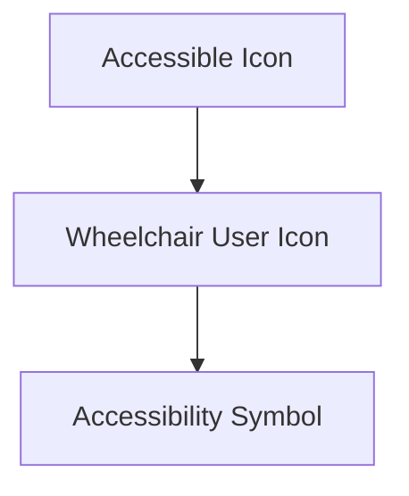


## LỘ TRÌNH CHĂM SÓC BỆNH NHÂN ĐỘT QUỴ CHẤT LƯỢNG CAO

## B. Các Khuyến Nghị Chính về Chăm Sóc Bệnh Nhân Đột quỵ

Đối với mỗi khuyến nghị thực hành tốt, đánh dấu để cho biết liệu các thực hành mô tả có sẵn là một phần của dịch vụ chăm sóc định kỳ; trong quá trình triển khai thực hiện; không được thực hiện, nghĩa là dịch vụ/nguồn lực có thể có sẵn nhưng hiện tại không phải là một phần của dịch vụ chăm sóc bệnh nhân đột quỵ trong các dịch vụ của quý vị; hoặc, các dịch vụ/nguồn lực/thiết bị không có sẵn tại các cơ sở của quý vị, do đó không thể thực hiện.

|  |  |  |
| --- | --- | --- |
|  |  |  |
|  |  |  |


|   | 2023 | 2024 | 2025 |
|---|:---:|:---:|:---:|
| Q1 | 50  | 55  | 60  |
| Q2 | 55  | 60  | 65  |
| Q3 | 60  | 65  | 70  |
| Q4 | 65  | 70  | 75  |


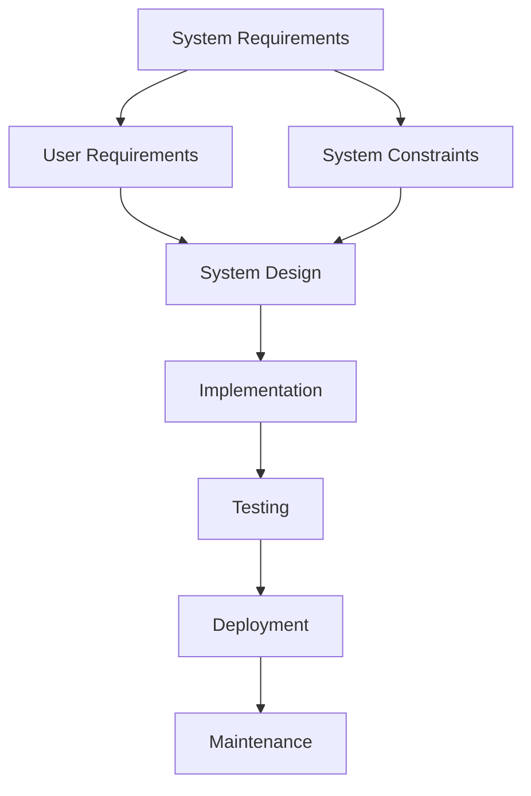


| Name          | Age | Gender | Occupation    |
|---------------|-----|--------|---------------|
| Alice         | 30  | Female | Engineer      |
| Bob           | 25  | Male   | Doctor        |
| Charlie       | 35  | Male   | Teacher       |
| Diana         | 28  | Female | Artist        |


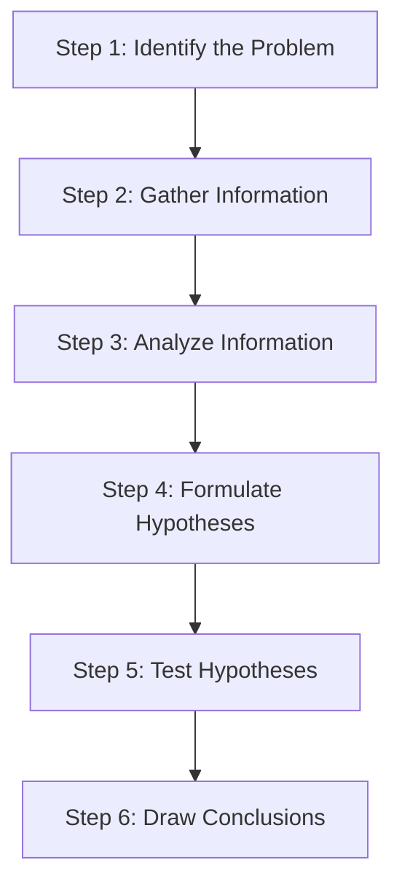


|       |         |          |
|-------|---------|----------|
|  1    |    A    | 10.00    |
|  2    |    B    |  7.50    |
|  3    |    C    |  5.25    |


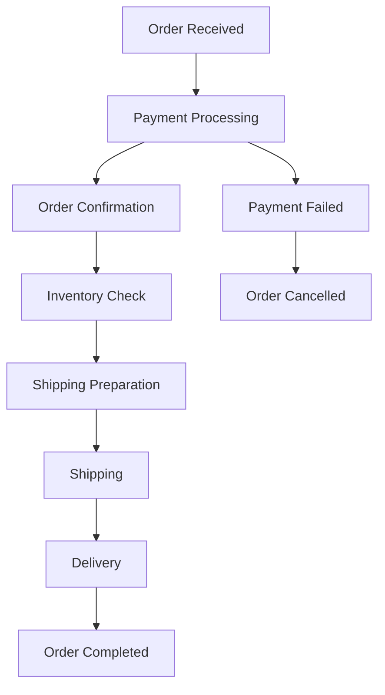


| HệThốngYTế và Nhận Biết Đột Quỵ Các Khuyến Nghị Chính DựaTrên Các Bằng Chứng                                                                                                                                                                                                                                                                                                                  | Cấp Độ Năng Lực DịchVụYTế Áp Dụng để ChămSóc Bệnh Nhân Đột   | Cấp Độ Năng Lực DịchVụYTế Áp Dụng để ChămSóc Bệnh Nhân Đột   | Cấp Độ Năng Lực DịchVụYTế Áp Dụng để ChămSóc Bệnh Nhân Đột   | Bằng Chứng HỗTrợ     | Tự Đánh Giá                                            |
|-----------------------------------------------------------------------------------------------------------------------------------------------------------------------------------------------------------------------------------------------------------------------------------------------------------------------------------------------------------------------------------------------|--------------------------------------------------------------|--------------------------------------------------------------|--------------------------------------------------------------|----------------------|--------------------------------------------------------|
|                                                                                                                                                                                                                                                                                                                                                                                               | Tối thiểu                                                    | Quỵ Cấp thiết                                                | Cao cấp                                                      |                      |                                                        |
| 1. Nên thu thập, ghi chép và thông báo cho nhân viên chăm sóc sức khoẻ về dấu hiệu khởi phát triệu chứng đột quỵ                                                                                                                                                                                                                                                                              |                                                              |                                                              |                                                              | Cấp độ bằng chứng: C | Có sẵn Đang được hoàn tất Không thực hiện Không có sẵn |
| 2. Tất cả bệnh nhân có các triệu chứng đột quỵ nên được vận chuyển đến viện chăm sóc sức khoẻ màcó thể cung cấp các dịch vụ chăm sóc có tổ chức cho bệnh nhân đột quỵ.                                                                                                                                                                                                                        |                                                              |                                                              |                                                              | Cấp độ bằng chứng: B | Có sẵn Đang được hoàn tất Không thực hiện Không có sẵn |
| 3. Tất cả các bệnh nhân có triệu chứng thần kinh khu trú/ triệu chứng đột quỵ cần phải tiến hành chụp não (chụp CT hoặc MRI) ngay.                                                                                                                                                                                                                                                            |                                                              |                                                              |                                                              | Cấp độ bằng chứng: B | Có sẵn Đang được hoàn tất Không thực hiện Không có sẵn |
| 4. Nên thực hiện xét nghiệm máu ban đầu                                                                                                                                                                                                                                                                                                                                                       |                                                              |                                                              |                                                              | Cấp độ bằng chứng: B | Có sẵn Đang được hoàn tất Không thực hiện Không có sẵn |
| 5. Tất cả các bệnh nhân nên thực hiện điện tâm đồ, đặc biệt là đối với các bệnh nhân có bệnh sử lâm sàng hoặc bằng chứng về bệnh tim hoặc bệnh phổi.                                                                                                                                                                                                                                          |                                                              |                                                              |                                                              | Cấp độ bằng chứng: B | Có sẵn Đang được hoàn tất Không thực hiện Không có sẵn |
| 6. Tất cả bệnh nhân bị đột quỵ nên được thăm khám sàng lọc hoặc đánh giá rối loạn chức năng nuốt của mình để xác định chứng khó nuốt có thể mắc phải trước khi đưa thức ăn, thức uống hoặc thuốc uống cho bệnh nhân.                                                                                                                                                                          |                                                              |                                                              |                                                              | Cấp độ bằng chứng: C | Có sẵn Đang được hoàn tất Không thực hiện Không có sẵn |
| 7. Tất cảcác bệnh nhân bị đột quỵ do thiếu máu cục bộ cấp tính có thể được điều trị trong vòng 4,5 giờ kể từ khi khởi phát triệu chứng nên được bác sĩ có chuyên mônvề đột quỵ (tại chỗ hoặc thông qua tư vấn về y tế từ xa/tư vấn về đột quỵ từ xa) đánh giá không chậm trễ để xác định tính đủ điều kiện để điều trị bằng chất hoạt hóa plasminogen môđược truyền qua đường tĩnh mạch (tPA) |                                                              |                                                              |                                                              | Cấp độ bằng chứng: A | Có sẵn Đang được hoàn tất Không thực hiện Không có sẵn |

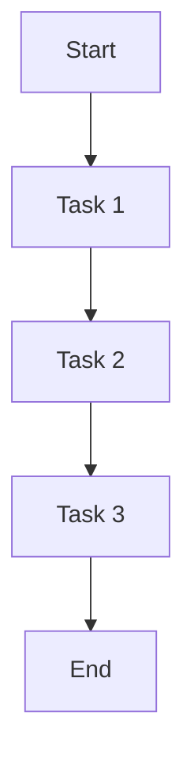


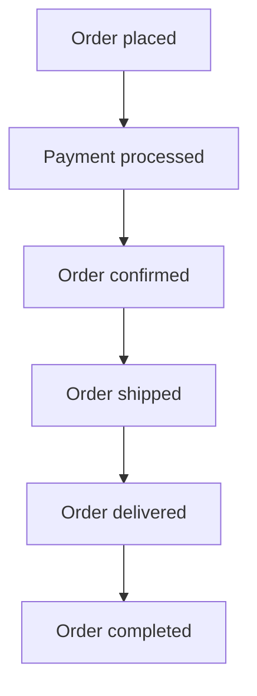


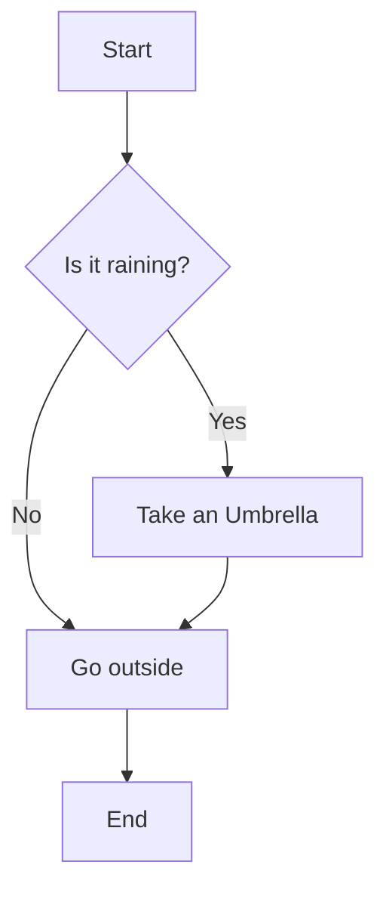


| HệThốngYTế và Nhận Biết Đột Quỵ Các Khuyến Nghị Chính DựaTrên Các Bằng Chứng                                                                                                                                                                                                                                                                                                                                                                                                                                           | Cấp Độ Năng Lực DịchVụYTế Áp Dụng để ChămSóc Bệnh Nhân Đột   | Quỵ       | Cấp Độ Năng Lực DịchVụYTế Áp Dụng để ChămSóc Bệnh Nhân Đột   | Bằng Chứng HỗTrợ     | Tự Đánh Giá                                            |
|------------------------------------------------------------------------------------------------------------------------------------------------------------------------------------------------------------------------------------------------------------------------------------------------------------------------------------------------------------------------------------------------------------------------------------------------------------------------------------------------------------------------|--------------------------------------------------------------|-----------|--------------------------------------------------------------|----------------------|--------------------------------------------------------|
|                                                                                                                                                                                                                                                                                                                                                                                                                                                                                                                        | Tối thiểu                                                    | Cấp thiết | Cao cấp                                                      |                      |                                                        |
| 8. Tất cả các bệnh nhân bị tắc nghẽn mạch lớn (LVO) và đột quỵ cấp tính do thiếu máu cục bộ (AIS) cần được đánh giá để hút huyết khối nội mạch ở những nơi có sẵn các biện pháp can thiệp (tại chỗ hoặc thông qua việc chuyển tới một trung tâm đột quỵ khác cung cấp liệu pháp nội mạch). Hút huyết khối nội mạch hiện tại là tiêu chuẩn chăm sóc dành cho những bệnh nhân đã được chọn bị mắc chứng đột quỵ cấp tính do thiếu máu cục bộ và tắc nghẽn mạch lớn xuất hiện trong vòng 6 giờ sau khi khởi phát đột quỵ. |                                                              |           |                                                              | Cấp độ bằng chứng: A | Có sẵn Đang được hoàn tất Không thực hiện Không có sẵn |
| 9. Tất cả bệnh nhân bị đột quỵ cấp tính do thiếu máu cục bộ chưa dùng thuốc chống kết tụ tiểu cầu và những người không dùng alteplase nên dùng axit acetylsalicylic (ASA) ngay lập tức như là liều nạp một lần (300 - 325 mg)sauđólà75-150mgmỗi ngày sau khi chụp não đã loại trừ tình trạng xuất huyết trong hộp sọ.                                                                                                                                                                                                  |                                                              |           |                                                              | Cấp độ bằng chứng: A | Có sẵn Đang được hoàn tất Không thực hiện Không có sẵn |
| 10. Xuất huyết trong não phải được phát hiện ngay và bệnh nhân phải được các bác sĩ có chuyên mônvề kiểm soát đột quỵ siêu cấp tính đánh giá ngay lập tức                                                                                                                                                                                                                                                                                                                                                              |                                                              |           |                                                              | Cấp độ bằng chứng: C | Có sẵn Đang được hoàn tất Không thực hiện Không có sẵn |
| 11. Bệnh nhân bị đột quỵ cấp tính phải được nhập viện.                                                                                                                                                                                                                                                                                                                                                                                                                                                                 |                                                              |           |                                                              | Cấp độ bằng chứng: A | Có sẵn Đang được hoàn tất Không thực hiện Không có sẵn |
| 12. Bệnh nhân bị đột quỵ nhẹ hoặc cơn thiếu máunãocục bộ tạm thời phải được đánh giá khẩn cấp và bắt đầu tiến hành kiểm soát phòng ngừa, ở trong bệnh viện hoặc được điều trị tại một phòng khám chuyên mônngoại trú.                                                                                                                                                                                                                                                                                                  |                                                              |           |                                                              | Cấp độ bằng chứng: B | Có sẵn Đang được hoàn tất Không thực hiện Không có sẵn |

## LỘ TRÌNH CHĂM SÓC BỆNH NHÂN ĐỘT QUỴ CHẤT LƯỢNG CAO

Các khuyến nghị nào là những ưu tiên hàng đầu để thực hiện của quý vị?

Các bước tiếp theo để quý vị bắt đầu phát triển và thực hiện những thực hành tốt này là gì?

## LỘ TRÌNH CHĂM SÓC BỆNH NHÂN ĐỘT QUỴ CHẤT LƯỢNG CAO

## C. Các Chỉ Số Chính về Chất Lượng Chăm Sóc Bệnh Nhân Đột Quỵ

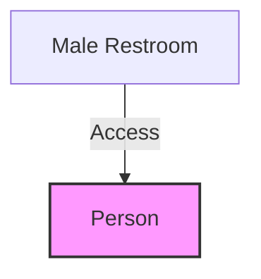


Đối với mỗi chỉ số chất lượng, hãy ghi chú về tình trạng liệu rằng dữ liệu đang được thu thập tích cực và thường xuyên; hoặc, đang được hoàn tất quá trình thu thập dữ liệu để có được chỉ số; hoặc, có thể có dữ liệu nhưng hiện tại không được thu thập; hoặc, không hề có dữ liệu cho chỉ số này nên không thể thu thập hoặc báo cáo. Hãy đánh dấu vào ô thích hợp nhất cho mỗi chỉ số.

| Các Biện PhápThực                                                      | Hiện                                                                                                                               | Tử số                                                                                                                                                                                                                                                                   | Mẫusố                                                                                                                                                                                                                                                                                                                                    | Tự Đánh Giá                                                                               |
|------------------------------------------------------------------------|------------------------------------------------------------------------------------------------------------------------------------|-------------------------------------------------------------------------------------------------------------------------------------------------------------------------------------------------------------------------------------------------------------------------|------------------------------------------------------------------------------------------------------------------------------------------------------------------------------------------------------------------------------------------------------------------------------------------------------------------------------------------|-------------------------------------------------------------------------------------------|
| ChămSóc Bệnh Nhân Đột Quỵ Siêu CấpTính (những giờ đầu sau khi đột quỵ) | ChămSóc Bệnh Nhân Đột Quỵ Siêu CấpTính (những giờ đầu sau khi đột quỵ)                                                             | ChămSóc Bệnh Nhân Đột Quỵ Siêu CấpTính (những giờ đầu sau khi đột quỵ)                                                                                                                                                                                                  | ChămSóc Bệnh Nhân Đột Quỵ Siêu CấpTính (những giờ đầu sau khi đột quỵ)                                                                                                                                                                                                                                                                   | ChămSóc Bệnh Nhân Đột Quỵ Siêu CấpTính (những giờ đầu sau khi đột quỵ)                    |
| 1.                                                                     | Thời gian từ lúc khởi phát đột quỵ cho đến khi chuyên gia chăm sóc sức khỏe đánh giá (tính bằng phút/giờ).                         | Giờ/phút trung vị từ thời gian Tình Trạng Bình Thường ỞLần Gặp Cuối cho đến khi đến Phòng Cấp Cứu đối với tất cả các bệnh nhân bị đột quỵ và TIA                                                                                                                        | Tổng số các trường hợp đột quỵ và/hoặc thiếu máu cục bộ thoáng qua (TIA) trong dân cư. Hoặc Tổng số trường hợp đột quỵ do thiếu máu cục bộ được nhập vào ED hoặc bệnh viện (tùy thuộc vào thực tế tại địa phương).                                                                                                                       | Dữ liệu được thu thập Đang được hoàn tất Dữ liệu không được thu thập Dữ liệu không có sẵn |
| 2.                                                                     | Tỷ lệ bệnh nhân bị đột quỵ và TIA chụp CT trong vòng một giờ kể từ khi đến bệnh viện và trong vòng 24 giờ kể từ khi đến bệnh viện. | KQI2.a Bắt đầu chụp CT (lớp đầu tiên) trong vòng 1 giờ kể từ khi đến bệnh viện (Có/ không) KQ2.b Bắt đầu chụp CT (lớp đầu tiên) trong vòng 24 giờ kể từ khi đến bệnh viện (Có/ không)                                                                                   | Tổng số các trường hợp đột quỵ và/hoặc thiếu máu cục bộ thoáng qua (TIA) trong dân cư. Hoặc Tổng số trường hợp đột quỵ do thiếu máu cục bộ được nhập vào ED hoặc bệnh viện (tùy thuộc vào thực tế tại địa phương).                                                                                                                       | Dữ liệu được thu thập Đang được hoàn tất Dữ liệu không được thu thập Dữ liệu không có sẵn |
| 3.                                                                     | Tỷ lệ bệnh nhân bị đột quỵ và TIA được khám sàng lọc hoặc đánh giá về thiếu hụt chức năng nuốt.                                    | Số trường hợp bị đột quỵ/TIA có hồ sơ chứng nhận đã hoàn thành khám sàng lọc rối loạn chức năng nuốt (Không có đánh giá về việc có cấp thiết hay không, khả năng áp dụng hoặc tính đủ điều kiện)                                                                        | Tổng số các trường hợp đột quỵ và/hoặc thiếu máu cục bộ thoáng qua (TIA) trong dân cư. Hoặc Tổng số trường hợp đột quỵ do thiếu máu cục bộ được nhập vào ED hoặc bệnh viện (tùy thuộc vào thực tế tại địa phương).                                                                                                                       | Dữ liệu được thu thập Đang được hoàn tất Dữ liệu không được thu thập Dữ liệu không có sẵn |
| 4.                                                                     | Tỷ lệ bệnh nhân bị đột quỵ do thiếu máu cục bộ được điều trị bằng tPA được truyền qua đường tĩnh mạch.                             | Số lượng tất cả bệnh nhân bị đột quỵ do thiếu máu cục bộ nhận tPA (Alteplase).                                                                                                                                                                                          | 1.Tổng số các trường hợp đột quỵ do thiếu máu cục bộ được tiếp nhập vào ED hoặc bệnh viện (tùy thuộc vào thực tế tại địa phương). 2.Tổng số các trường hợp đột quỵ do thiếu máu cục bộ được tiếp nhập vào ED hoặc bệnh viện (tùy thuộc vào thực tế tại địa phương) người đến trong vòng 4,5 giờ kể từ khi khởi phát triệu chứng đột quỵ. | Dữ liệu được thu thập Đang được hoàn tất Dữ liệu không được thu thập Dữ liệu không có sẵn |
| 5.                                                                     | Thời gian cửa sổ đến kim tiêm đối với bệnh nhân bị đột quỵ do thiếu máu cục bộ mànhận tPA (phút)                                   | Thời gian trung vị (tính bằng phút) từ lúc bệnh nhân đến phòng cấp cứu đến lúc sử dụng tPA đối với tất cả bệnh nhân nhận tPA để điều trị đột quỵ cấp tính Trung Vị (IQR) Số lượng tất cả bệnh nhân bị đột quỵ do thiếu máu cục bộ đã thực hiện hút huyết khối nội mạch. | Tổng số trường hợp đột quỵ do thiếu máu cục bộ được nhập vào ED hoặc bệnh viện (tùy thuộc vào thực tế tại địa phương). Tổng số trường hợp đột quỵ do thiếu máu cục bộ được nhập vào ED hoặc bệnh viện (tùy thuộc vào thực tế tại địa phương).                                                                                            | Dữ liệu được thu thập Đang được hoàn tất Dữ liệu không được thu thập Dữ liệu không có sẵn |

## LỘ TRÌNH CHĂM SÓC BỆNH NHÂN ĐỘT QUỴ CHẤT LƯỢNG CAO

| Các Biện PhápThực Hiện                                                                                                                                  | Tử số                                                                                                                                                                                                                         | Mẫusố                                                                                                                             | Tự Đánh Giá                                                                               |
|---------------------------------------------------------------------------------------------------------------------------------------------------------|-------------------------------------------------------------------------------------------------------------------------------------------------------------------------------------------------------------------------------|-----------------------------------------------------------------------------------------------------------------------------------|-------------------------------------------------------------------------------------------|
| ChămSóc Bệnh Nhân Đột Quỵ Siêu CấpTính (những giờ đầu sau khi đột quỵ)                                                                                  | ChămSóc Bệnh Nhân Đột Quỵ Siêu CấpTính (những giờ đầu sau khi đột quỵ)                                                                                                                                                        | ChămSóc Bệnh Nhân Đột Quỵ Siêu CấpTính (những giờ đầu sau khi đột quỵ)                                                            | ChămSóc Bệnh Nhân Đột Quỵ Siêu CấpTính (những giờ đầu sau khi đột quỵ)                    |
| 6. Tỷ lệ tất cả bệnh nhân bị đột quỵ do thiếu máu cục bộ nhận được điều trị bằng liệu pháp nội mạch cấp tính.                                           | Thời gian trung vị (tính bằng phút) từ lúc bệnh nhân đến phòng cấp cứu để tiếp cận động mạch (ví dụ như chọc dò háng) đối với tất cả các bệnh nhân bị đột quỵ do thiếu máu cục bộ nhận được điều trị bằng liệu pháp nội mạch. | Tổng số trường hợp đột quỵ do thiếu máu cục bộ được nhập vào ED hoặc bệnh viện (tùy thuộc vào thực tế tại địa phương).            | Dữ liệu được thu thập Đang được hoàn tất Dữ liệu không được thu thập Dữ liệu không có sẵn |
| 7. Thời gian trung vị từ khi tới bệnh viện cho đến khi tiếp cận động mạch (như chọc dò háng) cho bệnh nhân đang điều trị bằng liệu pháp nội mạch (phút) | Tỷ lệ các bệnh nhân bị đột quỵ do thiếu máu cục bộ và TIA nhận được điều trị bằng liệu pháp aspirin cấp tính trong vòng 48 giờ đầu tiên sau khi khởi phát triệu chứng.                                                        | Tổng số trường hợp đột quỵ do thiếu máu cục bộ được nhập vào ED hoặc bệnh viện (tùy thuộc vào thực tế tại địa phương).            | Dữ liệu được thu thập Đang được hoàn tất Dữ liệu không được thu thập Dữ liệu không có sẵn |
| 8. Tỷ lệ các bệnh nhân bị đột quỵ và TIA do thiếu máu cục bộ nhận được điều trị bằng liệu pháp aspirin cấp tính trong vòng 48 giờ đầu tiên.             | Tỷ lệ của tất cả các cơ sở chăm sóc sức khỏe công lập/tư nhân trong một khu vực cung cấp chất hoạt hóa plasminogenmô (và trong động mạch) tĩnh mạch và/hoặc liệu pháp nội mạch.                                               | Tổng số trường hợp đột quỵ do thiếu máu cục bộ được nhập vào ED hoặc bệnh viện (tùy thuộc vào thực tế tại địa phương).            | Dữ liệu được thu thập Đang được hoàn tất Dữ liệu không được thu thập Dữ liệu không có sẵn |
| 9. Chỉ số hệ thống - tính sẵn có của thuốc tPA và các dịch vụ nội mạch trong khu vực                                                                    | B. Số lượng chuyên gia trong mỗi tổ chức/ khu vực được đào tạo và có khả năng cung cấp liệu pháp làm tan huyết khối cấp tính                                                                                                  | Số lượng cơ sở dịch vụ y tế trong khu vực (được xác định trước). Số lượng chuyên gia y tế đủ điều kiện trong mỗi tổ chức/ khu vực | Dữ liệu được thu thập Đang được hoàn tất Dữ liệu không được thu thập Dữ liệu không có sẵn |

Các chỉ tiêu nào là ưu tiên hàng đầu của chúng tôi?

Ai sẽ thu thập dữ liệu?

Làm cách nào để thu thập dữ liệu (điện tử, trên giấy, v.v.)?

Dữ liệu sẽ được phân tích như thế nào? Khi nào? Tần suất là như thế nào?

Ai sẽ nhận được kết quả?

```mermaid
graph TD;
    A[World Stroke Organization] --> B[(logo)]
    B --> C[Logo with text]
```


## Tổ Chức Đột Quỵ Toàn Cầu Hướng Dẫn và Kế Hoạch Hành Động: Lộ Trình Chăm Sóc Bệnh Nhân Đột Quỵ Chất Lượng Cao

## NỘI TRÚ CẤP TÍNH DỊCH VỤ CHĂM SÓC BỆNH NHÂN ĐỘT QUỴ

Các tác giả: Lindsay MP , Norrving B, Furie KL, Donnan G, Langhorne P , Davis S Thay Mặt Ủy Ban Cố Vấn về Hướng Dẫn và Chất Lượng của Dịch Vụ Chăm Sóc Bệnh Nhân Đột Quỵ Toàn Cầu,

Nhóm Làm Việc về Các Hướng Dẫn Chăm Sóc Bệnh Nhân Đột Quỵ Toàn Cầu, và Nhóm Làm Việc về Chất Lượng của Dịch Vụ Chăm Sóc Bệnh Nhân Đột Quỵ Toàn Cầu.

Hướng Dẫn và Kế Hoạch Hành Động về Dịch Vụ Chăm Sóc Bệnh Nhân Đột Quỵ Toàn Cầu:

Đạt Được và Theo Dõi Dịch Vụ Chăm Sóc Bệnh Nhân Đột Quỵ Chất Lượng Cao

CHĂM SÓC TIỀN NHẬP VIỆN VÀ CHĂM SÓC CẤP CỨU

31

## LỘ TRÌNH CHĂM SÓC BỆNH NHÂN ĐỘT QUỴ CHẤT LƯỢNG CAO

## CHĂM SÓC BỆNH NHÂN NỘI TRÚ ĐỘT QUỴ CẤP TÍNH

Phần này tập trung vào giai đoạn chăm sóc nội trú cấp tính sau khi hoàn thành giai đoạn siêu cấp tính. Giai đoạn chăm sóc này thường bắt đầu từ khoảng 24 giờ sau khi khởi phát đột quỵ trong 5 đến 7 ngày đầu tiên.  Trong giai đoạn này bệnh nhân trở nên ổn định về mặt y tế và các mục tiêu chăm sóc chuyển sang đánh giá đột quỵ theo tiến trình, xác định bệnh căn, kiểm soát các triệu chứng dai dẳng, bắt đầu hồi phục, phục hồi chức năng sớm và phòng ngừa các biến chứng cấp tính.  Dịch vụ chăm sóc đột quỵ cấp tính lý tưởng bao gồm các nhà cung cấp dịch vụ chăm sóc sức khoẻ có chuyên môn về chăm sóc đột quỵ, và diễn ra tại các phòng khám hoặc đơn vị chăm sóc hoặc khoa đột quỵ tại bệnh viện, nhưng có thể xảy ra trong các địa điểm điều trị khác tại cộng đồng, bao gồm viện chăm sóc, dựa trên nguồn lực và cơ sở vật chất sẵn có.

Danh Sách Kiểm Tra Năng Lực Dịch Vụ Y Tế cho Dịch Vụ Chăm Sóc cho Bệnh Nhân Đột Quỵ^

|  |  |
| --- | --- |
| **Name** | **Age** |
| John Doe | 29 |
| Jane Smith | 34 |
| Jim Beam | 45 |


Vui lòng hoàn thành các thông tin sau để xác định rõ các dịch vụ chăm sóc cho bệnh nhân đột quỵ mà quý vị đang triển khai hoặc đánh giá.

| KHUVỰC:   | DANHSÁCHKIỂMTRATỔCHỨCHOÀNTHIỆN:   | NGƯỜI LIÊN HỆ CHÍNH:   |
|-----------|-----------------------------------|------------------------|

## PHẠM VI DỊCH VỤ:

- [ ] Đánh Giá Cấp Tỉnh/Tiểu Bang/Quốc Gia

- [ ] Đánh giá của Khu Vực/Địa Phương

- Bệnh viện đô thị lớn với dịch vụ chăm sóc bệnh nhân đột quỵ cao cấp (dịch vụ chăm sóc bệnh nhân đột quỵ toàn diện)
- Các bệnh viện cộng đồng cung cấp sự tiếp cận đối với một số dịch vụ chăm sóc bệnh nhân đột quỵ
- Cộng đồng có phòng khám y tế là dịch vụ chăm sóc sức khỏe duy nhất
- Cộng đồng nông thôn có nhân viên y tế đến thăm khám

MỤC ĐÍCH CỦA ĐÁNH GIÁ/NHẬN XÉT NÀY:

Hoàn thành bởi nhóm địa phương

## LỘ TRÌNH CHĂM SÓC BỆNH NHÂN ĐỘT QUỴ CHẤT LƯỢNG CAO

```mermaid
flowchart TD
    A[Dịch Vụ Chăm Sóc Sức Khỏe] --> A1[Cơ thể cung cấp dịch vụ chăm sóc sức khỏe]
    A --> A2[Tiêu chuẩn dịch vụ chăm sóc sức khỏe]
    A --> A3[Độ mức tiêu chuẩn dịch vụ]

    B[Cơ Điện Vụ Chăm Sóc Sức Khỏe Nhân Đột Quy] --> B1[Cơ thể cung cấp dịch vụ chăm sóc sức khỏe nhân đột quy]
    B --> B2[Tiêu chuẩn dịch vụ chăm sóc sức khỏe nhân đột quy]
    B --> B3[Độ mức tiêu chuẩn dịch vụ]

    C[Cơ Điện Vụ Chăm Sóc Dịch Vụ Nhân Đột Quy] --> C1[Cơ thể cung cấp dịch vụ chăm sóc nhân đột quy]
    C --> C2[Tiêu chuẩn dịch vụ chăm sóc nhân đột quy]
    C --> C3[Độ mức tiêu chuẩn dịch vụ]

    A1 --> D1[Cung cấp các chứng trình phát triển kỳ nạng dành giá]
    A1 --> D2[Cung cấp các chứng trình đào tạo về danh giá yếu tố bản đồ nguy cơ đốt quy; huyết áp, rừng nhĩ (kểm tra nhịp tim), tập thể dục, sử dụng dược phẩm (liên quan đến các trường hợp)]
    A1 --> D3[Ký nhận cơ bản trong quy trình tổ chức và thực hiện]
    A1 --> D4[Tập huấn về các kỹ thuật phục hồi cơ thể và làm chậm lại cho gia đình]
    A1 --> D5[Tập huấn cơ bản về khám sang loc rối loạn chức năng nội tiết và kiểm soát chức khỏe nuôi; và kiểm soát nhịp độ]

    A2 --> E1[Đảm bảo các dịch vụ chăm sóc được thực hiện theo tiêu chuẩn]
    A2 --> E2[Đảm bảo các dịch vụ chăm sóc được thực hiện theo tiêu chuẩn]
    A2 --> E3[Tiêu chuẩn dịch vụ chăm sóc sức khỏe]
    A2 --> E4[Tiêu chuẩn dịch vụ chăm sóc sức khỏe]
    A2 --> E5[Tiêu chuẩn dịch vụ chăm sóc sức khỏe]

    B1 --> F1[Tiêu chuẩn dịch vụ chăm sóc cơ bản]
    B1 --> F2[Tiêu chuẩn dịch vụ chăm sóc cơ bản]
    B1 --> F3[Tiêu chuẩn dịch vụ chăm sóc cơ bản]

    C1 --> G1[Tiêu chuẩn dịch vụ chăm sóc cơ bản]
    C1 --> G2[Tiêu chuẩn dịch vụ chăm sóc cơ bản]
    C1 --> G3[Tiêu chuẩn dịch vụ chăm sóc cơ bản]
```


## LỘ TRÌNH CHĂM SÓC BỆNH NHÂN ĐỘT QUỴ CHẤT LƯỢNG CAO

| Dich Vụ Chăm Sóc Sức Khỏe Tới Thiều | Cách Dich Vụ Chăm Sóc Dịch Vụ Nhân Đột Quyết Cấp Điều trị Kế hoạch Dich vụ chăm sóc bệnh nhân đỗ tròng tiện | Cách Dich Vụ Chăm Sóc Dịch Vụ Nhân Đột Quyết Cấp Ngăn Ngừa Dịch Vụ Chăm Sóc Sức Khỏe Tới Thiều và Cấp Thiết) |
| ------------------------------------ | ------------------------------------------------------------ | ------------------------------------------------------------ |
| - Trị lý điều dưỡng  
  - Duoc si  
  - Nhân viên xã hội/quan lý trường hợp  
  - Nhâm Châm Sóc Giảm Nhe  
  - Nha vắt lý tri liệu  
  - Nha Tri Liệu Chức Năng Vận Động  
  - Nha Tri Liệu Ngon Nước  
  - Các phác đồ dể dẫn giá và chăn đoán nhận bệnh nhân đốt quy  
  - Các phác đồ nuông dãn chăm sớc bệnh dân đốt quy cấp tinh đua trển hương dân hành tột  
  - Các đánh giá tẹ và điều dưỡng  
  - Tiên sụ trương dây  
  - Khám sáng lốc rơi chủc nắng nuốt  
  - Dinh dưỡng bù nước  
  - Tinh trang chủc nắng, khá nắng cụ đống,  
  - Nguy cơ khét khí tính mach sầu (DVT)  
  - Mục độ phu thuốc  
  - Tinh toan ven cưa da  
  - Khá nắng kiềm sôdt bàng quang  
  - Nhiệt độ  
  - Các cục hơp liên ngành hảng tuân dể thành vế su tien trần của bệnh nhân dời vói các mục tiêu dịu trí; cấp nhất kê hoach quản lý  
  - Tiếp cận sôm lạc lieụ pháp phuc hồi chủc nắng - bao gồm cả đao tạo kí năng cho các y tá, cả trợ lý điều dưỡng và các thanh viên trong gia dịnh  
  - Giúp dức, dạo tạo kĩ nang và thu hut su tham gia vào việc kế hoạch chăm sốc dối vói bệnh nhân và gia dịnh  
  - Lập kế hoạch xuất viện  
  - Tiếp cận các dịch vụ phuc hồi chủc nắng sau đốt quy  
    - Xây dựng các đanh giá chủc nắng sôm, thiết lập mục tiêu và kế hoạch phuc hồi ca nhân  
  - Tiếp cận liệu pháp phòng ngừa đốt quy nhu thước aspirin, đề nghị thay đổi lối sống, kiệm sôat huyết áp  
  - Dich vụ chăm sóc bệnh nhân đốt quy hợp với han ducung cấp trong các khu vực dia lý rơi rac  
  - Các chuong trinh dao tao vẹ dot quy tát cả các đạp của nhà cung cấp dich vu chăm sóc sức khỏe | - Hệ thống giới thiệu phôi hợp  
  - Cung cấp tư vấn vẻ đỗt quy từ xa  
  - Tỏi các trung tâm hổn và heo lạnh hon  
  - Có thoả thuận bô que cacu thuong  
  - Có thoả thuận hội trường để chuẩn bị thueng vẻ dong tai noi sinh sống  
  - Tiếp cận các bệnh đốt quy: đanh giá chúc nang nuột, thuc an và chất lỏng. Đinh vi, dì chuyên, khá nắng kiềm sôdt, biện chứng (sốt, huyết khô tihn mach sầu (DVT), loét da dò diem ty)  
  - Bán in tài liệu giáo dục vẹ bệnh nhân đốt quy | - Các chuong trinh dao tao vẹ dot quy cho tất cả các cấp của nhà cung cấp dich vu chăm sóc sức khỏe  
  - Chương lưc và cơ chế thup đư liệu  
    - Sổ dạy ký bản nôi trư  
    - Cơ sở dữ liệu bệnh nhân trư đốt quy cấp tin (địa phuong hoặc khu vực)  
    - Sổ dăng ký phòng chổng đốt quy  
    - Cơ sở dữ liệu phòng chổng đốt quy  
    - Sổ dăng ký học sai đốt quy  
    - Cơ sở dữ liệu phúc hồi sau đốt quy (địa phuong hoặc khu vực) |


| DịchVụ ChămSóc Sức Khỏe Tối Thiểu   | Các DịchVụ ChămSóc Bệnh Nhân Đột Quỵ CấpThiết (Ngoài các dịch vụ được liệt kê trong mục Dịch vụ chăm sóc bệnh nhân đột quỵ tối                                                                                                                                                                                                                                                                                                                                                                                                                                                                                                                                                                                                                                                                                                                                                                                                                                                                                                                                                                                                                                                                                                                                                                                                                                                                                                                                                                                          | Các DịchVụ ChămSóc Bệnh Nhân Đột Quỵ Cao Cấp (Ngoài các dịch vụ được liệt kê trong mục Các dịch vụ chăm sóc bệnh nhân đột quỵ                                                                                                                                                                                                                                                                                                                                                                                                                                                                                                                                                                                                                                                                                                                                                                                                                  |
|-------------------------------------|-------------------------------------------------------------------------------------------------------------------------------------------------------------------------------------------------------------------------------------------------------------------------------------------------------------------------------------------------------------------------------------------------------------------------------------------------------------------------------------------------------------------------------------------------------------------------------------------------------------------------------------------------------------------------------------------------------------------------------------------------------------------------------------------------------------------------------------------------------------------------------------------------------------------------------------------------------------------------------------------------------------------------------------------------------------------------------------------------------------------------------------------------------------------------------------------------------------------------------------------------------------------------------------------------------------------------------------------------------------------------------------------------------------------------------------------------------------------------------------------------------------------------|------------------------------------------------------------------------------------------------------------------------------------------------------------------------------------------------------------------------------------------------------------------------------------------------------------------------------------------------------------------------------------------------------------------------------------------------------------------------------------------------------------------------------------------------------------------------------------------------------------------------------------------------------------------------------------------------------------------------------------------------------------------------------------------------------------------------------------------------------------------------------------------------------------------------------------------------|
|                                     | - Trợ lý điều dưỡng - Dược sĩ - Nhânviên xã hội/quản lý trường hợp -NhómChămSócGiảmNhẹ - Nhàvật lý trị liệu - NhàTrị LiệuChứcNăngVậnĐộng - NhàTrị Liệu NgônNgữ • Các phác đồ để đánh giá và chẩn đoán nhanh bệnh nhân đột quỵ • Các phác đồ hướng dẫn chăm sóc bệnh nhân đột quỵ cấp tính dựa trên hướng dẫn thực hành tốt - Các đánh giá y tế và điều dưỡng : - Tiền sử trước đây - Khámsànglọc rối loạn chức năng nuốt - Dinh dưỡng, bù nước - Tình trạng chức năng, khả năng cử động, - Nguy cơ huyết khối tính mạchsâu(DVT) -Mứcđộphụthuộc - Tính toàn vẹn của da - Khả năng kiểm soát bàng quang - Nhiệt độ • Các cuộc họp liên ngành hàng tuần để thảo luận về sự tiến triển của bệnh nhân đối với các mục tiêu điều trị; cập nhật kế hoạch quản lý • Tiếp cận sớm các liệu pháp phục hồi chức năng - bao gồmcả đào tạo kỹ năng cho các y tá, các trợ lý điều dưỡng và các thành viên trong gia đình • Giáo dục, đào tạo kỹ năng và thu hút sự tham gia vào việc lập kế hoạch chăm sóc đối với bệnh nhân và gia đình • Lập kế hoạch xuất viện Tiếp cận với các dịch vụ phục hồi chức năng sau đột quỵ • Xây dựng các đánh giá chức năng sớm, thiết lập mục tiêu và kế hoạch phục hồi cá nhân Tiếp cận các liệu pháp phòng ngừa đột quỵ như thuốc aspirin, đề nghị thay đổi lối sống, kiểm soát huyết áp Dịch vụ chăm sóc bệnh nhân đột quỵ phối hợp giới hạn được cung cấp trong các khu vực địa lý rời rạc Các chương trình đào tạo về đột quỵ cho tất cả các cấp của các nhà cung cấp dịch vụ chăm sóc sức khỏe | Hệ thống giới thiệu phối hợp Cung cấp tư vấn về đột quỵ từ xa tới các trung tâm nhỏ hơn và hẻo lánh hơn • Có thoả thuận bỏ qua xe cứu thương • Có thoả thuận hồi hương để chuyển bệnh nhân trở về cộng đồng tại nơi sinh sống • Tiếp cận các phác đồ chăm sóc bệnh nhân bị đột quỵ: đánh giá chức năng nuốt, thức ăn và chất lỏng. Định vị, di chuyển, khả năng kiểm soát, biến chứng (sốt, huyết khối tính mạch sâu (DVT), loét da do điểm tỳ) • Bản in tài liệu giáo dục về bệnh nhân đột quỵ Các chương trình đào tạo về đột quỵ cho tất cả các cấp của các nhà cung cấp dịch vụ chăm sóc sức khỏe Chiến lược và cơ chế thu thập dữ liệu • Sổ đăng ký bệnh nhân nội trú đột quỵ cấp tính • Cơ sở dữ liệu bệnh nhân nội trú đột quỵ cấp tính (địa phương hoặc khu vực) • Sổ đăng ký phòng chống đột quỵ • Cơ sở dữ liệu phòng chống đột quỵ • Sổ đăng ký phục hồi sau đột quỵ • Cơ sở dữ liệu phục hồi sau đột quỵ (địa phương hoặc khu vực) |

```mermaid
flowchart TD
    A1["Information"] --> B["Service"]
    B --> C["Support"]
```


## LỘ TRÌNH CHĂM SÓC BỆNH NHÂN ĐỘT QUỴ CHẤT LƯỢNG CAO

## B. Các Khuyến Nghị Chính về Chăm Sóc Bệnh Nhân Đột quỵ

Đối với mỗi khuyến nghị thực hành tốt, đánh dấu để cho biết liệu các thực hành mô tả có sẵn là một phần của dịch vụ chăm sóc định kỳ; trong quá trình triển khai thực hiện; không được thực hiện, nghĩa là dịch vụ/nguồn lực có thể có sẵn nhưng hiện tại không phải là một phần của dịch vụ chăm sóc bệnh nhân đột quỵ trong các dịch vụ của quý vị; hoặc, các dịch vụ/nguồn lực/thiết bị không có sẵn tại các cơ sở của quý vị, do đó không thể thực hiện.

| HệThốngYTế và Nhận Biết Đột Quỵ Các Khuyến Nghị Chính DựaTrên Các Bằng Chứng                                                                                                                                                                                                                                             | Cấp Độ Năng Lực DịchVụYTế Áp Dụng để ChămSóc Bệnh Nhân Đột Quỵ   | Cấp Độ Năng Lực DịchVụYTế Áp Dụng để ChămSóc Bệnh Nhân Đột Quỵ   | Cấp Độ Năng Lực DịchVụYTế Áp Dụng để ChămSóc Bệnh Nhân Đột Quỵ   | Bằng Chứng HỗTrợ                                      | Tự Đánh Giá                                            |
|--------------------------------------------------------------------------------------------------------------------------------------------------------------------------------------------------------------------------------------------------------------------------------------------------------------------------|------------------------------------------------------------------|------------------------------------------------------------------|------------------------------------------------------------------|-------------------------------------------------------|--------------------------------------------------------|
| HệThốngYTế và Nhận Biết Đột Quỵ Các Khuyến Nghị Chính DựaTrên Các Bằng Chứng                                                                                                                                                                                                                                             | Tối thiểu                                                        | Cấp thiết                                                        | Cao cấp                                                          | Bằng Chứng HỗTrợ                                      | Tự Đánh Giá                                            |
| HệThốngYTế và Nhận Biết Đột Quỵ Các Khuyến Nghị Chính DựaTrên Các Bằng Chứng                                                                                                                                                                                                                                             | ChămSóc Nội trú Cấp tính (những ngày đầu sau đột quỵ)            | ChămSóc Nội trú Cấp tính (những ngày đầu sau đột quỵ)            | ChămSóc Nội trú Cấp tính (những ngày đầu sau đột quỵ)            | ChămSóc Nội trú Cấp tính (những ngày đầu sau đột quỵ) | ChămSóc Nội trú Cấp tính (những ngày đầu sau đột quỵ)  |
| 1.a Bệnh nhân đột quỵ cấp tính nên được nhập viện.                                                                                                                                                                                                                                                                       |                                                                  |                                                                  |                                                                  | Cấp độ bằng chứng: A                                  | Có sẵn Đang được hoàn tất Không thực hiện Không có sẵn |
| 1.b Bệnh nhân bị đột quỵ nhẹ hoặc cơn thiếu máunãocục bộ tạm thời phải được đánh giá khẩn cấp và bắt đầu tiến hành kiểm soát phòng ngừa, (trong vòng 48 giờ kể từ khi khởi phát triệu chứng đột quỵ) ở trong bệnh viện hoặc được điều trị tại một phòng khám chuyên mônngoại trú .                                       |                                                                  |                                                                  |                                                                  | Cấp độ bằng chứng: B                                  | Có sẵn Đang được hoàn tất Không thực hiện Không có sẵn |
| 2. Bệnh nhân nhập viện bị đột qụy cấp tính hoặc cơn thiếu máu não cục bộ tạm thời nên được nhóm đột quỵ liên ngành điều trị, bao gồmít nhất một bác sỹ được đào tạo về chăm sóc đột quỵ, y tá, chuyên gia phục hồi chức năng (như nhà vật lý trị liệu, nhà trị liệu chức năng vận động, nhà trị liệu ngôn ngữ).          |                                                                  |                                                                  |                                                                  | Cấp độ bằng chứng: A                                  | Có sẵn Đang được hoàn tất Không thực hiện Không có sẵn |
| 3. Bệnh nhân nhập viện bị đột quỵ cấp tính hoặc cơn thiếu máu não cục bộ tạm thời nên được điều trị tại đơn vị chăm sóc bệnh nhân đột quỵ nội trú, một đơn vị chuyên mônthuộc bệnh viện xác định về mặt địa lý dành để quản lý bệnh nhân đột quỵ và nhân viên của nhóm đột quỵ liên ngành (xem Khuyến Nghị số 2 ở trên). |                                                                  |                                                                  |                                                                  | Cấp độ bằng chứng: A                                  | Có sẵn Đang được hoàn tất Không thực hiện Không có sẵn |
| 4. Cần thực hiện các chiến lược quản lý cho tất cả bệnh nhân đột quỵ để ngăn ngừa các biến chứng (ví dụ như sốt, nhiễm trùng, viêm phổi, hạ đường huyết, huyết khối tĩnh mạch sâu, loét da và đột quỵ tái phát).                                                                                                         |                                                                  |                                                                  |                                                                  | Cấp độ bằng chứng: A                                  | Có sẵn Đang được hoàn tất Không thực hiện Không có sẵn |

## LỘ TRÌNH CHĂM SÓC BỆNH NHÂN ĐỘT QUỴ CHẤT LƯỢNG CAO

| HệThốngYTế và Nhận Biết Đột Quỵ Các Khuyến Nghị Chính DựaTrên Các Bằng Chứng                                                                                                                                                                                                                                                                                      | Cấp Độ Năng Lực DịchVụYTế Áp Dụng để ChămSóc Bệnh Nhân Đột   | Cấp Độ Năng Lực DịchVụYTế Áp Dụng để ChămSóc Bệnh Nhân Đột   | Cấp Độ Năng Lực DịchVụYTế Áp Dụng để ChămSóc Bệnh Nhân Đột   | Bằng Chứng HỗTrợ                                      | Tự Đánh Giá                                            |
|-------------------------------------------------------------------------------------------------------------------------------------------------------------------------------------------------------------------------------------------------------------------------------------------------------------------------------------------------------------------|--------------------------------------------------------------|--------------------------------------------------------------|--------------------------------------------------------------|-------------------------------------------------------|--------------------------------------------------------|
| HệThốngYTế và Nhận Biết Đột Quỵ Các Khuyến Nghị Chính DựaTrên Các Bằng Chứng                                                                                                                                                                                                                                                                                      | Tối thiểu                                                    | Cấp thiết                                                    | Cao cấp                                                      | Bằng Chứng HỗTrợ                                      | Tự Đánh Giá                                            |
|                                                                                                                                                                                                                                                                                                                                                                   | ChămSóc Nội trú Cấp tính (những ngày đầu sau đột quỵ)        | ChămSóc Nội trú Cấp tính (những ngày đầu sau đột quỵ)        | ChămSóc Nội trú Cấp tính (những ngày đầu sau đột quỵ)        | ChămSóc Nội trú Cấp tính (những ngày đầu sau đột quỵ) | ChămSóc Nội trú Cấp tính (những ngày đầu sau đột quỵ)  |
| 5. Khi điều trị y tế được xem là vô ích, các bệnh nhân bị đột quỵ hủy hoại sức khỏe nên được chăm sóc giảm nhẹ và chăm sóc cuối đời phù hợp.                                                                                                                                                                                                                      |                                                              |                                                              |                                                              | Cấp độ bằng chứng: B                                  | Có sẵn Đang được hoàn tất Không thực hiện Không có sẵn |
| 6. Bệnh nhân bị đột quỵ do nghẽn mạch máu nghi ngờ hoặc thiếu cơ chế đột quỵ rõ ràng (ví dụ như chụp ảnh mạch thần kinh bình thường, không có dấu hiệu bệnh mạch lớn) cần phải mởrộng việc theo dõi tim.                                                                                                                                                          |                                                              |                                                              |                                                              | Cấp độ bằng chứng: B                                  | Có sẵn Đang được hoàn tất Không thực hiện Không có sẵn |
| 7.a Tất cả bệnh nhân bị đột quỵ cần được đánh giá nguy cơ tiến triển thuyên tắc huyết khối tĩnh mạch                                                                                                                                                                                                                                                              |                                                              |                                                              |                                                              | Cấp độ bằng chứng: C                                  | Có sẵn Đang được hoàn tất Không thực hiện Không có sẵn |
| 7.b Những bệnh nhân có nguy cơ mắc thuyên tắc huyết khối tĩnh mạch nên được bắt đầu điều trị phòng ngừa bệnh thuyên tắc huyết khối tĩnh mạch ngay lập tức nếu không có chống chỉ định.                                                                                                                                                                            |                                                              |                                                              |                                                              | Cấp độ bằng chứng: A                                  | Có sẵn Đang được hoàn tất Không thực hiện Không có sẵn |
| 8.a Không nên hoạt động thường xuyên, ở bên ngoài giường trong khoảng thời gian ban đầu (trong vòng 24 giờ kể từ sau khi khởi phát đột quỵ). Một số bệnh nhân bị đột quỵ cấp tính có thể vận động hợp lý trong khoảng thời gian ban đầu và nên sử dụng phương pháp đánh giá lâm sàng.                                                                             |                                                              |                                                              |                                                              | Cấp độ bằng chứng: C Cấp độ bằng chứng: B             | Có sẵn Đang được hoàn tất Không thực hiện Không có sẵn |
| 8.b Tất cả bệnh nhân nhập viện vì đột quỵ cấp tính cần được di chuyển sớm (từ 24 giờ đến 48 giờ khi khởi phát đột quỵ) nếu không có chống chỉ định (Chống chỉ định di chuyểnsớmbaogồm, nhưng không giới hạn, bệnh nhân thực hiện chọc động mạchđối với thủ thuật can thiệp, bệnh trạng không ổn định, độ bão hòa oxy thấp và gãy xương hoặc thương tích chi dưới) |                                                              |                                                              |                                                              | Cấp độ bằng chứng: B                                  | Có sẵn Đang được hoàn tất Không thực hiện Không có sẵn |

## LỘ TRÌNH CHĂM SÓC BỆNH NHÂN ĐỘT QUỴ CHẤT LƯỢNG CAO

| HệThốngYTế và Nhận Biết Đột Quỵ Các Khuyến Nghị Chính DựaTrên Các Bằng Chứng                                                                                                                                             | Cấp Độ Năng Lực DịchVụYTế Áp Dụng để ChămSóc Bệnh Nhân Đột   | Quỵ                                                   | Cấp Độ Năng Lực DịchVụYTế Áp Dụng để ChămSóc Bệnh Nhân Đột   | Bằng Chứng HỗTrợ                                      | Tự Đánh Giá                                            |
|--------------------------------------------------------------------------------------------------------------------------------------------------------------------------------------------------------------------------|--------------------------------------------------------------|-------------------------------------------------------|--------------------------------------------------------------|-------------------------------------------------------|--------------------------------------------------------|
|                                                                                                                                                                                                                          | Tối thiểu                                                    | Cấp thiết                                             | Cao cấp                                                      |                                                       |                                                        |
|                                                                                                                                                                                                                          | ChămSóc Nội trú Cấp tính (những ngày đầu sau đột quỵ)        | ChămSóc Nội trú Cấp tính (những ngày đầu sau đột quỵ) | ChămSóc Nội trú Cấp tính (những ngày đầu sau đột quỵ)        | ChămSóc Nội trú Cấp tính (những ngày đầu sau đột quỵ) | ChămSóc Nội trú Cấp tính (những ngày đầu sau đột quỵ)  |
| 8.c Các thành viên trong gia đình nên được đào tạo để hỗ trợ việc di chuyển.                                                                                                                                             |                                                              |                                                       |                                                              | Cấp độ bằng chứng: C                                  | Có sẵn Đang được hoàn tất Không thực hiện Không có sẵn |
| 9.a Cần theo dõi nhiệt độ và thực hiện các biện pháp chăm sóc làm giảm nhiệt độ như thuốc hạ sốt và tắm nước ấmkhi nhiệt độ tăng                                                                                         |                                                              |                                                       |                                                              | Cấp độ bằng chứng: B                                  | Có sẵn Đang được hoàn tất Không thực hiện Không có sẵn |
| 9.b Khi nhiệt độ lớn hơn 37,5° C, tăng tần suất theo dõi, nghiên cứu bệnh nhiễm trùng có thể có như viêm phổi hoặc nhiễm trùng đường tiết niệu và bắt đầu điều trị theo liệu pháp hạ sốt và kháng vi trùng theo yêu cầu. |                                                              |                                                       |                                                              | Cấp độ bằng chứng: A                                  | Có sẵn Đang được hoàn tất Không thực hiện Không có sẵn |
| 10. Cần tránh sử dụng ống thông đặt bên trong bởi vì nguy cơ nhiễm trùng đường tiết niệu                                                                                                                                 |                                                              |                                                       |                                                              | Cấp độ bằng chứng: B                                  | Có sẵn Đang được hoàn tất Không thực hiện Không có sẵn |
| 11. Tất cả các bệnh nhân đột quỵ nên được khám sàng lọc về tình trạng mất kiểm soát đường tiểu và bí tiểu (bị hoặc không bị tràn), mất kiểm soát đại tiện, và táo bón                                                    |                                                              |                                                       |                                                              | Cấp độ bằng chứng: C                                  | Có sẵn Đang được hoàn tất Không thực hiện Không có sẵn |
| 12. Nên khám sàng lọc tình trạng nuốt, dinh dưỡng và bù nước của bệnh nhân bị đột quỵ sớm nhất có thể (sử dụng công cụ khám sàng lọc đã được phê chuẩn nếu có thể).                                                      |                                                              |                                                       |                                                              | Cấp độ bằng chứng: B                                  | Có sẵn Đang được hoàn tất Không thực hiện Không có sẵn |
| 13. Các thành viên gia đình nên được đào tạo về kỹ thuật cho ăn đúng cách đối với các bệnh nhân bị đột quỵ gặp khó khăn khi nuốt.                                                                                        |                                                              |                                                       |                                                              | Cấp độ bằng chứng: C                                  | Có sẵn Đang được hoàn tất Không thực hiện Không có sẵn |

## LỘ TRÌNH CHĂM SÓC BỆNH NHÂN ĐỘT QUỴ CHẤT LƯỢNG CAO

Các khuyến nghị nào là những ưu tiên hàng đầu để thực hiện của quý vị?

Các bước tiếp theo để quý vị bắt đầu phát triển và thực hiện những thực hành tốt này là gì?

Hệ Thống Y Tế và Nhận Biết Đột Quỵ Các Khuyến Nghị Chính Dựa Trên Các Bằng Chứng

Cấp Độ Năng Lực Dịch Vụ Y Tế Áp Dụng để Chăm Sóc Bệnh Nhân Đột Quỵ

Bằng Chứng Hỗ Trợ

Tự Đánh Giá

Tối thiểu

Cấp thiết

Cao cấp

Chăm Sóc Nội trú Cấp tính (những ngày đầu sau đột quỵ)

14. Phải chuyển ngay các kết quả bất thường từ các lần khám sàng lọc về rối loạn chức năng nuốt ban đầu hoặc theo tiến trình đến nhà trị liệu âm ngữ, nhà trị liệu chức năng vận động, và/hoặc bác sĩ chuyên khoa dinh dưỡng để biết các biện pháp kiểm soát và đánh giá chi tiết hơn

15. Phải bắt đầu việc lập kế hoạch xuất viện càng sớm càng tốt sau khi bệnh nhân được tiếp nhận vào mỗi giai đoạn chăm sóc (ví dụ như phòng cấp cứu, chăm sóc nội trú cấp tính, phục hồi, tiếp tục chăm sóc phức hợp, chăm sóc tại nhà)

Cấp độ bằng chứng: C

Cấp độ bằng chứng: B

- [ ] Có sẵn

- [ ] Đang được hoàn tất

- [ ] Không thực hiện

- [ ] Không có sẵn

- [ ] Có sẵn

- [ ] Đang được hoàn tất

- [ ] Không thực hiện

- [ ] Không có sẵn

```mermaid
graph LR
  A[Toilet]
  B[Man]
  A --> B
```


## LỘ TRÌNH CHĂM SÓC BỆNH NHÂN ĐỘT QUỴ CHẤT LƯỢNG CAO

## C. Các Chỉ Số Chính về Chất Lượng Chăm Sóc Bệnh Nhân Đột Quỵ

Đối với mỗi chỉ số chất lượng, hãy ghi chú về tình trạng liệu rằng dữ liệu đang được thu thập tích cực và thường xuyên; hoặc, đang được hoàn tất quá trình thu thập dữ liệu để có được chỉ số; hoặc, có thể có dữ liệu nhưng hiện tại không được thu thập; hoặc, không hề có dữ liệu cho chỉ số này nên không thể thu thập hoặc báo cáo. Hãy đánh dấu vào ô thích hợp nhất cho mỗi chỉ số.

|                                                       | Các Biện PhápThực Hiện                                                                                                             | Tử số                                                                                                                                                                                            | Mẫusố                                                                                                                                    | Tự Đánh Giá                                                                               |
|-------------------------------------------------------|------------------------------------------------------------------------------------------------------------------------------------|--------------------------------------------------------------------------------------------------------------------------------------------------------------------------------------------------|------------------------------------------------------------------------------------------------------------------------------------------|-------------------------------------------------------------------------------------------|
| ChămSóc Nội trú Cấp tính (những ngày đầu sau đột quỵ) | ChămSóc Nội trú Cấp tính (những ngày đầu sau đột quỵ)                                                                              | ChămSóc Nội trú Cấp tính (những ngày đầu sau đột quỵ)                                                                                                                                            | ChămSóc Nội trú Cấp tính (những ngày đầu sau đột quỵ)                                                                                    | ChămSóc Nội trú Cấp tính (những ngày đầu sau đột quỵ)                                     |
| 1.                                                    | Tỷ lệ bệnh nhân đột quỵ được nhập viện điều trị nội trú cấp tính                                                                   | Số lượng bệnh nhân đến cơ sở chăm sóc sức khỏe đã được tiếp nhận vào đơn vị chăm sóc bệnh nhân nội trú.                                                                                          | Tổng số bệnh nhân đến cơ sở chăm sóc sức khỏe do đột quỵ hoặc TIA.                                                                       | Dữ liệu được thu thập Đang được hoàn tất Dữ liệu không được thu thập Dữ liệu không có sẵn |
| 2.                                                    | Tỷ lệ bệnh nhânTIA được tiếp cận các dịch vụ đánh giá nhanh.                                                                       | Số lượng bệnh nhân đến cơ sở chăm sóc sức khỏe nhận được đánh giá nhanh về TIA trong vòng 48 giờ kể từ khi khởi phát triệu chứng đột quỵ.                                                        | Tổng số bệnh nhân đến cơ sở chăm sóc sức khỏe doTIA.                                                                                     | Dữ liệu được thu thập Đang được hoàn tất Dữ liệu không được thu thập Dữ liệu không có sẵn |
| 3.                                                    | Tỷ lệ các bệnh nhân đột quỵ và TIA được tiếp nhận vào đơn vị chăm sóc bệnh nhân đột quỵ cấp tính.                                  | Số lượng bệnh nhân đột quỵ và TIA được nhập viện và được điều trị ở đơn vị chăm sóc bệnh nhân đột quỵ cấp tính chuyên mônvào bất kỳ thời điểm nào trong suốt thời gian họ nằm viện               | Tất cả bệnh nhân đột quỵ và TIA đều được tiếp nhận vào cơ sở chăm sóc cấp tính cho bệnh nhân nội trú.                                    | Dữ liệu được thu thập Đang được hoàn tất Dữ liệu không được thu thập Dữ liệu không có sẵn |
| 4.                                                    | Thời gian từ khi khởi phát đột quỵ cho đến khi cho đến khi cử động lần đầu tiên.                                                   | Giờ/ngày từ khi khởi phát đột quỵ cho đến khi cử động lần đầu tiên sau khi đến bệnh viện                                                                                                         | Tất cả bệnh nhân đột quỵ và TIA đều được tiếp nhận vào cơ sở chăm sóc cấp tính cho bệnh nhân nội trú.                                    | Dữ liệu được thu thập Đang được hoàn tất Dữ liệu không được thu thập Dữ liệu không có sẵn |
| 5.                                                    | Sự phân bố các địa điểm xuất viện cho các bệnh nhân đột quỵ và TIA tiếp tục sinh sống sau khi được nhận dịch vụ chăm sóc cấp tính. | Số lượng bệnh nhân đột quỵ được xuất viện về nhà hoặc địa điểm cư trú, đơn vị hồi phục cho bệnh nhân nội trú, địa điểm chăm sóc dài hạn, hoặc địa điểm khác sau khi nhập viện nội trú do đột quỵ | Tất cả bệnh nhân đột quỵ và TIA đều được tiếp nhận vào cơ sở chăm sóc cấp tính cho bệnh nhân nội trú, và đã xuất viện tiếp tục sinh sống | Dữ liệu được thu thập Đang được hoàn tất Dữ liệu không được thu thập Dữ liệu không có sẵn |
| 6.                                                    | Tỷ lệ bệnh nhân nội trú đột quỵ có bằng chứng về việc đã hoàn thành khám sàng lọc rối loạn chức năng nuốt.                         | Số lượng bệnh nhân đột quỵ được nhập viện có hồ sơ chứng nhận đã hoàn tất về khám sàng lọc rối loạn chức năng nuốt trong hồ sơ bệnh án của họ.                                                   | Tất cả bệnh nhân đột quỵ và TIA đều được tiếp nhận vào bệnh viện chăm sóc cấp tính cho bệnh nhân nội trú.                                | Dữ liệu được thu thập Đang được hoàn tất Dữ liệu không được thu thập Dữ liệu không có sẵn |

## LỘ TRÌNH CHĂM SÓC BỆNH NHÂN ĐỘT QUỴ CHẤT LƯỢNG CAO

Các chỉ tiêu nào là ưu tiên hàng đầu của chúng tôi?

Ai sẽ thu thập dữ liệu?

Làm cách nào để thu thập dữ liệu (điện tử, trên giấy, v.v.)?

Dữ liệu sẽ được phân tích như thế nào? Khi nào? Tần suất là như thế nào?

Ai sẽ nhận được kết quả?

```mermaid
graph TD;
    A["World Stroke"] --> B["Organization"];
    classDef blue fill:#0073CF,stroke:#000000,color:#FFFFFF;
    classDef green fill:#51B736,stroke:#000000,color:#FFFFFF;
    class A blue;
    class B green;
```


## Tổ Chức Đột Quỵ Toàn Cầu Hướng Dẫn và Kế Hoạch Hành Động: Lộ Trình Chăm Sóc Bệnh Nhân Đột Quỵ Chất Lượng Cao

## PHÒNG NGỪA ĐỘT QUỴ THỨ PHÁT

Các tác giả: Lindsay MP , Norrving B, Furie KL, Donnan G, Langhorne P , Davis S Nhân Đột Quỵ Toàn Cầu,

Nhóm Làm Việc về Các Hướng Dẫn Chăm Sóc Bệnh Nhân Đột Quỵ Toàn Cầu, Cầu.

Thay Mặt Ủy Ban Cố Vấn về Hướng Dẫn và Chất Lượng của Dịch Vụ Chăm Sóc Bệnh và Nhóm Làm Việc về Chất Lượng của Dịch Vụ Chăm Sóc Bệnh Nhân Đột Quỵ Toàn

Hướng Dẫn và Kế Hoạch Hành Động về Dịch Vụ Chăm Sóc Bệnh Nhân Đột Quỵ Toàn Cầu:

Đạt Được và Theo Dõi Dịch Vụ Chăm Sóc Bệnh Nhân Đột Quỵ Chất Lượng Cao

CHĂM SÓC BỆNH NHÂN NỘI TRÚ ĐỘT QUỴ CẤP TÍNH

41

## LỘ TRÌNH CHĂM SÓC BỆNH NHÂN ĐỘT QUỴ CHẤT LƯỢNG CAO

## PHÒNG NGỪA ĐỘT QUỴ TÁI PHÁT

Phần này tập trung vào đánh giá và kiểm soát các yếu tố nguy cơ gây đột quỵ và các vấn đề thể chất, nhận thức và cảm xúc mắc phải đối với những bệnh nhân sống sót sau đột quỵ (bao gồm bệnh nhân đột quỵ và TIA). Phần này không đề cập trực tiếp đến việc phòng ngừa đột quỵ cấp một. Các dịch vụ và hoạt động phòng ngừa đột quỵ được cung cấp trong giai đoạn bán cấp tính.

Tốt nhất dịch vụ chăm sóc phòng ngừa đột quỵ cần bao gồm các nhà cung cấp dịch vụ chăm sóc sức khoẻ có chuyên môn về chăm sóc bệnh nhân đột quỵ, và diễn ra trong bất kỳ địa điểm điều trị nào và cho các bệnh nhân mắc tất cả các loại đột quỵ và tất cả các mức độ nghiêm trọng của đột quỵ, bao gồm các phòng khám phòng ngừa, các chương trình giảm nguy cơ mắc bệnh về mạch máu, các chương trình kiểm soát bệnh mạn tính, bệnh viện chăm sóc cấp tính, phòng cấp cứu, chăm sóc ban đầu và các địa điểm điều trị khác tại cộng đồng, và tại nhà, dựa trên nguồn lực và cơ sở vật chất sẵn có. Cả chuyên gia và người bình thường nên sử dụng các công cụ có hướng dẫn và phòng ngừa di động đã được phê chuẩn (ví dụ: ứng dụng Máy Đo Nguy Cơ Đột Quỵ; Feigin và các cộng sự năm 2015) trong trường hợp có sẵn.

## Danh Sách Kiểm Tra Năng Lực Dịch Vụ Y Tế cho Dịch Vụ Chăm Sóc cho Bệnh Nhân Đột Quỵ^

|     |     |       |           |              |
| --- | --- | ----- | --------- | ------------ |
|     |     |       |           |              |
|     |     |       |           |              |
|     |     |       |           |              |
|     |     |       |           |              |


Vui lòng hoàn thành các thông tin sau để xác định rõ các dịch vụ chăm sóc cho bệnh nhân đột quỵ mà quý vị đang triển khai hoặc đánh giá.

| KHUVỰC:   | DANHSÁCHKIỂMTRATỔCHỨCHOÀNTHIỆN:   | NGƯỜI LIÊN HỆ CHÍNH:   |
|-----------|-----------------------------------|------------------------|

KHU VỰC:

DANH SÁCH KIỂM TRA TỔ CHỨC HOÀN THIỆN:                             NGƯỜI LIÊN HỆ CHÍNH:

## PHẠM VI DỊCH VỤ:

MỤC ĐÍCH CỦA ĐÁNH GIÁ/NHẬN XÉT NÀY:

Hoàn thành bởi nhóm địa phương

- [ ] Đánh Giá Cấp Tỉnh/Tiểu Bang/Quốc Gia

- [ ] Đánh giá của Khu Vực/Địa Phương

- [ ] Bệnh viện đô thị lớn với dịch vụ chăm sóc bệnh nhân đột quỵ cao cấp (dịch vụ chăm sóc bệnh nhân đột quỵ toàn diện)

- [ ] Các bệnh viện cộng đồng cung cấp sự tiếp cận đối với một số dịch vụ chăm sóc bệnh nhân đột quỵ

- [ ] Cộng đồng có phòng khám y tế là dịch vụ chăm sóc sức khỏe duy nhất

- [ ] Cộng đồng nông thôn có nhân viên y tế đến thăm khám

## LỘ TRÌNH CHĂM SÓC BỆNH NHÂN ĐỘT QUỴ CHẤT LƯỢNG CAO

```mermaid
Dịch Vụ Chăm Sóc Sức Khỏe Tối Thiểu|Cấp Dịch Vụ Chăm Sóc Bệnh Nhân Đột Quyển Mục Dịch Vụ Chăm Sóc Bệnh Nhân Đột Quyển Cấp Dịch Vụ Chăm Sóc Bệnh Nhân Đột Quyển
---|---|---
Có thể cung cấp các dịch vụ chăm sóc sức khỏe thường phòng dịp cập mạch đã loã xơ cứng dinh|Tiếp cần các dịch vụ chăm sóc cơ bản Xét nghiệm(CBC, máu điển phỏng, trí, đường glucose, INR, PT) Điện tâm đồ (12 dẫn)|Tiếp cần các dịch vụ chăm sóc cao cấp Năng Cường Chương Trị (MRI) Chụp CT Tuổi Màu Các thiệt bị thê đội ECG kèo dài
Tương cấp chuyên trình phát triển ký năng giả Cung cấp các chương trình đào tạo về danh giá yếu tố bản đao ngừu cơ đột quy: huyết áp, rung nhi (kiểm tra nhịp tim), tập thể dục, sử dụng đồ ủng cố, chế độ ăn uống (liên quan đến chăm sóc hổp) Tư vấn năng cơ bản, và chăm sóc và dinh dưỡng cơ thể hưởng dược làm loc vơi loại chất nguỵ nướng vôi và soát chưng không hỏt đố Kháng đối tiếp các kịch thước phỏng tập huẩn vè các kỹ thuật phục hồi chức năng cơ bản, và chăm sóc dinh dưỡng để hỗ trợ hồng đan la cho gia đình Tập huẩn cơ bản về khám sang loc rồi loại chất nguỵ nướng vôi và soát chưng không hỏt đố Không đối tiếp các kịch thước phỏng|Tiếp cần các dịch vụ chăm sóc cơ bản Điện tâm đồ (12 dẫn) Chụp Cát Lớp (CT) nào và hẹt mạch Năng Lực hấp CT Mạch Màu (CTA) Siêu âm tim Siêu âm Doppler Máy đo nhịp tim Holter Đường dược cho các chương trình đào tạo về chăm sóc bệnh nhân đột quy Địa điểm chăm sóc cấp tính Y tế đột cao cấp Chuyển viên điều dưỡng|Tiếp cần các dịch vụ chăm sóc cao cấp Năng Cường Chương Trị (MRI) Chụp CT Tuổi Màu Các thiệt bị thê đội ECG kèo dài
Thiết lập các kịch thước phòng ngừu và các chương trình phỏng ngừu cá nhân trong phòng ngừu cá nhân trong phòng ngừu cá nhân trong phòng|Bác sĩ Đa khoa/Gia đình/Chăm sóc chinh Nhà thầm kinh học Bác sĩ nội trú Bác sĩ tim mạch Bác sĩ xoa phẫu Bác sĩ Khoa Cấp Y Khoa Thể Chất và Phục Hồi Chức Năng Bác sĩ Da khoa/Gia đình/Chăm sóc chinh Chương trình trị trịen và duy trì năng lực cơt trong chăm sóc bệnh nhân đột quy|Tiếp cần các dịch vụ chăm sóc cao cấp Bác sĩ Đa khoa/Gia đình/Chăm sóc chinh Nhà thầm kinh học Bác sĩ nội trú Bác sĩ tim mạch Bác sĩ xoa phẫu Bác sĩ Khoa Cấp Y Khoa Thể Chất và Phục Hồi Chức Năng Bác sĩ Da khoa/Gia đình/Chăm sóc chinh Chương trình trị trịen và duy trì năng lực cơt trong chăm sóc bệnh nhân đột quy
Thiết lập các kịch thước phòng ngừu và các chương trình phỏng ngừu cá nhân trong phòng ngừu cá nhân trong phòng ngừu cá nhân trong phòng|Các thẩm viên khám đốt quy liên ngưỡng Bác sĩ có chuyên môn đốt quy Y Tả Châm Sức Bệnh Nhân Đột Quy Trợ lý điều dưỡng Đức sĩ Nhân viên xã hội/quản lý trường hợp Nhóm Chăm Sóc Giám Nhè Nhà vệ trị liệu (Kem loại đá đen nhân viên phục hồi chức năng)|Tiếp cần các dịch vụ chăm sóc cao cấp nhóm đốt quy cấp luyên ngưỡng Hỗ trợ đám cung cấp trông cả khu vực dia lý riêng
Tiếp cận hạn chế với loại khách quen và cách phòng ngừu cá nhân trong phòng|Ngược chung trình đào tạo vè phòng ngừu cá nhân trong phòng Ngược chung trình đào tạo vè phòng ngừu cá nhân trong phòng|Ngược chung trình đào tạo vè phòng ngừu cá nhân trong phòng
Truy cập Internet Tiếp cận các công cụ dông nhu Mây Đo Ngoy Cơ Đột Quy
```


## LỘ TRÌNH CHĂM SÓC BỆNH NHÂN ĐỘT QUỴ CHẤT LƯỢNG CAO

```mermaid
flowchart TD
    A["Start"] --> B["Task 1: Preparation"]
    B --> C["Task 2: Execution"]
    C --> D["Task 3: Review"]
    D --> E["End"]
```


|     | Monday | Tuesday | Wednesday | Thursday | Friday |
|-----|--------|---------|-----------|----------|--------|
| 8 AM |        |         |           |          |        |
| 9 AM |        |         |           |          |        |
| 10 AM |       |         |           |          |        |
| 11 AM |       |         |           |          |        |
| 12 PM |       |         |           |          |        |
| 1 PM  |       |         |           |          |        |
| 2 PM  |       |         |           |          |        |
| 3 PM  |       |         |           |          |        |
| 4 PM  |       |         |           |          |        |
| 5 PM  |       |         |           |          |        |
| 6 PM  |       |         |           |          |        |
| 7 PM  |       |         |           |          |        |


```mermaid
graph TD
    A[Start] --> B[Analyze Image]
    B --> C{Is this a TABLE / GRID / MATRIX / spreadsheet-like structure?}
    C -- Yes --> D[Output clean markdown table]
    C -- No --> E{Is this a structured DIAGRAM / FLOWCHART / CHART / MODEL?}
    E -- Yes --> F[Output raw ]
    E -- No --> G[Output "" (empty string)]
    D --> H[End]
    F --> H
    G --> H
```


```mermaid
graph TD
    A1[Start] --> B1{Is the document a table?}
    B1 -- Yes --> C1[Output Markdown Table]
    B1 -- No --> B2{Is the document a structured diagram?}
    B2 -- Yes --> C2[Output ]
    B2 -- No --> D[Output Empty String]
```


| Tối thiểu DịchVụ ChămSóc Sức Khỏe   | Các DịchVụ ChămSóc Bệnh Nhân Đột Quỵ CấpThiết (Ngoài các dịch vụ được liệt kê trong mục Dịch vụ chăm sóc bệnh nhân đột quỵ tối thiểu)                                                                                                                                                                                                                                                                                                                                                                                                                                                                                           | Các DịchVụ ChămSóc Bệnh Nhân Đột Quỵ Cao Cấp (Ngoài các dịch vụ được liệt kê trong mục Các dịch vụ chăm sóc bệnh nhân đột quỵ tối thiểu và cấp thiết)                                                                                                                                                                                    |
|-------------------------------------|---------------------------------------------------------------------------------------------------------------------------------------------------------------------------------------------------------------------------------------------------------------------------------------------------------------------------------------------------------------------------------------------------------------------------------------------------------------------------------------------------------------------------------------------------------------------------------------------------------------------------------|------------------------------------------------------------------------------------------------------------------------------------------------------------------------------------------------------------------------------------------------------------------------------------------------------------------------------------------|
|                                     | Tiếp cận dịch vụ phòng ngừa thứ cấp • Các chuyên gia hoặc phòng khám phòng ngừa có tổ chức • Các đánh giá yếu tố nguy cơ • Kiểm soát huyết áp • Thuốc chống đông máu và chống kết tụ tiểu cầu • Giáo dục, đào tạo kỹ năng và thu hút sự tham gia vào việc lập kế hoạch chăm sóc đối với bệnh nhân và gia đình • Phục hồi chức năng theo tiến trình • Kiểm soát và đánh giá nhận thức • Kiểm soát và đánh giá trầm cảm Dịch vụ chăm sóc bệnh nhân đột quỵ phối hợp giới hạn được cung cấp trong các khu vực địa lý rời rạc Các chương trình đào tạo về đột quỵ cho tất cả các cấp của các nhà cung cấp dịch vụ chăm sóc sức khỏe | Chiến lược và cơ chế thu thập dữ liệu • Sổ đăng ký bệnh nhân nội trú đột quỵ cấp tính • Cơ sở dữ liệu bệnh nhân nội trú đột quỵ cấp tính (địa phương hoặc khu vực) • Sổ đăng ký phòng chống đột quỵ • Cơ sở dữ liệu phòng chống đột quỵ • Sổ đăng ký phục hồi sau đột quỵ • Cơ sở dữ liệu phục hồi sau đột quỵ (địa phương hoặc khu vực) |

```mermaid
graph TD
A[Restroom] -->|Men| B
A -->|Women| C
A -->|Accessible| D
```


## LỘ TRÌNH CHĂM SÓC BỆNH NHÂN ĐỘT QUỴ CHẤT LƯỢNG CAO

## B. Các Khuyến Nghị Chính về Chăm Sóc Bệnh Nhân Đột quỵ

Đối với mỗi khuyến nghị thực hành tốt, đánh dấu để cho biết liệu các thực hành mô tả có sẵn là một phần của dịch vụ chăm sóc định kỳ; trong quá trình triển khai thực hiện; không được thực hiện, nghĩa là dịch vụ/nguồn lực có thể có sẵn nhưng hiện tại không phải là một phần của dịch vụ chăm sóc bệnh nhân đột quỵ trong các dịch vụ của quý vị; hoặc, các dịch vụ/nguồn lực/thiết bị không có sẵn tại các cơ sở của quý vị, do đó không thể thực hiện.

|       | 1    | 2    | 3    | 4    |
|-------|------|------|------|------|
| 1     |   X  |      |      |      |
| 2     |      |   X  |      |      |
| 3     |      |      |   X  |      |
| 4     |      |      |      |   X  |


```mermaid
graph TD
    A[Start] --> B{Is it a table?}
    B -- Yes --> C[Output markdown table]
    B -- No --> D{Is it a diagram?}
    D -- Yes --> E[Output ]
    D -- No --> F[Output ""]
```


```mermaid
graph TD;
    A1["User"] --> B["Server"];
    B --> C["Database"];
    C --> B;
    B --> A1;
```


```mermaid
graph TD
    A[Start] --> B{Is it raining?}
    B -- Yes --> C[Take an Umbrella]
    B -- No --> D[Go outside]
    C --> E{Is it cold?}
    E -- Yes --> F[Wear a jacket]
    E -- No --> D
    F --> D
    D --> G[End]
```


```mermaid
graph TD;
    A["Start"] --> B["Step 1: Gather Requirements"];
    B --> C["Step 2: Design System"];
    C --> D["Step 3: Develop System"];
    D --> E["Step 4: Test System"];
    E --> F["Step 5: Deploy System"];
    F --> G["Step 6: Maintain System"];
    G --> H["End"];
```


```mermaid
flowchart TD
    A[Start] --> B{Check Inventory}
    B -- Yes --> C[Process Order]
    B -- No --> D[Order Supplies]
    C --> E[Ship Order]
    D --> B
    E --> F[End]
```


```mermaid
flowchart TD
    A["Initiate"]
    B["Select Destination"]
    C["Select Departure Date"]
    D["Select Return Date"]
    E["Select Number of Passengers"]
    F["Select Cabin Class"]
    G["Review Booking Details"]
    H["Confirm Booking"]
    I["Receive Confirmation"]
    J["Payment"]

    A --> B
    B --> C
    C --> D
    D --> E
    E --> F
    F --> G
    G --> H
    H --> J
    J --> I
```


| **Name**        | **Age** | **Occupation** | **Location** |
|-----------------|---------|----------------|--------------|
| John Doe        | 30      | Engineer       | New York     |
| Jane Smith      | 25      | Designer       | San Francisco|
| Bob Johnson     | 35      | Manager        | Los Angeles  |


```mermaid
graph TD
    A1["Start"] --> A2["Prepare Ingredients"]
    A2 --> A3["Heat Oven"]
    A3 --> A4["Mix Batter"]
    A4 --> A5["Pour into Pan"]
    A5 --> A6["Bake for 30 minutes"]
    A6 --> A7["Check Doneness"]
    A7 -->|Done| A8["Cool"]
    A7 -->|Not Done| A6
    A8 --> A9["Serve"]
    A9 --> A10["End"]
```


```mermaid
flowchart TD
    A["Start"]
    B["Collect Requirements"]
    C["Analyze Requirements"]
    D["Design Solution"]
    E["Develop"]
    F["Test"]
    G["Deploy"]
    H["Maintain"]
    A --> B
    B --> C
    C --> D
    D --> E
    E --> F
    F --> G
    G --> H
```


| Date       | Task                    | Status     |
|------------|-------------------------|------------|
| 2023-10-01 | Project Kickoff Meeting | Completed  |
| 2023-10-05 | Design Review           | In Progress|
| 2023-10-10 | Development Start       | Scheduled  |
| 2023-10-15 | Testing Phase           | Scheduled  |
| 2023-10-20 | Deployment              | Scheduled  |


| 2017 | 2018 | 2019 | 2020 | 2021 | 2022 | 2023 |
| :---: | :---: | :---: | :---: | :---: | :---: | :---: |
| 2017 |   -   |  220  |  462  |  615  |  811  |  915  |
| 2018 |  220  |   -   |  242  |  395  |  591  |  695  |
| 2019 |  462  |  242  |   -   |  153  |  349  |  453  |
| 2020 |  615  |  395  |  153  |   -   |  196  |  300  |
| 2021 |  811  |  591  |  349  |  196  |   -   |  104  |
| 2022 |  915  |  695  |  453  |  300  |  104  |   -   |


| ID | Name         | Age | Occupation   |
|----|--------------|-----|--------------|
| 1  | Alice        | 30  | Engineer     |
| 2  | Bob          | 25  | Designer     |
| 3  | Charlie      | 35  | Manager      |
| 4  | Dave         | 40  | Doctor       |


```mermaid
flowchart TD
    A["Start"] --> B["Login"]
    B --> C["Dashboard"]
    C --> D["View Profile"]
    C --> E["Edit Profile"]
    C --> F["Logout"]
    D --> C
    E --> C
    F --> A
```


| Day       | Task 1                         | Task 2                           | Task 3               |
|-----------|--------------------------------|----------------------------------|----------------------|
| Monday    | Meeting with Client            | Code Review                      | Team Stand-up        |
| Tuesday   | Work on Project X              | Lunch with Team                  | Documentation        |
| Wednesday | Code Refactoring               | Design Meeting                   | Code Review          |
| Thursday  | Testing                        | Client Presentation              | Team Meeting         |
| Friday    | Bug Fixing                     | Project Planning                 | Code Review          |


| HệThốngYTế và Nhận Biết Đột Quỵ Các Khuyến Nghị Chính DựaTrên Các Bằng Chứng                                                                                                                                                                                                                             | Cấp Độ Năng Lực DịchVụYTế Áp Dụng để ChămSóc Bệnh Nhân Đột Quỵ   | Cấp Độ Năng Lực DịchVụYTế Áp Dụng để ChămSóc Bệnh Nhân Đột Quỵ   | Cấp Độ Năng Lực DịchVụYTế Áp Dụng để ChămSóc Bệnh Nhân Đột Quỵ   | Bằng Chứng HỗTrợ     | Tự Đánh Giá                                            |
|----------------------------------------------------------------------------------------------------------------------------------------------------------------------------------------------------------------------------------------------------------------------------------------------------------|------------------------------------------------------------------|------------------------------------------------------------------|------------------------------------------------------------------|----------------------|--------------------------------------------------------|
| HệThốngYTế và Nhận Biết Đột Quỵ Các Khuyến Nghị Chính DựaTrên Các Bằng Chứng                                                                                                                                                                                                                             |                                                                  | Cấp thiết                                                        | Cao cấp                                                          | Bằng Chứng HỗTrợ     | Tự Đánh Giá                                            |
| 1.a Tiếp cận các bệnh nhânTIA và đột quỵ về các yếu tố nguy cơ gây bệnh về mạch máu và các vấn đề kiểm soát lối sống: hút thuốc, mức độ tập luyện, chế độ ăn uống, cân nặng, và sử dụng đồ uống có cồn và muối.                                                                                          |                                                                  |                                                                  |                                                                  | Cấp độ bằng chứng: B | Có sẵn Đang được hoàn tất Không thực hiện Không có sẵn |
| 1.b Tiếp cận các bệnh nhânTIA và đột quỵ về các yếu tố nguy cơ gây bệnh về mạch máu: chứng tăng huyết áp, tiểu đường, rung nhĩ, và tăng cholesterol trong máu.                                                                                                                                           |                                                                  |                                                                  |                                                                  | Cấp độ bằng chứng: A | Có sẵn Đang được hoàn tất Không thực hiện Không có sẵn |
| 1.c Tiếp cận các bệnh nhânTIA và đột quỵ về các yếu tố nguy cơ bệnh về mạch máu: bệnh động mạch cảnh, bệnh tim.                                                                                                                                                                                          |                                                                  |                                                                  |                                                                  | Cấp độ bằng chứng: A | Có sẵn Đang được hoàn tất Không thực hiện Không có sẵn |
| 2. Cung cấp thông tin và tư vấn về các chiến lược khả thi để điều chỉnh lối sống để giảm nguy cơ gây bệnh về mạch máu (hút thuốc, cân nặng, chế độ ăn uống, lượng muối, tập thể dục, căng thẳng, sử dụng đồ uống có cồn).                                                                                |                                                                  |                                                                  |                                                                  | Cấp độ bằng chứng: B | Có sẵn Đang được hoàn tất Không thực hiện Không có sẵn |
| 3. Giới thiệu đến các chuyên gia thích hợp để cung cấp nhiều đánh giá toàn diện và các chương trình có cấu trúc hơn để kiểm soát các yếu tố nguy cơ gây bệnh về mạch máu cụ thể.                                                                                                                         |                                                                  |                                                                  |                                                                  | Cấp độ bằng chứng: C | Có sẵn Đang được hoàn tất Không thực hiện Không có sẵn |
| 4. Tất cả các bệnh nhân bị đột quỵ do thiếu máu cục bộ hoặc thiếu máu não thoáng qua cần được kê liệu pháp kháng kết tập tiểu cầu để phòng ngừa thứ cấp đột quỵ tái phát trừ khi có một dấu hiệu về chống đông máu (sau khi kết quả chụp CT đã thiết lập một chẩn đoán về nguyên nhân thiếu máu cục bộ). |                                                                  |                                                                  |                                                                  | Cấp độ bằng chứng: A | Có sẵn Đang được hoàn tất Không thực hiện Không có sẵn |
| 5. Tất cả các bệnh nhân bị đột quỵ hoặc thiếu máu não thoáng qua cần được giám sát huyết áp thường xuyên.                                                                                                                                                                                                |                                                                  |                                                                  |                                                                  | Cấp độ bằng chứng: B | Có sẵn Đang được hoàn tất Không thực hiện Không có sẵn |

## LỘ TRÌNH CHĂM SÓC BỆNH NHÂN ĐỘT QUỴ CHẤT LƯỢNG CAO

| HệThốngYTế và Nhận Biết Đột Quỵ Các Khuyến Nghị Chính DựaTrên Các Bằng Chứng                                                                                                                                                                          | Cấp Độ Năng Lực DịchVụYTế Áp Dụng để ChămSóc Bệnh Nhân Đột Quỵ   | Cấp Độ Năng Lực DịchVụYTế Áp Dụng để ChămSóc Bệnh Nhân Đột Quỵ   | Cấp Độ Năng Lực DịchVụYTế Áp Dụng để ChămSóc Bệnh Nhân Đột Quỵ   | Bằng Chứng HỗTrợ     | Tự Đánh Giá                                            |
|-------------------------------------------------------------------------------------------------------------------------------------------------------------------------------------------------------------------------------------------------------|------------------------------------------------------------------|------------------------------------------------------------------|------------------------------------------------------------------|----------------------|--------------------------------------------------------|
|                                                                                                                                                                                                                                                       | Tối thiểu                                                        | Cấp thiết                                                        | Cao cấp                                                          | Bằng Chứng HỗTrợ     | Tự Đánh Giá                                            |
| Tất cả bệnh nhân đột quỵ cần được bắt đầu dùng thuốc chống tăng huyết áp trước khi xuất viện cho để điều trị theo các mục tiêu riêng.                                                                                                                 |                                                                  |                                                                  |                                                                  |                      |                                                        |
| 6. Phần lớn bệnh nhân cần được kê thuốc statin như một biện pháp phòng ngừa thứ cấp đối với hầu hết những bệnh nhân bị đột quỵ do thiếu máu cục bộ hoặc thiếu máu não thoáng qua.                                                                     |                                                                  |                                                                  |                                                                  | Cấp độ bằng chứng: B | Có sẵn Đang được hoàn tất Không thực hiện Không có sẵn |
| 7. Cần giám sát mức đường huyết ở những bệnh nhân tiểu đường bị đột quỵ hoặc thiếu máu não thoáng qua.                                                                                                                                                |                                                                  |                                                                  |                                                                  | Cấp độ bằng chứng: B | Có sẵn Đang được hoàn tất Không thực hiện Không có sẵn |
| 8. Những bệnh nhân tiểu đường bị đột quỵ hoặcTIA cần được điều trị để đạt được các mục tiêu đường huyết riêng. Trong hấu hết các trường hợp bệnh nhân cần được điều trị để đạt được mức glycated hemoglobin (HbA1C) ≤7,0 phần trăm.                   |                                                                  |                                                                  |                                                                  | Cấp độ bằng chứng: A | Có sẵn Đang được hoàn tất Không thực hiện Không có sẵn |
| 9. Bệnh nhận bị rung nhĩ hoặc cuồng nhĩ (bộc phát, liên tục hoặc lâu dài) cần nhận thuốc uống chống đông máu uống. Các thuốc chống đông máu uống trực tiếp được ưu tiên hơn warfarin ở bệnh rung nhĩ không do bệnh van tim.                           |                                                                  |                                                                  |                                                                  | Cấp độ bằng chứng: A | Có sẵn Đang được hoàn tất Không thực hiện Không có sẵn |
| 10. Cần có một cá nhân có chuyên mônvề đột quỵ đánh giá cho những bệnh nhân bị thiếu máu não thoáng qua hoặc đột quỵ không gây tàn phế và hẹp động mạch cảnh trong cùng bên từ 50 đến 99 phần trăm.                                                   |                                                                  |                                                                  |                                                                  | Cấp độ bằng chứng: B | Có sẵn Đang được hoàn tất Không thực hiện Không có sẵn |
| 11. Các bệnh nhân được lựa chọn bị hẹp động mạch cảnh trong cùng bên từ 50 đến 99 phần trăm cần được đề nghị và giới thiệu về biện pháp tái thông lòng động mạch cảnh càng sớm càng tốt, với mục tiêu phẫu thuật trong vòng từ bảy đến mười bốn ngày. |                                                                  |                                                                  |                                                                  | Cấp độ bằng chứng: B | Có sẵn Đang được hoàn tất Không thực hiện Không có sẵn |

## LỘ TRÌNH CHĂM SÓC BỆNH NHÂN ĐỘT QUỴ CHẤT LƯỢNG CAO

Các khuyến nghị nào là những ưu tiên hàng đầu để thực hiện của quý vị?

Các bước tiếp theo để quý vị bắt đầu phát triển và thực hiện những thực hành tốt này là gì?

```mermaid
flowchart LR
    A[Step 1: Identify the type of structure] --> B{Is this a table?}
    B -->|Yes| C[Output clean markdown table]
    B -->|No| D{Is this a diagram?}
    D -->|Yes| E[Output raw ]
    D -->|No| F[Output ""]
```


## LỘ TRÌNH CHĂM SÓC BỆNH NHÂN ĐỘT QUỴ CHẤT LƯỢNG CAO

## C. Các Chỉ Số Chính về Chất Lượng Chăm Sóc Bệnh Nhân Đột Quỵ

Đối với mỗi chỉ số chất lượng, hãy ghi chú về tình trạng liệu rằng dữ liệu đang được thu thập tích cực và thường xuyên; hoặc, đang được hoàn tất quá trình thu thập dữ liệu để có được chỉ số; hoặc, có thể có dữ liệu nhưng hiện tại không được thu thập; hoặc, không hề có dữ liệu cho chỉ số này nên không thể thu thập hoặc báo cáo. Hãy đánh dấu vào ô thích hợp nhất cho mỗi chỉ số.

| Các Biện PhápThực                                                                                                                            | Hiện                                                                                                                                                                                                              | Tử số Mẫusố                                                                                                                                                                                       | Tự Đánh Giá                                                                               |
|----------------------------------------------------------------------------------------------------------------------------------------------|-------------------------------------------------------------------------------------------------------------------------------------------------------------------------------------------------------------------|---------------------------------------------------------------------------------------------------------------------------------------------------------------------------------------------------|-------------------------------------------------------------------------------------------|
| 1. Tỷ lệ bệnh nhânTIA và đột quỵ do thiếu máu cục bộ được kê chất chống kết tụ tiểu cầu.                                                     | Số lượng bệnh nhânTIA và đột quỵ do thiếu máu cục bộ được xuất viện từ Phòng Cấp Cứu hoặc từ đơn vị chăm sóc cấp tính nội trú được điều trị theo liệu pháp chống kết tụ tiểu cầu.                                 | Số trường hợp bệnh nhân đột quỵ và TIA do thiếu máu cục bộ trong phạm vi dân số và môi trường xác định (dựa trên vị trí, khung thời gian v.v.)                                                    | Dữ liệu được thu thập Đang được hoàn tất Dữ liệu không được thu thập Dữ liệu không có sẵn |
| 2. Tỷ lệ bệnh nhânTIA và đột quỵ do thiếu máu cục bộ được kê chất statin (chất chỉ thị hệ thống: tính sẵn có của thuốc statin trong khu vực) | Số lượng bệnh nhânTIA và đột quỵ do thiếu máu cục bộ được kê thuốc hạ lipid trong môi trường và khung thời gian được xác định                                                                                     | Số trường hợp bệnh nhân đột quỵ và TIA do thiếu máu cục bộ trong phạm vi dân số và môi trường xác định (dựa trên vị trí, khung thời gian v.v.)                                                    | Dữ liệu được thu thập Đang được hoàn tất Dữ liệu không được thu thập Dữ liệu không có sẵn |
| 3. Tỷ lệ bệnh nhânTIA và đột quỵ do thiếu máu cục bộ được kê chất chống đông máu                                                             | Số lượng bệnh nhânTIA và đột quỵ do thiếu máu cục bộ bị rung nhĩ và không chống chỉ định đối với liệu pháp chống kết tụ tiểu cầu, nhận liệu pháp chống đông máu trong môi trường và khung thời gian được xác định | Số trường hợp bệnh nhân đột quỵ và TIA do thiếu máu cục bộ trong phạm vi dân số và môi trường xác định (dựa trên vị trí, khung thời gian v.v.)                                                    | Dữ liệu được thu thập Đang được hoàn tất Dữ liệu không được thu thập Dữ liệu không có sẵn |
| 4. Tỷ lệ bệnh nhânTIA và đột quỵ do thiếu máu cục bộ mắc bệnh ở vùng động mạch cảnh, đã trải qua tái thông lòng động mạch cảnh.              | Số lượng bệnh nhân đột quỵ bị hẹp động mạch cảnh từ vừa đến nghiêm trọng trải qua một thủ thuật can thiệp động mạch cảnh.                                                                                         | Số lượng bệnh nhân được chẩn đoán mắc chứng hẹp động mạch cảnh từ trung bình đến nghiêm trọng (từ 50 đến 99%) trong phạm vi dân số và môi trường xác định (dựa trên vị trí, khung thời gian v.v.) | Dữ liệu được thu thập Đang được hoàn tất Dữ liệu không được thu thập Dữ liệu không có sẵn |
| 5. Thời gian từ khi khởi phát đột quỵ đến khi tái thông lòng động mạch cảnh.                                                                 | Thời gian trung vị (tính bằng ngày) từ khi khởi phát triệu chứng đột quỵ đến khi tái thông lòng động mạch cảnh đối với bệnh nhân đột quỵ cấp tính và TIA mắc bệnh ở vùng động mạch cảnh (IQR)                     | Tổng số trường hợp đột quỵ và TIA do thiếu máu cục bộ mắc bệnh ở vùng động mạch cảnh được nhập vào ED hoặc bệnh viện (tùy thuộc vào thực tế tại địa phương).                                      | Dữ liệu được thu thập Đang được hoàn tất Dữ liệu không được thu thập Dữ liệu không có sẵn |

## LỘ TRÌNH CHĂM SÓC BỆNH NHÂN ĐỘT QUỴ CHẤT LƯỢNG CAO

Các chỉ tiêu nào là ưu tiên hàng đầu của chúng tôi?

Ai sẽ thu thập dữ liệu?

Làm cách nào để thu thập dữ liệu (điện tử, trên giấy, v.v.)?

Dữ liệu sẽ được phân tích như thế nào? Khi nào? Tần suất là như thế nào?

Ai sẽ nhận được kết quả?

```mermaid
graph LR
    A[World] -- Stroke --> B[Organization]
```


## Tổ Chức Đột Quỵ Toàn Cầu Hướng Dẫn và Kế Hoạch Hành Động: Lộ Trình Chăm Sóc Bệnh Nhân Đột Quỵ Chất Lượng Cao

## PHỤC HỒI CHỨC NĂNG CHO BỆNH NHÂN ĐỘT QUỴ

Các tác giả: Lindsay MP , Norrving B, Furie KL, Donnan G, Langhorne P , Davis S Thay Mặt Ủy Ban Cố Vấn về Hướng Dẫn và Chất Lượng của Dịch Vụ Chăm Sóc Bệnh Nhân Đột Quỵ Toàn Cầu,

Nhóm Làm Việc về Các Hướng Dẫn Chăm Sóc Bệnh Nhân Đột Quỵ Toàn Cầu, và Nhóm Làm Việc về Chất Lượng của Dịch Vụ Chăm Sóc Bệnh Nhân Đột Quỵ Toàn Cầu.

Hướng Dẫn và Kế Hoạch Hành Động về Dịch Vụ Chăm Sóc Bệnh Nhân Đột Quỵ Toàn Cầu:

Đạt Được và Theo Dõi Dịch Vụ Chăm Sóc Bệnh Nhân Đột Quỵ Chất Lượng Cao

PHÒNG NGỪA ĐỘT QUỴ THỨ PHÁT

50

## PHỤC HỒI CHỨC NĂNG CHO BỆNH NHÂN ĐỘT QUỴ

Phần này tập trung vào việc thiết lập mục tiêu, đánh giá, các liệu pháp hồi phục chức năng và các yếu tố khác và các biện pháp can thiệp đểthúc đẩy sự hồi phục tối ưu về thể chất, nhận thức và cảm xúc theo tiến trình đối với những người sống sót sau đột quỵ. Các mục tiêu của phục hồi chức năng sau đột quỵ để giúp những người sống sót sau đột quỵ lấy lại được sự độc lập trong hoạt động và nâng cao chất lượng cuộc sống nhiều nhất có thể. Phục hồi chức năng sau đột quỵ có thể phục hồi đáng kể các kết quả cho người sống sót sau đột quỵ, và có thể được định hướng theo mục tiêu.

Các hoạt động và dịch vụ phục hồi chức năng sau đột quỵ được cung cấp trong giai đoạn bán cấp tính, thường bắt đầu ngay sau khi xảy ra đột quỵ, sau khi bệnh nhân này ổn định ở mức trung bình, và có thể cải thiện sức khỏe trong nhiều tuần, nhiều tháng hoặc thậm chí nhiều năm sau cơn đột quỵ. Tốt nhất dịch vụ phục hồi chức năng sau đột quỵ nên bao gồm các nhà cung cấp dịch vụ chăm sóc sức khoẻ có chuyên môn về phục hồi chức năng sau đột quỵ, và diễn ra ở nhiều môi trường, bao gồm các đơn vị phục hồi chức năng nội trú, các chương trình phục hồi chức năng tại cộng đồng, các bệnh viện chăm sóc cấp tính, các chương trình ban ngày, và tại nhà, dựa trên nguồn lực và cơ sở vật chất sẵn có.

Danh Sách Kiểm Tra Năng Lực Dịch Vụ Y Tế cho Dịch Vụ Chăm Sóc cho Bệnh Nhân Đột Quỵ^

| Name       | Age | City       |
|------------|-----|------------|
| John Doe   | 29  | New York   |
| Jane Smith | 34  | Los Angeles|
| Bob Johnson| 45  | Chicago    |


Vui lòng hoàn thành các thông tin sau để xác định rõ các dịch vụ chăm sóc cho bệnh nhân đột quỵ mà quý vị đang triển khai hoặc đánh giá.

| KHUVỰC:   | DANHSÁCHKIỂMTRATỔCHỨCHOÀNTHIỆN:   | NGƯỜI LIÊN HỆ CHÍNH:   |
|-----------|-----------------------------------|------------------------|

KHU VỰC:

DANH SÁCH KIỂM TRA TỔ CHỨC HOÀN THIỆN:                             NGƯỜI LIÊN HỆ CHÍNH:

## PHẠM VI DỊCH VỤ:

MỤC ĐÍCH CỦA ĐÁNH GIÁ/NHẬN XÉT NÀY:

Hoàn thành bởi nhóm địa phương

- [ ] Đánh Giá Cấp Tỉnh/Tiểu Bang/Quốc Gia

- [ ] Đánh giá của Khu Vực/Địa Phương

- [ ] Bệnh viện đô thị lớn với dịch vụ chăm sóc bệnh nhân đột quỵ cao cấp (dịch vụ chăm sóc bệnh nhân đột quỵ toàn diện)

- [ ] Các bệnh viện cộng đồng cung cấp sự tiếp cận đối với một số dịch vụ chăm sóc bệnh nhân đột quỵ

- [ ] Cộng đồng có phòng khám y tế là dịch vụ chăm sóc sức khỏe duy nhất

- [ ] Cộng đồng nông thôn có nhân viên y tế đến thăm khám

## LỘ TRÌNH CHĂM SÓC BỆNH NHÂN ĐỘT QUỴ CHẤT LƯỢNG CAO

| TỈnh/Huyện | Các Dịch Vụ Chăm Sóc Bệnh Nhân Đột Quý Mức Đơn Thiết (Ngoại trừ các dịch vụ được liệt kê trong mục cấp cao) | Các Dịch Vụ Chăm Sóc Bệnh Nhân Đột Quý Mức Cấp Cao (Ngoại trừ các dịch vụ được liệt kê trong mục cấp cao) |
|---|---|---|
| **Địa Chỉ Vụ Chăm Sóc Sức Khỏe** |  |  |
| Có thể cung cấp các dịch vụ chăm sóc tại công đồng địa phương mà không có sự phải hợp giới qua khu vực đi lý xác định |  |  |
| Tiếp cận với các bác sĩ rành ché Chung cấp chăm sóc trình phẫu thuật ký năng đanh |  |  |
| Cung cấp các chương trình tổ đào tạo về đánh giá về cơ bản đon trắng, huyết áp, rừng nhi (kể tra nhịp tim), tập thể dục, súc dụng dược có, chế độ ăn uống (liên quan đến các trường hợp) |  |  |
| Kỷ năng có bản trong quản lý tiểu nguội có, thuốc, quản lý lỏng |  |  |
| Tập huấn về các kỹ thuật phúc hồi vi má cơ thể hướng dẫn lại cho gia đình |  |  |
| Tập huấn về cách bảo khám sang lộc rõ loại nấm nướng và kiểm soát nhiễm trùng |  |  |
| Tham số mức độ tiếp tiệm nhân công soc (ý tạ hoàn thiện viên cộng tác giả đại) |  |  |
| Được về đỗng quy: hết áp, rừng nhi (kể tra nhịp tim), tập thể dục, súc dụng dược có, chế độ ăn uống (liên quan đến các trường hợp) |  |  |
| Tập huấn về các kỹ thuật phúc hồi vi má cơ thể hướng dẫn lại cho gia đình |  |  |
| Tập huấn về cách bảo khám sang lộc rõ loại nấm nướng và kiểm soát nhiễm trùng |  |  |
| Truy cập Internet |  |  |
| Tiếp cận chướng tạo giảng về đốt quy qua thiết bị đông (như WSA) |  |  |
| Tiếp cận công cụ đi động như Máy Đo Nguồn Cao Đột Quy |  |  |
| **Địa Chỉ Vụ Chăm Sóc Bệnh Nhân Đột Quý Mức Đơn Thiết** |  |  |
| Tiếp cận với các bác sĩ có chuyên môn đỗ quy (mặc dù không phải là chuyên gia về đỗ quy) | Tiếp cận với các bác sĩ có chuyên môn đỗ quy (mặc dù không phải là chuyên gia về đỗ quy) |  |
| Y Học Thế Chất và Phục Hồi Chức Năng | Y Học Thế Chất và Phục Hồi Chức Năng |  |
| Bác sĩ Đa Khoa/Gia đình/Chăm sóc Chuyên | Nhà thâm kinh hoc |  |
| Tiếp cận với các chương trình đa bộ phận thương qua phương thức điều trị đỗ quy từ xa, và chấp Xương viện thông |  |  |
| Tiếp cận với các bác sĩ và dánh giá về điều dường thống qua chương trình đa bộ phận thương qua phương thức điều trị đỗ quy từ xa, và chấp Xương viện thông |  |  |
| Tiếp cận với các bác sĩ có chuyên môn đỗ quy |  |  |
| Tiếp cận với các bác sĩ có chuyên môn đỗ quy (mặc dù không phải là chuyên gia về đỗ quy) |  |  |
| Xây dựng các danh giá chức năng sớm, thiết lập mục tiêu và kế hoạch phục hồi cá nhân |  |  |
| Các giảng họp đỗ quy cho bệnh nhân và gia đình |  |  |
| Các chương trình đa bộ cho bệnh nhân và gia đình về các khuyết tật quan lý |  |  |
| Các dịch vụ phúc hồi chức năng đỗ quy |  |  |
| Các dịch vụ phúc hồi chức năng sớm cho bệnh nhân sau đỗ quy |  |  |
| Các dịch vụ phúc hồi chức năng sớm cho bệnh nhân sau đỗ quy |  |  |
| Các chương trình phục hồi sớm tự nhân |  |  |
| Các chương trình phục hồi sớm tự nhân |  |  |
| Các chương trình phục hồi sớm tự nhân |  |  |
| Tiếp cận các dịch vụ chăm sóc đỗ quy phục hồi chức năng sau đỗ quy |  |  |
| Đơn vị xác nhận về mặt lý học cho dịch vụ chăm sóc bệnh lý nhân đỗ quy |  |  |
| Hoạt, mô hình phẩn nhân bệnh nhân đỗ quy |  |  |
| Tiếp cận dịch vụ chăm sóc nhân đốt quy (địa phương hoặc khu vực) |  |  |
| **Địa Chỉ Vụ Chăm Sóc Bệnh Nhân Đột Quý Mức Cấp Cao** |  |  |
| Tiếp cận với các bác sĩ có chuyên môn đỗ quy (mặc dù không phải là chuyên gia về đỗ quy) | Tiếp cận với các bác sĩ có chuyên môn đỗ quy (mặc dù không phải là chuyên gia về đỗ quy) |  |
| Y Học Thế Chất và Phục Hồi Chức Năng | Y Học Thế Chất và Phục Hồi Chức Năng |  |
| Nhà thâm kinh hoc | Bác sĩ Đa Khoa/Gia đình/Chăm sóc Chuyên |  |
| Chương trình phạt triển và duy trì chứng trình phục hồi chức năng nhân đỗ quy |  |  |
| Nhà vặt lý liệu |  |  |
| Trung tâm Y tế Cộng đồng |  |  |
| Nhà Trị Liệu Ngôn Ngữ |  |  |
| Nhà Trị Liệu Tâm Lý |  |  |
| Các dịch vụ y tế lý học kinh |  |  |
| Nhà Trị Liệu Chức Năng Nghe |  |  |
| Các Trị Lệ Về Phục Hồi Chức Năng |  |  |
| Y Tả |  |  |
| Trò lý điều dưỡng |  |  |
| Điều dưỡng |  |  |
| Nhân viên xã hội/quản lý trường hợp |  |  |
| Khác |  |  |
| Cung cấp tư vấn về đỗ quy từ xa và cách cung cấp nhân hỗ trợ |  |  |
| Bán in tài liệu giáo dục về bệnh nhân đỗ quy |  |  |
| Các chương trình đào tạo các nhân viên cấp có thể cung cấp dịch vụ chăm sóc sức khỏe |  |  |
| Chỉn lực và cơ chế thu thập dữ liệu |  |  |
| Sở dá liệu phục hồi sau đỗ quy (địa phương hoặc khu vực) |  |  |


## LỘ TRÌNH CHĂM SÓC BỆNH NHÂN ĐỘT QUỴ CHẤT LƯỢNG CAO

| **Tối thiểu** | **Dịch Vụ Chăm Sóc Sức Khỏe** | **Cao Địch (Người chăm sóc dịch vụ được liệt kê trong mục Dịch vụ chăm sóc sức khỏe nhân đợt quy tối thiểu)** | **Cao Địch (Người chăm sóc dịch vụ được liệt kê trong mục Cao Địch người chăm sóc dịch vụ nhân đợt quy tối cao và cấp thiết)** |
| -------------- | ------------------------------- | ---------------------------------------------------------------------------------------------------- | ------------------------------------------------------------------------------------------------------------ |
| - Các thành viên của nhóm đợt quy liên ngành<br>- Bác sĩ cơ chung môn đợt quy<br>- Y Tá Chăm Sóc Bệnh Nhân Đột Quý<br>- Trợ lý điều dưỡng<br>- Dược sĩ<br>- Nhân viên xã hội/quản lý trường hợp<br>- Nhóm Chăm Sóc Giám Nhể<br>- Nhà vật lý trị liệu<br>- Nhà Trí Liệu Chức Năng Vận Động<br>- Nhà Trí Liệu Ngôn Ngữ<br>- Các phác đồ để đánh giá và chẩn đoán nhân bản nhân đợt quy<br>- Các phác đồ huống dấn chăm sốc phục hồi chức năng sau đợt quy dưa trên các huống dấn thuc hành tốt<br>  - Các đánh giá y tế và điều dưỡng:<br>- Khám sang lọc rối loạn chức năng nuốt<br>- Đinh dưỡng, bù nước<br>- Tinh trang chức năng, khả năng cử động, nguy cơ DVT<br>- Mục độ phức<br>- Chức năng chi trên và chi dưới, chức năng đi bộ và căn bằng<br>- Vấn đề về giơ tiếp<br>- Suy giảm cảm quan và thi lực<br>- Chức năng nhân thức<br>- Kiểm soát và khám sang lọc trầm cảm và tâm trạng<br>- Các cuộc họp liên ngành tuần để thảo luận về sự tiến triển của bệnh nhân đổi với các mục tiêu điều trị; cập nhật kế hoạch quản lý<br>- Giáo dục, đào tạo kĩ năng và thu hút sự tham gia vào việc lập kế hoạch chăm sóc đổi về bệnh nhân và gia đình<br>- Lập kế hoạch xuất viện | | |
|  - Dịch vụ chăm sóc sức khỏe nhân đợt quy phải hợp giời hạn được cung cấp trong các khu vực địa lý rộng rãi | | | |
| - Các chương trình đào tạo về đợt quy cho tất cả các cấp của các nhà cung cấp dịch vụ chăm sóc sức khỏe | | | |


| Tối thiểu DịchVụ ChămSóc Sức Khỏe   | Các DịchVụ ChămSóc Bệnh Nhân Đột Quỵ CấpThiết (Ngoài các dịch vụ được liệt kê trong mục Dịch vụ chăm sóc bệnh nhân đột quỵ tối thiểu)                                                                                                                                                                                                                                                                                                                                                                                                                                                                                                                                                                                                                                                                                                                                                                                                                                                                                                                                                                                                                                                                                                                                                      | Các DịchVụ ChămSóc Bệnh Nhân Đột Quỵ Cao Cấp (Ngoài các dịch vụ được liệt kê trong mục Các dịch vụ chăm sóc bệnh nhân đột quỵ tối thiểu và cấp thiết)   |
|-------------------------------------|--------------------------------------------------------------------------------------------------------------------------------------------------------------------------------------------------------------------------------------------------------------------------------------------------------------------------------------------------------------------------------------------------------------------------------------------------------------------------------------------------------------------------------------------------------------------------------------------------------------------------------------------------------------------------------------------------------------------------------------------------------------------------------------------------------------------------------------------------------------------------------------------------------------------------------------------------------------------------------------------------------------------------------------------------------------------------------------------------------------------------------------------------------------------------------------------------------------------------------------------------------------------------------------------|---------------------------------------------------------------------------------------------------------------------------------------------------------|
|                                     | • Các thành viên của nhóm đột quỵ liên ngành - Bác sĩ có chuyênmônđộtquỵ - YTáChămSócBệnhNhânĐột Quỵ - Trợ lý điều dưỡng - Dược sĩ - Nhânviên xã hội/quản lý trường hợp - NhómChămSócGiảmNhẹ - Nhàvật lý trị liệu - NhàTrị LiệuChứcNăngVận Động - NhàTrị LiệuNgônNgữ • Các phác đồ để đánh giá và chẩn đoán nhanh bệnh nhân đột quỵ • Các phác đồ hướng dẫn chăm sóc phục hồi chức năng sau đột quỵ dựa trên các hướng dẫn thực hành tốt - Các đánh giá y tế và điều dưỡng: - Khámsànglọc rối loạn chức năng nuốt - Dinh dưỡng, bù nước - Tình trạng chức năng, khả năng cử động,nguycơDVT - Mứcđộphụthuộc - Chức năng chi trên và chi dưới, chức năng đi bộ và cân bằng - Vấn đề về giao tiếp - Suy giảm cảmquanvàthị lực - Chức năng nhận thức - Kiểm soát và khámsànglọc trầm cảmvàtâmtrạng • Các cuộc họp liên ngành hàng tuần để thảo luận về sự tiến triển của bệnh nhân đối với các mục tiêu điều trị; cập nhật kế hoạch quản lý • Giáo dục, đào tạo kỹ năng và thu hút sự tham gia vào việc lập kế hoạch chăm sóc đối với bệnh nhân và gia đình • Lập kế hoạch xuất viện Dịch vụ chăm sóc bệnh nhân đột quỵ phối hợp giới hạn được cung cấp trong các khu vực địa lý rời rạc Các chương trình đào tạo về đột quỵ cho tất cả các cấp của các nhà cung cấp dịch vụ chăm sóc sức khỏe |                                                                                                                                                         |

```mermaid
graph TD
A["Restroom"] -->|Location| B["On each floor"]
A -->|Symbol| C["Blue for men, pink for women, and white for accessible toilets"]
```


## LỘ TRÌNH CHĂM SÓC BỆNH NHÂN ĐỘT QUỴ CHẤT LƯỢNG CAO

## B. Các Khuyến Nghị Chính về Chăm Sóc Bệnh Nhân Đột quỵ

Đối với mỗi khuyến nghị thực hành tốt, đánh dấu để cho biết liệu các thực hành mô tả có sẵn là một phần của dịch vụ chăm sóc định kỳ; trong quá trình triển khai thực hiện; không được thực hiện, nghĩa là dịch vụ/nguồn lực có thể có sẵn nhưng hiện tại không phải là một phần của dịch vụ chăm sóc bệnh nhân đột quỵ trong các dịch vụ của quý vị; hoặc, các dịch vụ/nguồn lực/thiết bị không có sẵn tại các cơ sở của quý vị, do đó không thể thực hiện.

```mermaid
graph TD;
    A["Login"] --> B["Verify Credentials"];
    B -->|Valid| C["Access Granted"];
    B -->|Invalid| D["Access Denied"];
    C --> E["Main Menu"];
    D --> A;
```


| Task                   | Priority | Status   |
|------------------------|----------|----------|
| Buy groceries          | High     | Pending  |
| Pay electricity bill   | Medium   | Completed|
| Doctor's appointment   | Low      | Pending  |
| Finish project report  | High     | In Progress|


| **Title**         | **Director** | **Release Date** | **Rating** |
|-------------------|--------------|------------------|------------|
| Inception         | Nolan        | July 16, 2010    | 8.8        |
| The Dark Knight   | Nolan        | July 18, 2008    | 9.0        |
| Interstellar      | Nolan        | November 7, 2014 | 8.6        |


```mermaid
flowchart TD
    A[Start] --> B["Choose a programming language"]
    B --> C["Learn basic syntax"]
    B --> D["Explore libraries"]
    B --> E["Practice coding"]
    C --> F["Write simple programs"]
    D --> G["Integrate libraries into projects"]
    E --> H["Solve coding challenges"]
    F --> I["Build small projects"]
    G --> J["Build larger projects"]
    H --> K["Contribute to open source"]
    I --> L["Apply for internships"]
    J --> M["Apply for jobs"]
    K --> N["Get hired"]
    L --> N
    M --> N
    N["End"]
```


| Day       | Start | End   | Duration | Activity            | Location             |
|-----------|-------|-------|----------|---------------------|----------------------|
| Monday    | 9:00  | 12:00 | 3 hours  | Team Meeting        | Conference Room      |
|           | 13:00 | 16:00 | 3 hours  | Project Development | Office               |
|           | 16:00 | 17:00 | 1 hour   | Code Review         | Office               |
| Tuesday   | 9:00  | 12:00 | 3 hours  | Client Presentation | Client Office        |
|           | 14:00 | 16:00 | 2 hours  | Documentation       | Office               |
|           | 16:00 | 17:00 | 1 hour   | Project Review      | Office               |
| Wednesday | 9:00  | 12:00 | 3 hours  | Team Meeting        | Conference Room      |
|           | 13:00 | 17:00 | 4 hours  | Development         | Office               |
| Thursday  | 9:00  | 12:00 | 3 hours  | Design Workshop     | Design Studio        |
|           | 14:00 | 16:00 | 2 hours  | Data Analysis       | Office               |
|           | 16:00 | 17:00 | 1 hour   | Code Review         | Office               |
| Friday    | 9:00  | 12:00 | 3 hours  | Project Development | Office               |
|           | 14:00 | 16:00 | 2 hours  | Team Meeting        | Conference Room      |
|           | 16:00 | 17:00 | 1 hour   | Project Review      | Office               |


```mermaid
graph TD
    A[Home] --> B{Is page protected?}
    B -- Yes --> C[Login]
    B -- No --> D[Show page]
    C --> E{Login successful?}
    E -- Yes --> D
    E -- No --> C
```


```mermaid
graph LR
    A["User"] --> B["Request Input"]
    B --> C["Process Input"]
    C --> D["Generate Response"]
    D --> E["Display Output"]
    E --> A
```


```mermaid
flowchart TD
    A[Start] --> B{Is it raining?}
    B -->|Yes| C[Take an Umbrella]
    B -->|No| D[Go outside]
    C --> E[End]
    D --> E
```


```mermaid
graph LR
    A["Project Kickoff"] --> B["Requirement Gathering"]
    B --> C["Design"]
    C --> D["Development"]
    D --> E["Testing"]
    E --> F["Deployment"]
    F --> G["Maintenance"]
```


| HệThốngYTế và Nhận Biết Đột Quỵ Các Khuyến Nghị Chính DựaTrên Các Bằng Chứng                                                                                                                                           | Cấp Độ Năng Lực DịchVụYTế Áp Dụng để ChămSóc Bệnh Nhân Đột   | Quỵ       | Cấp Độ Năng Lực DịchVụYTế Áp Dụng để ChămSóc Bệnh Nhân Đột   | Bằng Chứng HỗTrợ                          | Tự Đánh Giá                                            |
|------------------------------------------------------------------------------------------------------------------------------------------------------------------------------------------------------------------------|--------------------------------------------------------------|-----------|--------------------------------------------------------------|-------------------------------------------|--------------------------------------------------------|
|                                                                                                                                                                                                                        | Tối thiểu                                                    | Cấp thiết | Cao cấp                                                      |                                           |                                                        |
| 1. Tất cả các bệnh nhân bị đột quỵ cấp tính cần có đánh giá ban đầu về chức năng để xác định các nhu cầu phục hồi chức năng và nhận một kết hoạch phục hồi chức năng riêng.                                            |                                                              |           |                                                              | Cấp độ bằng chứng: A                      | Có sẵn Đang được hoàn tất Không thực hiện Không có sẵn |
| 2. Tất cả các bệnh nhân được tiếp nhận vào đơn vị phục hồi chức năng nội trú sau đột quỵ cần được điều trị ở đơn vị phục hồi chức năng sau đột quỵ chuyên môn.                                                         |                                                              |           |                                                              | Cấp độ bằng chứng: A                      | Có sẵn Đang được hoàn tất Không thực hiện Không có sẵn |
| 3. Liệu pháp cần bao gồmviệc sử dụng lặp đi lặp lại và tăng cường các nhiệm vụ thách thức bệnh nhân để có được những kỹ năng cần thiết cho việc thực hiện các nhiệm vụ và các hoạt động chức năng.                     |                                                              |           |                                                              | Cấp độ bằng chứng: A                      | Có sẵn Đang được hoàn tất Không thực hiện Không có sẵn |
| 4. Bệnh nhân cần được đào tạo thích ứng (như sử dụng thiết bị chuyên dụng) để cải thiện hiệu suất của các nhiệm vụ chức năng cụ thể.                                                                                   |                                                              |           |                                                              | Cấp độ bằng chứng: A                      | Có sẵn Đang được hoàn tất Không thực hiện Không có sẵn |
| 5. Có thể ngăn ngừa hoặc điều trị chứng co cứng và co thắt bằng cách xác định vị trí các môhình chống co cứng, các bài tập trong khoảng di chuyển của khớp, và/hoặc kéo dãn. Không nên sử dụng thanh nẹp thường xuyên. |                                                              |           |                                                              | Cấp độ bằng chứng: A Cấp độ bằng chứng: B | Có sẵn Đang được hoàn tất Không thực hiện Không có sẵn |
| 6. Các nhân viên chăm sóc sức khỏe và gia đình cần được hướng dẫn để bảo vệ và hỗ trợ tay bị liệt nhẹ trong khi cử động, và để bảo vệ khi sử dụng xe lăn bằng cách sử dụng một khay đỡ bán phần hoặc máng lót tay.     |                                                              |           |                                                              | Cấp độ bằng chứng: B                      | Có sẵn Đang được hoàn tất Không thực hiện Không có sẵn |
| 7. Bệnh nhân cần phải nhận thức được nguy cơ té ngã của mình bị gia tăng và đưa ra danh sách các biện pháp phòng ngừa để giảm nguy cơ té ngã.                                                                          |                                                              |           |                                                              | Cấp độ bằng chứng: C                      | Có sẵn Đang được hoàn tất Không thực hiện Không có sẵn |
| 8. Bệnh nhân cần được đánh giá sau cơn đau do đột quỵ, bao gồmđau dai dẳng ở thần kinh trung ương và đau vai ở bên bị ảnh hưởng.                                                                                       |                                                              |           |                                                              | Cấp độ bằng chứng: C                      | Có sẵn Đang được hoàn tất Không thực hiện Không có sẵn |

| Feature     | Basic Plan | Pro Plan | Enterprise Plan |
|-------------|------------|----------|-----------------|
| Users       | 1          | 5        | 50+             |
| Storage     | 1 GB       | 10 GB    | 100 GB+         |
| Support     | Email      | Email, Chat | Email, Chat, Phone |
| Price       | \$10/month | \$50/month | Custom          |


```mermaid
graph TD
    A["Project Charter"] -->|Define| B["Project Plan"]
    B -->|Develop| C["Project Execution"]
    C -->|Control| D["Project Closure"]
    subgraph "Project Plan"
        B1["Scope Statement"]
        B2["Work Breakdown Structure (WBS)"]
        B3["Schedule"]
        B4["Cost Estimate"]
        B5["Quality Plan"]
        B6["Human Resource Plan"]
        B7["Communications Plan"]
        B8["Risk Management Plan"]
        B9["Procurement Plan"]
        B10["Stakeholder Management Plan"]
    end
    subgraph "Project Execution"
        C1["Direct and Manage Project Work"]
        C2["Manage Project Knowledge"]
        C3["Manage Quality"]
        C4["Acquire Resources"]
        C5["Develop Team"]
        C6["Manage Team"]
        C7["Manage Communications"]
        C8["Conduct Procurements"]
        C9["Manage Stakeholder Engagement"]
    end
    subgraph "Project Closure"
        D1["Close Project or Phase"]
    end
```


```mermaid
flowchart TD
    A[Start] --> B["Choose your main activity"]
    B -->|"Work"| C["Go to Office"]
    B -->|"Exercise"| D["Go to Gym"]
    B -->|"Relax"| E["Go to Park"]
    C --> F["Work until 5 PM"]
    D --> G["Exercise until 7 PM"]
    E --> H["Relax until 8 PM"]
    F --> I["Go Home"]
    G --> I
    H --> I
    I --> J["End"]
```


## LỘ TRÌNH CHĂM SÓC BỆNH NHÂN ĐỘT QUỴ CHẤT LƯỢNG CAO

| HệThốngYTế và Nhận Biết Đột Quỵ Các Khuyến Nghị Chính DựaTrên Các Bằng Chứng                                                                                                                                                        | Cấp Độ Năng Lực DịchVụYTế Áp Dụng để ChămSóc Bệnh Nhân Đột Quỵ   | Cấp Độ Năng Lực DịchVụYTế Áp Dụng để ChămSóc Bệnh Nhân Đột Quỵ   | Cấp Độ Năng Lực DịchVụYTế Áp Dụng để ChămSóc Bệnh Nhân Đột Quỵ   | Bằng Chứng HỗTrợ     | Tự Đánh Giá                                            |
|-------------------------------------------------------------------------------------------------------------------------------------------------------------------------------------------------------------------------------------|------------------------------------------------------------------|------------------------------------------------------------------|------------------------------------------------------------------|----------------------|--------------------------------------------------------|
|                                                                                                                                                                                                                                     | Tối thiểu                                                        | Cấp thiết                                                        | Cao cấp                                                          |                      |                                                        |
| 9. Bệnh nhân cần được đánh giá về tình trạng suy giảm khả năng giao tiếp.                                                                                                                                                           |                                                                  |                                                                  |                                                                  | Cấp độ bằng chứng: C | Có sẵn Đang được hoàn tất Không thực hiện Không có sẵn |
| 10. Cần thực hiện các biện pháp can thiệp để cải thiện chức năng giao tiếp cho bệnh nhân mắc chứng mất ngôn ngữ (như hướng dẫn các gia đình về nhu cầu cho cuộc trò chuyện đang diễn ra, sử dụng các chiến lược không cần lời nói). |                                                                  |                                                                  |                                                                  | Cấp độ bằng chứng: B | Có sẵn Đang được hoàn tất Không thực hiện Không có sẵn |
| 11. Các bệnh nhân bị chứng mất ngôn ngữ cần được đưa đến nhà trị liệu ngôn ngữ để có liệu pháp riêng nhằm cải thiện khả năng giao tiếp.                                                                                             |                                                                  |                                                                  |                                                                  | Cấp độ bằng chứng: C | Có sẵn Đang được hoàn tất Không thực hiện Không có sẵn |

Các khuyến nghị nào là những ưu tiên hàng đầu để thực hiện của quý vị?

Các bước tiếp theo để quý vị bắt đầu phát triển và thực hiện những thực hành tốt này là gì?

```mermaid
graph TD;
    A["Restroom"] --> B["Man"];
    A["Restroom"] --> C["Woman"];
    A["Restroom"] --> D["Disabled"];
```


## LỘ TRÌNH CHĂM SÓC BỆNH NHÂN ĐỘT QUỴ CHẤT LƯỢNG CAO

## C. Các Chỉ Số Chính về Chất Lượng Chăm Sóc Bệnh Nhân Đột Quỵ

Đối với mỗi chỉ số chất lượng, hãy ghi chú về tình trạng liệu rằng dữ liệu đang được thu thập tích cực và thường xuyên; hoặc, đang được hoàn tất quá trình thu thập dữ liệu để có được chỉ số; hoặc, có thể có dữ liệu nhưng hiện tại không được thu thập; hoặc, không hề có dữ liệu cho chỉ số này nên không thể thu thập hoặc báo cáo. Hãy đánh dấu vào ô thích hợp nhất cho mỗi chỉ số.

|    | Các Biện PhápThực Hiện                                                                                                                                                            | Tử số                                                                                                                                                                                                                                                     | Mẫusố                                                                                                                                                                   | Tự Đánh Giá                                                                               |
|----|-----------------------------------------------------------------------------------------------------------------------------------------------------------------------------------|-----------------------------------------------------------------------------------------------------------------------------------------------------------------------------------------------------------------------------------------------------------|-------------------------------------------------------------------------------------------------------------------------------------------------------------------------|-------------------------------------------------------------------------------------------|
|  1 | Phân bố điểm khuyết tật trên toàn bộ nhóm đối tượng đột quỵ sử dụng điểm theoThang Rankin đã được sửa đổi sau khi được cho về từ đơn vị chăm sóc cấp tính và 3 tháng sau đột quỵ. | Phân bố tần suất các điểm số trên thang Rankin đã sửa đổi cho mỗi bệnh nhân tại thời điểm được cho về từ đơn vị chăm sóc cấp tính và vào ba tháng sau khi khởi phát đột quỵ. [(Chúng tôi sẽ sử dụng dữ liệu để phân loại MRS 0-2, MRS 0-5 hoặc MRS 0-6.)] | Tất cả bệnh nhân đột quỵ và TIA đều được tiếp nhận vào bệnh viện chăm sóc cấp tính cho bệnh nhân nội trú, Và đã được xuất viện tiếp tục sinh sống                       | Dữ liệu được thu thập Đang được hoàn tất Dữ liệu không được thu thập Dữ liệu không có sẵn |
|  2 | Tỷ lệ bệnh nhân đột quỵ được tiếp nhận vào đơn vị phục hồi chức năng nội trú được điều trị tại đơn vị chăm sóc đột quỵ phục hồi chức năng nội trú.                                | Số lượng bệnh nhậnTIA và đột quỵ được tiếp nhận vào giường phục hồi chức năng nội trú và được điều trị tại đơn vị phục hồi chức năng sau đột quỵ chuyên mônvào bất kỳ thời điểm nào trong suốt thời gian họ nằm viện                                      | Tất cả bệnh nhân đột quỵ và TIA đều nhập viện hồi phục chức năng nội trú.                                                                                               | Dữ liệu được thu thập Đang được hoàn tất Dữ liệu không được thu thập Dữ liệu không có sẵn |
|  3 | Lượng thời gian nhận liệu pháp trực tiếp trung bình mỗi ngày từ mỗi lần rèn luyện phục hồi chức năng (tính bằng phút)                                                             | Lượng thời gian trung vị (phút) của liệu pháp trực tiếp đối với mỗi bệnh nhân được tiếp nhận vào giường phục hồi chức năng nội trú (tính tổng, sau đó phân chia cho mỗi loại liệu pháp được nhận - ví dụ PT, OT, SLP)                                     | Tất cả bệnh nhân đột quỵ và TIA đều nhập viện hồi phục chức năng nội trú.                                                                                               | Dữ liệu được thu thập Đang được hoàn tất Dữ liệu không được thu thập Dữ liệu không có sẵn |
|  4 | Tỷ lệ bệnh nhân đột quỵ tại bệnh viện hoặc bệnh viện phục hồi chức năng trải qua một lần ngã sau đột quỵ hoặc TIA                                                                 | Số bệnh nhận đột quỵ và TIA đã được tiếp nhận vào một địa điểm điều trị nội trú (cấp tính hoặc hồi phục chức năng) gặp ít nhất một lần ngã trong thời gian nằm điều trị                                                                                   | Tất cả các bệnh nhânTIA và đột quỵ trong bệnh viện chăm sóc sức khỏe (phân chia theo bệnh viện cấp tính và bệnh viện phục hồi chức năng)                                | Dữ liệu được thu thập Đang được hoàn tất Dữ liệu không được thu thập Dữ liệu không có sẵn |
|  5 | Tỷ lệ bệnh nhân đột quỵ đã trải qua một lần ngã phải điều trị bằng thuốc cho những thương tích phải chịu trong lần ngã.                                                           | Số bệnh nhận đột quỵ và TIA đã được tiếp nhận vào một địa điểm điều trị nội trú (cấp tính hoặc hồi phục chức năng) trải qua ít nhất một lần ngã trong thời gian điều trị đã phải sử dụng biện pháp can thiệp y tế để điều trị các thương tích do ngã.     | Số bệnh nhận đột quỵ và TIA đã được tiếp nhận vào một địa điểm điều trị nội trú (cấp tính hoặc hồi phục chức năng) gặp ít nhất một lần ngã trong thời gian nằm điều trị | Dữ liệu được thu thập Đang được hoàn tất Dữ liệu không được thu thập Dữ liệu không có sẵn |

## LỘ TRÌNH CHĂM SÓC BỆNH NHÂN ĐỘT QUỴ CHẤT LƯỢNG CAO

Các chỉ tiêu nào là ưu tiên hàng đầu của chúng tôi?

Ai sẽ thu thập dữ liệu?

Làm cách nào để thu thập dữ liệu (điện tử, trên giấy, v.v.)?

Dữ liệu sẽ được phân tích như thế nào? Khi nào? Tần suất là như thế nào?

Ai sẽ nhận được kết quả?

```mermaid
graph TD
    subgraph A["World Stroke Organization"]
    A1[Logo]
    end
    A1-->A2["World Stroke Organization"]
```


## Tổ Chức Đột Quỵ Toàn Cầu Hướng Dẫn và Kế Hoạch Hành Động: Lộ Trình Chăm Sóc Bệnh Nhân Đột Quỵ Chất Lượng Cao

## TÁI HÒA NHẬP CỘNG ĐỒNG VÀ PHỤC HỒI LÂU DÀI

Các tác giả: Lindsay MP , Norrving B, Furie KL, Donnan G, Langhorne P , Davis S Nhân Đột Quỵ Toàn Cầu,

Nhóm Làm Việc về Các Hướng Dẫn Chăm Sóc Bệnh Nhân Đột Quỵ Toàn Cầu, Cầu.

Thay Mặt Ủy Ban Cố Vấn về Hướng Dẫn và Chất Lượng của Dịch Vụ Chăm Sóc Bệnh và Nhóm Làm Việc về Chất Lượng của Dịch Vụ Chăm Sóc Bệnh Nhân Đột Quỵ Toàn

Hướng Dẫn và Kế Hoạch Hành Động về Dịch Vụ Chăm Sóc Bệnh Nhân Đột Quỵ Toàn Cầu:

Đạt Được và Theo Dõi Dịch Vụ Chăm Sóc Bệnh Nhân Đột Quỵ Chất Lượng Cao

TÁI HÒA NHẬP CỘNG ĐỒNG VÀ PHỤC HỒI LÂU DÀI

58

## LỘ TRÌNH CHĂM SÓC BỆNH NHÂN ĐỘT QUỴ CHẤT LƯỢNG CAO

## TÁI HÒA NHẬP CỘNG ĐỒNG VÀ PHỤC HỒI LÂU DÀI

Phần này tập trung vào các bệnh nhân sau đột quỵ trong giai đoạn chăm sóc bán cấp sau khi họ rời cơ sở chăm sóc nội trú (cấp tính và/hoặc phục hồi) và quay trở về cộng đồng, trở lại nơi cư trú trước khi bị đột quỵ, hoặc đến một địa điểm khác để đáp ứng được nhu cầu hỗ trợ và chăm sóc sau cơn đột quỵ của họ. Mục đích của tái hòa nhập cộng đồng là nhằm khuyến khích bệnh nhân trở lại với lối sống tiêu chuẩn, tham gia vào các hoạt động trong gia đình cũng như xã hội, độc lập nhất có thể trong hoạt động chức năng cũng như nâng cao chất lượng cuộc sống. Tái hoà nhập thành công có thể cải thiện đáng kể tình trạng sức khỏe của các bệnh nhân sống sót sau cơn đột quỵ, và cần có mục tiêu định hướng rõ ràng.

Các hoạt động và dịch vụ quản lý đột quỵ cũng như tái hòa nhập cộng đồng bắt đầu từ kế hoạch xuất viện sau khi được chăm sóc cấp tính, và các hoạt động chăm sóc liên tục kéo dài nhiều năm sau đột quỵ. Tốt nhất hoạt động tái hòa nhập cộng đồng nên bao gồm các nhà cung cấp dịch vụ chăm sóc sức khỏe có chuyên môn trong phục hồi sau đột quỵ, hỗ trợ từ xã hội và gia đình,các hoạt động giải trí, phục hồi chức năng, chất lượng cuộc sống. Tái hòa nhập cộng đồng diễn ra ở nhiều môi trường bao gồm các chương trình phục hồi dựa vào cộng đồng, các chương trình ban ngày, chương trình giải trí, môi trường giáo dục, nơi làm việc, tại nhà, dựa trên nguồn lực và cơ sở vật chất sẵn có.

Danh Sách Kiểm Tra Năng Lực Dịch Vụ Y Tế cho Dịch Vụ Chăm Sóc cho Bệnh Nhân Đột Quỵ^

```mermaid
flowchart TD
    A[Start] --> B{"Is the light on?"}
    B -- Yes --> C[Turn off the light]
    B -- No --> D[Turn on the light]
    C --> E[End]
    D --> E
```


Vui lòng hoàn thành các thông tin sau để xác định rõ các dịch vụ chăm sóc cho bệnh nhân đột quỵ mà quý vị đang triển khai hoặc đánh giá.

| KHUVỰC:   | DANHSÁCHKIỂMTRATỔCHỨCHOÀNTHIỆN:   | NGƯỜI LIÊN HỆ CHÍNH:   |
|-----------|-----------------------------------|------------------------|

KHU VỰC:

DANH SÁCH KIỂM TRA TỔ CHỨC HOÀN THIỆN:                             NGƯỜI LIÊN HỆ CHÍNH:

## PHẠM VI DỊCH VỤ:

## MỤC ĐÍCH CỦA ĐÁNH GIÁ/NHẬN XÉT NÀY:

Hoàn thành bởi nhóm địa phương

- [ ] Đánh Giá Cấp Tỉnh/Tiểu Bang/Quốc Gia

- [ ] Đánh giá của Khu Vực/Địa Phương

- [ ] Bệnh viện đô thị lớn với dịch vụ chăm sóc bệnh nhân đột quỵ cao cấp (dịch vụ chăm sóc bệnh nhân đột quỵ toàn diện)

- Các bệnh viện cộng đồng cung cấp sự tiếp cận đối với một số dịch vụ chăm sóc bệnh nhân đột quỵ

- [x] Cộng đồng có phòng khám y tế là dịch vụ chăm sóc sức khỏe duy nhất

- [ ] Cộng đồng nông thôn có nhân viên y tế đến thăm khám

## LỘ TRÌNH CHĂM SÓC BỆNH NHÂN ĐỘT QUỴ CHẤT LƯỢNG CAO

## A. Các Dịch Vụ và Nguồn Lực Chăm Sóc Bệnh Nhân Đột Quỵ Sẵn Có

| Các Dịch Vụ Và Nguyên Lực Chăm Sóc Bệnh Nhân Đột Quý Sản Co | 
| --- |
| Vui lòng xem lại tất cả dịch vụ trong các danh sách này và đánh dấu vào tất cả các dịch vụ và nguyên lực mà quý hiền có và có sẵn để cung cấp dịch vụ chăm sóc bệnh nhân đột quý. Sau khi hoàn tất, hãy xem xét các câu hỏi dưới đây để xác định loại dịch vụ chăm sóc bệnh nhân đột quý nào mà quý hiền có. |
| --- |
| **Tối Thiểu Dịch Vụ Chăm Sóc Sức Khỏe** | **Các Dịch Vụ Chăm Sóc Bệnh Nhân Đột Quý Cấp Thiết (Người cả dịch vụ được liet kê trong mục Dịch vụ chăm sóc bệnh nhân đột quý tối thiểu)** | **Các Dịch Vụ Chăm Sóc Bệnh Nhân Đột Quý Cấp Thiết (Người cả dịch vụ được liet kê trong mục Các dịch vụ chăm sóc bệnh nhân đột quý tối thiểu và các dịch vụ)** |
| --- | --- | --- |
| Có thể cung cấp dịch vụ chăm sóc tối thiểu cho công đồng đã phương mà không có sự phải hợp giữ giá cả khu vực lý xác định | Tiếp cấn của các chúng trình công động điều dụng chống qua chúng trình đạo tạo | Tiếp cấn của chúng trình công động điều dụng hộp phục sau đột quý |
| Tiếp cấn với các bác sĩ rất hành chứng trình phát triện ngành đánh giá | Điềm chính sốc bệnh đau | Các giứng dốc phục đột quý cho bệnh nhân nổi trứ |
| Cùng cáp chúng trình đạo tạo về đánh giá yếu tố có bán dán tôi ngược đốt quý: huết áp, rung nhị (kiểm tra nhịp tîm), tập độc, việc sự dùng đồng cóc, chéo đán uống (liện quán đánh trường hôp) | Ỳ tà khoá/Châm sốc chính | Các địch vụ chăm sốc sức khỏe tại nhà đối với các bệnh nhân đột quý |
| Cùng cáp chúng trình đạo tạo về đánh giá yếu tố có bán dán tôi ngược đốt quý: huết áp, rung nhị (kiểm tra nhịp tîm), tập độc, việc sự dùng đồng cóc, chéo đán uống (liện quán đánh trường hôp) | Nhận kính hôc | Các chúng trình phục hồi sau đột quý tròng công động điều phường/tự nhấn |
| Kỵ năng có bấn trảng quán lý yêu tố ngược, thuốc, quyết lọng | Bác sì giáp thái phục kính | Các nhộm hộ trợ bệnh nhân và gia đình |
| Tạp hợp cấc bác sì chăm sốc bán, địch vận điều dụng vì mà có thể huống dánh vì các huống dẫn lại cho gia đình | Bác sì tìm mật | Phống khấm phống chống đột quý |
| Tạp hợp cấc bác sì chăm sốc bán, địch vận điều dụng vì mà có thể huống dánh vì các huống dẫn lại cho gia đình | Bác sì đại hộa | Phục chúng trình ngân hộp |
| Tòi huấn có bán về khâm sáng lọc rồi loạn chúc năng nướt về kiếm soát chật kháo nướt; về kiếm soát nhiệt độ | Y Khoa Cáp Cứu | Dịch vụ chăm sốc bệnh nhân đột quý phối hộp đáy đức cúng cấp trỏng cấc chúng trình chăm sốc tối thiêu |
| Thay đối mục đối tiếp tại nhàn viện chăm sốc sức khỏe (y tác học nhân viện công động đạn) | Tiếp cấn của chúng trình giá đều trức tiếp tháng qua phụng thức điều trả phối hợp xa, và chúp Xuấng Quáng thống | Các địch vụ chăm sốc bệnh nhân đốt quý các bác sì nhận đạm tực trức tiếp tròng tậm nhớ hon |
| Đạo tạo về đánh giá yếu tố có bán về ngược đốt quý: huết áp, rung nhị (kiểm tra nhịp tîm), tập độc, việc sự dùng đồng cóc, chéo đán uống (liện quán đánh trường hôp) | Đốc đối huống đạn châm sốc bệnh nhân đột quý tròng công động sau điều trí cấp tính đạp trản huống xác định huống chính của bệnh nhân đốt quý tròng khu vức lý xác định | Các chúng trình phục hồi sau đột quý tròng công động điều phường/tự nhấn |
| Tiếp cấn với các bác sĩ rất hành chứng trình phát triện ngành đánh giá | Các chúng trình đạo tạo về đánh giá yếu tố có bán dán tôi ngược đốt quý: huết áp, rung nhị (kiểm tra nhịp tîm), tập độc, việc sự dùng đồng cóc, chéo đán uống (liện quán đánh trường hôp) | Tiếp cấn của các chúng trình công động điều dụng hộp phục sau đột quý |
| Tiếp cấn của các chúng trình công động điều dụng hộp phục sau đột quý | Các chúng trình đạo tạo về đánh giá yếu tố có bán dán tôi ngược đốt quý: huết áp, rung nhị (kiểm tra nhịp tîm), tập độc, việc sự dùng đồng cóc, chéo đán uống (liện quán đánh trường hôp) | Các chúng trình đạo tạo về đánh giá yếu tố có bán dán tôi ngược đốt quý: huết áp, rung nhị (kiểm tra nhịp tîm), tập độc, việc sự dùng đồng cóc, chéo đán uống (liện quán đánh trường hôp) |
| Cùng cáp chúng trình đạo tạo về đánh giá yếu tố có bán dán tôi ngược đốt quý: huết áp, rung nhị (kiểm tra nhịp tîm), tập độc, việc sự dùng đồng cóc, chéo đán uống (liện quán đánh trường hôp) | Các chúng trình đạo tạo về đánh giá yếu tố có bán dán tôi ngược đốt quý: huết áp, rung nhị (kiểm tra nhịp tîm), tập độc, việc sự dùng đồng cóc, chéo đán uống (liện quán đánh trường hôp) | Tiếp cấn của các chúng trình công động điều dụng hộp phục sau đột quý |


| Vui lòng xemlạitừngdịchvụtrongcácdanhsáchnàyvàđánhdấuvàotấtcảcácdịchvụvànguồnlựcmàquývịhiệncóvàcósẵnđểcungcấpdịchvụchămsócbệnh nhân đột quỵ. Sau khi hoàn tất, hãy xemxét các câu trả lời của quý vị để xác định loại dịch vụ chămsóc bệnh nhân đột quỵ nào màquývịhiện có.                                                                                                                                                                                                                                                                                                                                                                                                                                                                                                                                                                                                                                                                                                                                                                                                                                                                                                                                                                                                                                                                                                                                                                                                                                                                                          | Vui lòng xemlạitừngdịchvụtrongcácdanhsáchnàyvàđánhdấuvàotấtcảcácdịchvụvànguồnlựcmàquývịhiệncóvàcósẵnđểcungcấpdịchvụchămsócbệnh nhân đột quỵ. Sau khi hoàn tất, hãy xemxét các câu trả lời của quý vị để xác định loại dịch vụ chămsóc bệnh nhân đột quỵ nào màquývịhiện có.                                                                                                                                                                                                                                                                                                                                                                                                                                                                                                                                                                                                                                                                                                                                                                                                                                                                                                                                                                                                                                                                                                                                                                    | Vui lòng xemlạitừngdịchvụtrongcácdanhsáchnàyvàđánhdấuvàotấtcảcácdịchvụvànguồnlựcmàquývịhiệncóvàcósẵnđểcungcấpdịchvụchămsócbệnh nhân đột quỵ. Sau khi hoàn tất, hãy xemxét các câu trả lời của quý vị để xác định loại dịch vụ chămsóc bệnh nhân đột quỵ nào màquývịhiện có.                                                                                                                                                                                                                                                                                                                                                                                                                                                                                                                                                                                                                                                                                                                                                                                                                                                                                                                                                                                                                                                                                                                                                                                                                                                                                                                  |
|----------------------------------------------------------------------------------------------------------------------------------------------------------------------------------------------------------------------------------------------------------------------------------------------------------------------------------------------------------------------------------------------------------------------------------------------------------------------------------------------------------------------------------------------------------------------------------------------------------------------------------------------------------------------------------------------------------------------------------------------------------------------------------------------------------------------------------------------------------------------------------------------------------------------------------------------------------------------------------------------------------------------------------------------------------------------------------------------------------------------------------------------------------------------------------------------------------------------------------------------------------------------------------------------------------------------------------------------------------------------------------------------------------------------------------------------------------------------------------------------------------------------------------------------------------------------|------------------------------------------------------------------------------------------------------------------------------------------------------------------------------------------------------------------------------------------------------------------------------------------------------------------------------------------------------------------------------------------------------------------------------------------------------------------------------------------------------------------------------------------------------------------------------------------------------------------------------------------------------------------------------------------------------------------------------------------------------------------------------------------------------------------------------------------------------------------------------------------------------------------------------------------------------------------------------------------------------------------------------------------------------------------------------------------------------------------------------------------------------------------------------------------------------------------------------------------------------------------------------------------------------------------------------------------------------------------------------------------------------------------------------------------------|----------------------------------------------------------------------------------------------------------------------------------------------------------------------------------------------------------------------------------------------------------------------------------------------------------------------------------------------------------------------------------------------------------------------------------------------------------------------------------------------------------------------------------------------------------------------------------------------------------------------------------------------------------------------------------------------------------------------------------------------------------------------------------------------------------------------------------------------------------------------------------------------------------------------------------------------------------------------------------------------------------------------------------------------------------------------------------------------------------------------------------------------------------------------------------------------------------------------------------------------------------------------------------------------------------------------------------------------------------------------------------------------------------------------------------------------------------------------------------------------------------------------------------------------------------------------------------------------|
| Tối thiểu DịchVụ ChămSóc Sức Khỏe                                                                                                                                                                                                                                                                                                                                                                                                                                                                                                                                                                                                                                                                                                                                                                                                                                                                                                                                                                                                                                                                                                                                                                                                                                                                                                                                                                                                                                                                                                                                    | Các DịchVụ ChămSóc Bệnh Nhân Đột Quỵ CấpThiết (Ngoài các dịch vụ được liệt kê trong mục Dịch vụ chăm sóc bệnh nhân đột quỵ tối thiểu)                                                                                                                                                                                                                                                                                                                                                                                                                                                                                                                                                                                                                                                                                                                                                                                                                                                                                                                                                                                                                                                                                                                                                                                                                                                                                                          | Các DịchVụ ChămSóc Bệnh Nhân Đột Quỵ Cao Cấp (Ngoài các dịch vụ được liệt kê trong mục Các dịch vụ chăm sóc bệnh nhân đột quỵ tối thiểu và cấp thiết)                                                                                                                                                                                                                                                                                                                                                                                                                                                                                                                                                                                                                                                                                                                                                                                                                                                                                                                                                                                                                                                                                                                                                                                                                                                                                                                                                                                                                                        |
| Có thể cung cấp dịch vụ chăm sóc tại cộng đồng địa phương màkhông có sự phối hợp giữa các khu vực địa lý xác định Tiếp cận với các bác sỹ rất hạn chế • Cung cấp chương trình phát triển kỹ năng đánh giá • Cung cấp các chương trình đào tạo về đánh giá yếu tố cơ bản dẫn tới nguy cơ đột quỵ: huyết áp, rung nhĩ (kiểm tra nhịp tim), tập thể dục, việc sử dụng đồ uống có cồn, chế độ ăn uống (liên quan đến các trường hợp) • Kỹ năng cơ bản trong quản lý yếu tố nguy cơ, thuốc, quản lý lối sống • Tập huấn về các kỹ thuật phục hồi chức năng cơ bản, di chuyển và định vị màcó thể hướng dẫn lại cho gia đình • Tập huấn cơ bản về khám sàng lọc rối loạn chức năng nuốt và kiểm soát chứng khó nuốt; và kiểm soát nhiệt độ Thay đổi mức độ tiếp cận tới nhân viên chăm sóc sức khỏe (y tá hoặc nhân viên công tác giáo dân) • Đào tạo về đánh giá yếu tố cơ bản về nguy cơ đột quỵ: huyết áp, rung nhĩ (kiểm tra nhịp tim), tập thể dục, sử dụng đồ uống có cồn, chế độ ăn uống (liên quan đến các trường hợp) • Tập huấn về các kỹ thuật phục hồi chức năng cơ bản, di chuyển và định vị màcó thể hướng dẫn lại cho gia đình • Tập huấn cơ bản về khám sàng lọc rối loạn chức năng nuốt và kiểm soát chứng khó nuốt; và kiểm soát nhiệt độ Không được tiếp cận các dịch vụ chẩn đoán hoặc chăm sóc tại bệnh viện Tiếp cận hạn chế với các lời khuyên về cách phòng ngừa cơ bản nhất trong lối sống Truy cập Internet • Tiếp cận chương trình giáo dục về đột quỵ qua thiết bị di động (như WSA) • Tiếp cận các công cụ di động như Máy Đo Nguy Cơ Đột Quỵ | Tiếp cận với các y tá và đánh giá về điều dưỡng thông qua chương trình đào tạo về chăm sóc bệnh nhân đột quỵ • Địa điểm chăm sóc ban đầu • Y tá được đào tạo nâng cao • Chuyên viên điều dưỡng Khả năng tái tiếp cận với các bác sĩ có chuyên mônđột quỵ (mặc dù không phải là chuyên gia về đột quỵ) • Bác sĩ Đa khoa/Gia đình/Chăm sóc chính • Nhà thần kinh học • Bác sĩ giải phẫu thần kinh • Bác sỹ nội khoa • Bác sĩ tim mạch • Bác sĩ lão khoa • Y Khoa Cấp Cứu • Y HọcThể Chất và Phục Hồi Chức Năng • Tiếp cận với các chuyên gia về đột quỵ thông qua phương thức điều trị đột quỵ từ xa, và chụp Xquang viễn thông • Phác đồ để hướng dẫn chăm sóc bệnh nhân đột quỵ trong cộng đồng sau điều trị cấp tính dựa trên những hướng dẫn thực hành tốt. - Các đánh giá về y tế và điều dưỡng: - Tiền sử trước đây - Khámsànglọc rối loạn chức năng nuốt - Dinh dưỡng, bù nước - Tình trạng chức năng, khả năng cử động, - Nguy cơ huyết khối tínhmạchsâu (DVT) -Mứcđộphụthuộc - TínhToànVẹnCủaDa - Khả năng kiểm soát bàng quang và ruột • Giáo dục, đào tạo kỹ năng và thu hút sự tham gia vào việc lập kế hoạch chăm sóc đối với bệnh nhân và gia đình • Lập kế hoạch xuất viện Tiếp cận các liệu pháp phòng ngừa đột quỵ như thuốc aspirin, đề nghị thay đổi lối sống, kiểm soát huyết áp Dịch vụ chăm sóc bệnh nhân đột quỵ phối hợp giới hạn được cung cấp trong các khu vực địa lý rời rạc Các chương trình đào tạo về đột quỵ cho | Tiếp cận các chương trình cộng đồng để hồi phục sau đột quỵ • Các giường hồi phục đột quỵ cho bệnh nhân nội trú • Các chương trình hỗ trợ xuất viện sớm • Các dịch vụ chăm sóc sức khỏe tại nhà đối với các bệnh nhân đột quỵ • Các dịch vụ phục hồi sau đột quỵ có tổ chức cho bệnh nhân ngoại trú • Các chương trình phục hồi sau đột quỵ trong cộng đồng địa phương/ tư nhân • Các nhóm hỗ trợ bệnh nhân và gia đình • Phòng khám phòng chống đột quỵ • Phục hồi chức năng nghề nghiệp Dịch vụ chăm sóc bệnh nhân đột quỵ phối hợp đầy đủ được cung cấp trong các khu vực địa lý riêng biệt • Các dịch vụ chăm sóc bệnh nhân đột quỵ cao cấp được hợp lý hóa thành một số trung tâm nhỏ hơn • Lộ trình cho bệnh nhân đột quỵ xác định hướng di chuyển của bệnh nhân đột quỵ trong khu vực tới các cấp dịch vụ cao hơn và thấp hơn theo yêu cầu • Hệ thống giới thiệu phối hợp • Cung cấp tư vấn về đột quỵ từ xa tới các trung tâm nhỏ hơn và hẻo lánh hơn • Có thoả thuận bỏ qua xe cứu thương • Có thoả thuận hồi hương để chuyển bệnh nhân trở về cộng đồng tại nơi sinh sống • Bản in tài liệu giáo dục về bệnh nhân đột quỵ Các chương trình đào tạo về đột quỵ cho tất cả các cấp của các nhà cung cấp dịch vụ chăm sóc sức khỏe Chiến lược và cơ chế thu thập dữ liệu • Sổ đăng ký bệnh nhân nội trú đột quỵ cấp tính • Cơ sở dữ liệu bệnh nhân nội trú đột quỵ cấp tính (địa phương hoặc khu vực) • Sổ đăng ký phòng chống đột quỵ • Cơ sở dữ liệu phòng chống đột quỵ • Sổ đăng ký phục hồi chức năng sau đột quỵ • Cơ sở dữ liệu phục hồi sau đột quỵ (địa phương hoặc khu vực) |

```mermaid
graph LR
A["Person"] --> B["Toilet"]
```


## LỘ TRÌNH CHĂM SÓC BỆNH NHÂN ĐỘT QUỴ CHẤT LƯỢNG CAO

## B. Các Khuyến Nghị Chính về Chăm Sóc Bệnh Nhân Đột quỵ

Đối với mỗi khuyến nghị thực hành tốt, đánh dấu để cho biết liệu các thực hành mô tả có sẵn là một phần của dịch vụ chăm sóc định kỳ; trong quá trình triển khai thực hiện; không được thực hiện, nghĩa là dịch vụ/nguồn lực có thể có sẵn nhưng hiện tại không phải là một phần của dịch vụ chăm sóc bệnh nhân đột quỵ trong các dịch vụ của quý vị; hoặc, các dịch vụ/nguồn lực/thiết bị không có sẵn tại các cơ sở của quý vị, do đó không thể thực hiện.

```mermaid
flowchart TD
    A1["Start"] --> A2["Enter User Data"]
    A2 --> A3["Check if user is admin"]
    A3 -- Yes --> A4["Grant admin access"]
    A3 -- No --> A5["Check if user is registered"]
    A5 -- Yes --> A6["Grant registered user access"]
    A5 -- No --> A7["Redirect to registration page"]
```


```mermaid
flowchart TD
    A1["Start"] --> A2["Task 1"]
    A2 --> A3["Task 2"]
    A3 --> A4["Task 3"]
    A4 --> A5["Task 4"]
    A5 --> A6["End"]
```


| Task            | Priority | Status       | Deadline   |
|-----------------|----------|--------------|------------|
| Project Kickoff | High     | Completed    | 2023-10-01 |
| Design Phase    | Medium   | In Progress  | 2023-10-15 |
| Development     | High     | Not Started  | 2023-11-01 |
| Testing         | Medium   | Not Started  | 2023-11-15 |
| Deployment      | High     | Not Started  | 2023-12-01 |


```mermaid
graph TD;
    A[Start] --> B["Check Inventory"];
    B -->|Sufficient| C["Proceed to Production"];
    B -->|Insufficient| D["Order Materials"];
    C --> E["Manufacture Product"];
    D --> B;
    E --> F["Quality Control"];
    F -->|Passed| G["Pack and Ship"];
    F -->|Failed| H["Return to Production"];
    G --> I["End"];
    H --> E;
```


| Date       | Activity               | Duration (Hours) |
|------------|------------------------|------------------|
| 2023-10-02 | Project Planning       | 3                |
| 2023-10-03 | Research               | 4                |
| 2023-10-04 | Data Collection        | 5                |
| 2023-10-05 | Analysis               | 6                |
| 2023-10-06 | Reporting              | 2                |
| 2023-10-07 | Review                 | 1                |


```mermaid
flowchart TD
    A[Start] --> B[Input Data]
    B --> C[Process Data]
    C --> D{Check Conditions}
    D -->|Yes| E[Generate Report]
    D -->|No| F[Error Handling]
    E --> G[End]
    F --> G[End]
```


```mermaid
graph TD;
    A1["Start"] --> B1["Input Data"];
    B1 --> C1["Process Data"];
    C1 --> D1["Store Data"];
    D1 --> E1["End"];
```


| Name       | Age | Gender |
|------------|-----|--------|
| John Doe   | 29  | Male   |
| Jane Smith | 34  | Female |
| Emily Jones| 23  | Female |


```mermaid
graph LR
    A[Start] --> B{Is the user authenticated?}
    B -- Yes --> C[Load user profile]
    B -- No --> D[Redirect to login page]
    C --> E{User profile exists?}
    E -- Yes --> F[Display user profile]
    E -- No --> G[Create new user profile]
    G --> F
    F --> H[End]
    D --> H
```


```mermaid
graph TD
    A["Data Source"] -->|Pull| B["ETL"]
    B -->|Load| C["Data Warehouse"]
    C -->|Extract| D["BI Tools"]
    D -->|Visualize| E["Report"]
```


| HệThốngYTế và Nhận Biết Đột Quỵ Các Khuyến Nghị Chính DựaTrên Các Bằng Chứng                                                                                                                                                                                                                                          | Cấp Độ Năng Lực DịchVụYTế Áp Dụng để ChămSóc Bệnh Nhân Đột   | Quỵ       | Cấp Độ Năng Lực DịchVụYTế Áp Dụng để ChămSóc Bệnh Nhân Đột   | Bằng Chứng HỗTrợ     | Tự Đánh Giá                                            |
|-----------------------------------------------------------------------------------------------------------------------------------------------------------------------------------------------------------------------------------------------------------------------------------------------------------------------|--------------------------------------------------------------|-----------|--------------------------------------------------------------|----------------------|--------------------------------------------------------|
|                                                                                                                                                                                                                                                                                                                       | Tối thiểu                                                    | Cấp thiết | Cao cấp                                                      |                      |                                                        |
| 1. Nên khám sàng lọc cho tất cả các bệnh nhân đột quỵ về các triệu chứng trầm cảm (tốt nhất bằng cách sử dụng một công cụ được phê chuẩn).                                                                                                                                                                            |                                                              |           |                                                              | Cấp độ bằng chứng: B | Có sẵn Đang được hoàn tất Không thực hiện Không có sẵn |
| 2. Sau khi có những đánh giá chính thức, nên cân nhắc các biện pháp can thiệp điều trị - dùng thuốc, tư vấn hoặc kết hợp đối với các bệnh nhân được chẩn đoán mắc rối loạn trầm cảm.                                                                                                                                  |                                                              |           |                                                              | Cấp độ bằng chứng: A | Có sẵn Đang được hoàn tất Không thực hiện Không có sẵn |
| 3.a Nên khám sàng lọc về những thay đổi trong tình trạng nhận thức của bệnh nhân đột quỵ.                                                                                                                                                                                                                             |                                                              |           |                                                              | Cấp độ bằng chứng: C | Có sẵn Đang được hoàn tất Không thực hiện Không có sẵn |
| 3.b Các bệnh nhân bị rối loạn chức năng nhận thức cần được cung cấp các dịch vụ phục hồi chức năng nhận thức đã được cá nhân hóa theo tình trạng thiếu hụt của họ.                                                                                                                                                    |                                                              |           |                                                              | Cấp độ bằng chứng: B | Có sẵn Đang được hoàn tất Không thực hiện Không có sẵn |
| 4. Các bệnh nhân sống sót sau đột quỵ, các thành viên gia đình và những người chăm sóc không chính thức của bệnh nhân, nên liên hệ với nhóm chăm sóc sức khỏe về đột quỵ để tham gia vào chương trình chăm sóc cao cấp.                                                                                               |                                                              |           |                                                              | Cấp độ bằng chứng: C | Có sẵn Đang được hoàn tất Không thực hiện Không có sẵn |
| 5. Bệnh nhân, các thành viên gia đình và người chăm sóc không chính thức cần nắm được các thông tin, giáo dục, đào tạo, hỗ trợ tinh thần và các dịch vụ cộng đồng cụ thể trong từng giai đoạn chuyển tiếp màhọđang trải qua.                                                                                          |                                                              |           |                                                              | Cấp độ bằng chứng: A | Có sẵn Đang được hoàn tất Không thực hiện Không có sẵn |
| 6. Bệnh nhân, các thành viên gia đình và những người chăm sóc không chính thức nên cùng tham gia thiết lập mục tiêu.                                                                                                                                                                                                  |                                                              |           |                                                              | Cấp độ bằng chứng: C | Có sẵn Đang được hoàn tất Không thực hiện Không có sẵn |
| 7. Những người bị đột quỵ đang sống trong cộng đồng cần được theo dõi thường xuyên và liên tục, với nhà cung cấp dịch vụ chăm sóc sức khoẻ để có được đánh giá hồi phục, ngăn ngừa tình trạng xấu đi, tối đa hóa kết quả về tình trạng tâm lý xã hội và hoạt động chức năng, cũng như cải thiện chất lượng cuộc sống. |                                                              |           |                                                              | Cấp độ bằng chứng: B | Có sẵn Đang được hoàn tất Không thực hiện Không có sẵn |

```mermaid
graph TD
    A["Project Start"] --> B["Requirement Analysis"]
    B --> C["Design"]
    C --> D["Implementation"]
    D --> E["Testing"]
    E --> F["Deployment"]
    F --> G["Maintenance"]
```


| Date       | Activity            | Duration (hours) |
|------------|---------------------|------------------|
| 2023-10-01 | Meeting with Team   | 2                |
| 2023-10-01 | Project Planning    | 3                |
| 2023-10-02 | Code Review         | 1.5              |
| 2023-10-02 | Client Presentation | 2                |
| 2023-10-03 | Team Building       | 4                |


```mermaid
graph LR
    A[Start] --> B{Is it raining?}
    B -- Yes --> C[Take an umbrella]
    B -- No --> D[Go outside]
    C --> E{Is it cold?}
    D --> E
    E -- Yes --> F[Wear a jacket]
    E -- No --> G[Enjoy the weather]
    F --> G
```


| Task         | Status      | Priority | Due Date   |
|--------------|-------------|----------|------------|
| Design Mockup| In Progress | High     | 2023-12-01 |
| Code Review  | Completed   | Medium   | 2023-11-25 |
| Testing      | Not Started | Low      | 2023-12-10 |
| Deployment   | Pending     | High     | 2023-12-05 |


## LỘ TRÌNH CHĂM SÓC BỆNH NHÂN ĐỘT QUỴ CHẤT LƯỢNG CAO

| HệThốngYTế và Nhận Biết Đột Quỵ Các Khuyến Nghị Chính DựaTrên Các Bằng Chứng                                                                                                                                                                                   | Cấp Độ Năng Lực DịchVụYTế Áp Dụng để ChămSóc Bệnh Nhân Đột Quỵ   | Cấp Độ Năng Lực DịchVụYTế Áp Dụng để ChămSóc Bệnh Nhân Đột Quỵ   | Cấp Độ Năng Lực DịchVụYTế Áp Dụng để ChămSóc Bệnh Nhân Đột Quỵ   | Bằng Chứng HỗTrợ     | Tự Đánh Giá                                            |
|----------------------------------------------------------------------------------------------------------------------------------------------------------------------------------------------------------------------------------------------------------------|------------------------------------------------------------------|------------------------------------------------------------------|------------------------------------------------------------------|----------------------|--------------------------------------------------------|
|                                                                                                                                                                                                                                                                | Tối thiểu                                                        | Cấp thiết                                                        | Cao cấp                                                          |                      |                                                        |
| 8. Nếu sau quá trình chăm sóc cấp tính, các bệnh nhân đột quỵ có thay đổi/ suy giảm tình trạng chức năng, nên kiểm tra đánh giá lại bệnh nhân, thậm chí kiểm tra đánh giá trong nhiều tháng sau đột quỵ.                                                       |                                                                  |                                                                  |                                                                  | Cấp độ bằng chứng: B | Có sẵn Đang được hoàn tất Không thực hiện Không có sẵn |
| 9. Nên theo dõi thường xuyên tình trạng mệt mỏi sau đột quỵ của các bệnh nhân đột quỵ qua các lần thăm khám sức khỏe (ví dụ, chăm sóc sức khỏe ban đầu, chăm sóc tại nhà và điều trị ngoại trú) sau khi họ trở lại với cộng đồng và tại thời điểm chuyển tiếp. |                                                                  |                                                                  |                                                                  | Cấp độ bằng chứng: C | Có sẵn Đang được hoàn tất Không thực hiện Không có sẵn |
| 10. Đối với những bệnh nhân gặp mệt mỏi sau đột quỵ, các thành viên trong gia đình và những người chăm sóc không chính thức nên được đào tạo những chiến lược duy trì năng lượng và kiểm soát mệt mỏi.                                                         |                                                                  |                                                                  |                                                                  | Cấp độ bằng chứng: B | Có sẵn Đang được hoàn tất Không thực hiện Không có sẵn |

Các khuyến nghị nào là những ưu tiên hàng đầu để thực hiện của quý vị?

Các bước tiếp theo để quý vị bắt đầu phát triển và thực hiện những thực hành tốt này là gì?

```mermaid
graph TD
  A[Accessible Toilet] --> B{Is this a toilet}
  B -- Yes --> C[Use this toilet]
  B -- No --> D[Do not use this toilet]
```


## LỘ TRÌNH CHĂM SÓC BỆNH NHÂN ĐỘT QUỴ CHẤT LƯỢNG CAO

## C. Các Chỉ Số Chính về Chất Lượng Chăm Sóc Bệnh Nhân Đột Quỵ

Đối với mỗi chỉ số chất lượng, hãy ghi chú về tình trạng liệu rằng dữ liệu đang được thu thập tích cực và thường xuyên; hoặc, đang được hoàn tất quá trình thu thập dữ liệu để có được chỉ số; hoặc, có thể có dữ liệu nhưng hiện tại không được thu thập; hoặc, không hề có dữ liệu cho chỉ số này nên không thể thu thập hoặc báo cáo. Hãy đánh dấu vào ô thích hợp nhất cho mỗi chỉ số.

| Các Biện PhápThực Hiện                                                                                                                                                                                                              | Tử số                                                                                                                                                     | Mẫusố                                                                              | Tự Đánh Giá                                                                               |
|-------------------------------------------------------------------------------------------------------------------------------------------------------------------------------------------------------------------------------------|-----------------------------------------------------------------------------------------------------------------------------------------------------------|------------------------------------------------------------------------------------|-------------------------------------------------------------------------------------------|
| B. Phục Hồi Đột Quỵ Lâu Dài                                                                                                                                                                                                         | B. Phục Hồi Đột Quỵ Lâu Dài                                                                                                                               | B. Phục Hồi Đột Quỵ Lâu Dài                                                        | B. Phục Hồi Đột Quỵ Lâu Dài                                                               |
| 1. Tỉ lệ bệnh nhân có hồ sơ theo dõi kiểm tra toàn diện (ví dụ, Danh Sách KiểmTra Sau Đột Quỵ)                                                                                                                                      | Số lượng các bệnh nhân có hồ sơ đánh giá theo dõi từ một chuyên gia chăm sóc sức khỏe.                                                                    | Tất cả các bệnh nhân đột quỵ và TIA xuất viện và tiếp tục sinh sống tại cộng đồng. | Dữ liệu được thu thập Đang được hoàn tất Dữ liệu không được thu thập Dữ liệu không có sẵn |
| 2. Tỉ lệ phần trăm bệnh nhân đột quỵ được chẩn đoán bị rối loạn trầm cảm ở thời điểm 6 tháng và 1 năm sau đột quỵ.                                                                                                                  | Số lượng các bệnh nhân được chẩn đoán trầm cảm tại thời điểm 6 tháng hoặc một năm kể từ thời điểm có dấu hiệu khởi phát đột quỵ.                          | Tất cả các bệnh nhân đột quỵ và TIA xuất viện và tiếp tục sinh sống tại cộng đồng. | Dữ liệu được thu thập Đang được hoàn tất Dữ liệu không được thu thập Dữ liệu không có sẵn |
| 3. Tỉ lệ phần trăm bệnh nhân đột quỵ được chẩn đoán bị suy giảm nhận thức ở thời điểm 6 tháng và 1 năm sau đột quỵ.                                                                                                                 | Số lượng bệnh nhân thực hiện đánh giá nhận thức được ghi lại tại thời điểm 6 tháng hoặc một năm kể từ thời điểm có dấu hiệu khởi phát đột quỵ.            | Tất cả các bệnh nhân đột quỵ và TIA xuất viện và tiếp tục sinh sống tại cộng đồng. | Dữ liệu được thu thập Đang được hoàn tất Dữ liệu không được thu thập Dữ liệu không có sẵn |
| 4. Tỉ lệ phần trăm bệnh nhân và các gia đình không thể vượt qua đột quỵ tại thời điểm 6 tháng và một năm sau đột quỵ.                                                                                                               | Số lượng bệnh nhân được chẩn đoán không thể vượt qua được ghi lại tại thời điểm 6 tháng hoặc một năm kể từ thời điểm có dấu hiệu khởi phát đột quỵ.       | Tất cả các bệnh nhân đột quỵ và TIA xuất viện và tiếp tục sinh sống tại cộng đồng. | Dữ liệu được thu thập Đang được hoàn tất Dữ liệu không được thu thập Dữ liệu không có sẵn |
| 5. Bằng chứng bằng văn bản về cuộc hẹn khám theo dõi với thành viên nhóm đột quỵ tại thời điểm 6 tuần sau khi xuất viện.                                                                                                            | Số lượng bệnh nhân có thăm khám theo dõi đột quỵ hoặc thực hiện TIA và được ghi lại trong vòng 6 tháng tuần sau xuất viện từ bệnh viện chăm sóc cấp tính. | Tất cả các bệnh nhân đột quỵ và TIA xuất viện và tiếp tục sinh sống tại cộng đồng. | Dữ liệu được thu thập Đang được hoàn tất Dữ liệu không được thu thập Dữ liệu không có sẵn |
| 6. Tỉ lệ phần trăm bệnh nhân được trở lại cộng đồng sau đột quỵ và sau đó trong vòng 6 tháng hoặc 1 năm sau khi phải chuyển đến một cơ sở chăm sóc dài hạn. (Lưu ý: có thể tính cả những ngày ở nhà cộng đồng trước khi nhập viện). | Số lượng bệnh nhân được tiếp nhận vào cơ sở chăm sóc dài hạn trong vòng 6 tháng hoặc một năm sau dấu hiệu đột quỵ hoặc TIA.                               | Tất cả các bệnh nhân đột quỵ và TIA xuất viện và tiếp tục sinh sống tại cộng đồng. | Có sẵn Đang được hoàn tất Không thực hiện Không có sẵn                                    |

## LỘ TRÌNH CHĂM SÓC BỆNH NHÂN ĐỘT QUỴ CHẤT LƯỢNG CAO

Các chỉ tiêu nào là ưu tiên hàng đầu của chúng tôi?

Ai sẽ thu thập dữ liệu?

Làm cách nào để thu thập dữ liệu (điện tử, trên giấy, v.v.)?

Dữ liệu sẽ được phân tích như thế nào? Khi nào? Tần suất là như thế nào?

Ai sẽ nhận được kết quả?

| World Stroke Organization |
| :---: |
|  |


## PHỤ LỤC 1

## Các Bước để Điều Chỉnh Hướng Dẫn Chăm Sóc Bệnh Nhân Đột Quỵ Toàn Cầu WSO Phù Hợp Với Mục Đích Sử Dụng của Địa Phương

## Điều Chỉnh Hướng Dẫn Chăm Sóc Bệnh Nhân Đột Quỵ Toàn Cầu WSO Phù Hợp Với Mục Đích Sử Dụng của Địa Phương

Hướng Dẫn Chăm Sóc Bệnh Nhân Đột Quỵ Toàn Cầu WSO xác định dịch vụ chăm sóc lý tưởng cho các bệnh nhân đột quỵ thông qua dịch vụ chăm sóc toàn diện. Hướng dẫn này nêu bật các chủ đề có mức độ bằng chứng về hiệu quả cao nhất hoặc được coi là các yếu tố thúc đẩy chính của hệ thống.  Chúng tôi nhận thấy rằng những người sử dụng Hướng Dẫn Chăm Sóc Bệnh Nhân Đột Quỵ WSO và Kế Hoạch Hành Động chỉ có thể thực hiện một số khuyến nghị, và/hoặc đang thực hiện chỉ một số phần trong dịch vụ chăm sóc đột quỵ toàn diện (như đã được định nghĩa trong khung chương trình trên) tại một thời điểm.

Các hướng dẫn thực hành lâm sàng được tạo ra như những yếu tố hỗ trợ việc hiểu bằng chứng trong thực hành lâm sàng.  Những kiểm nghiệm đột quỵ trên khắp thế giới đã nhiều lần cho thấy rằng vẫn tồn tại một khoảng cách lớn giữa những gì bằng chứng chứng minh là thực hành tốt nhất trong chăm sóc đột quỵ và dịch vụ chăm sóc thực sự đã được thực hiện trong thực tế.   Một số mục tiêu của hướng dẫn Chăm Sóc Bệnh Nhân Đột Quỵ Toàn Cầu WSO là để tạo thuận lợi cho việc triển khai việc áp dụng bằng chứng trong thực tế, hỗ trợ đưa ra quyết định lâm sàng, cụ thể là những phương pháp điều trị có lợi và ảnh hưởng đến chính sách công (Kastner và cộng sự 2011).

Việc tiếp thu và thực hiện tại địa phương đối với các khuyến nghị về chăm sóc bệnh nhân đột quỵ cần tuân thủ theo quy trình nghiêm ngặt và được phê chuẩn.  Ủy Ban Quản Lý Chất Lượng và Hướng Dẫn Chăm Sóc Bệnh Nhân Đột Quỵ Toàn Cầu WSO đã phát triển chương trình khung để hỗ trợ các nhóm trong việc thực hiện Hướng Dẫn Chăm Sóc Bệnh Nhân Đột Quỵ Toàn Cầu WSO, dựa trên các mô hình hiện hành như mô hình ADAPTE (Hợp tác ADAPTE, 2009) và công cụ đánh giá Hướng Dẫn AGREE (AGREE Trust, 2010).

Sơ đồ tiến trình sau mô tả các bước mà bất cứ nhóm địa phương, khu vực hay quốc gia nào áp dụng Hướng Dẫn Chăm Sóc Bệnh Nhân Đột Quỵ WSO để sử dụng tại địa phương nên thực hiện. Sau đó là các mô tả chi tiết hơn cho từng bước. Cần cân nhắc thực tiễn theo nơi có thể thực hiện cho từng bước. Phần này cũng cung cấp liên kết đến các nguồn tài nguyên hữu ích nếu cần thêm thông tin chi tiết.

Ở những nơi có nguồn lực hạn chế, có thể sửa đổi hoặc bỏ qua hoàn toàn một số bước. Điều quan trọng là cân nhắc những lợi ích và rủi ro khi thực hiện các bước này. Ví dụ, trong khi thiết lập nhóm làm việc, có thể quyết định đơn giản hóa bước này; tuy nhiên, lý tưởng nhất vẫn nên bao gồm bao gồm đại diện từ nhiều ngành khác nhau.

Hướng Dẫn và Kế Hoạch Hành Động về Dịch Vụ Chăm Sóc Bệnh Nhân Đột Quỵ Toàn Cầu:

Đạt Được và Theo Dõi Dịch Vụ Chăm Sóc Bệnh Nhân Đột Quỵ Chất Lượng Cao

TÁI HÒA NHẬP CỘNG ĐỒNG VÀ PHỤC HỒI LÂU DÀI

65

## Các bước để điều chỉnh hướng dẫn và kế hoạch hành động chăm sóc bệnh nhân đột quỵ toàn cầu để áp dụng tại địa phương.

| Thiết lập nhóm làm việc | Đàm báo các bến đường quán cả những người đại diện
| --- | ---
| Xác định phạm vi và chủ đề | Đảm bảo các giai đoạn áp dụng của dịch vụ chăm sóc bệnh nhân được quy định
| Tìm kiếm nguồn thông tin chính xác | Xem xét và lựa chọn nguồn dẫn trực tiếp đến thông tin chính xác
| Đánh giá & Tổng hợp bàng chứng | Tuân thủ quy trình có hệ thống trong thẩm định chất lượng và điểm mạnh của bằng chứng mới
| Chọn các nguồn và sử dụng thông tin để viết bói cảnh đã phỏng | Phải rõ ràng và sâu rễ nhất có thể
| Tư vấn và Đánh giá Bên Ngoại | Bao gồm các cuộc thoả luận với người dùng cuối, các nhà lãnh đạo thành và các nhà tài trợ
| Phổ biến và Thực hiện | Cung cấp các công cụ hỗ trợ thực hiện
| Chỉn Lược Đánh Giá | Xác định các chỉ số chất lượng chính để đánh giá việc thực hiện và đòng lẽn kết quả về tình trạng sức khoẻ của bệnh nhân


| Thiết lập nhómlàm việc                                                       | • Đảmbảo các bên liên quan chính là những người đại diện • Tìm kiếm các chuyên gia từ các khu vực có thẩm quyền khác                                                                                                                                                                             |
|------------------------------------------------------------------------------|--------------------------------------------------------------------------------------------------------------------------------------------------------------------------------------------------------------------------------------------------------------------------------------------------|
| Xác định phạmvi và chủ đề                                                    | • Xác định các giai đoạn áp dụng của dịch vụ chăm sóc bệnh nhân đột quỵ toàn diện • Chọn các chủ đề chính cần được giải quyết trong hướng dẫn dành cho địa phương của quý vị                                                                                                                     |
| Tìm kiếm bằng chứng tốt nhất                                                 | • Xem xét và lựa chọn hướng dẫn thích hợp từ các quốc gia đóng góp cho Hướng Dẫn Chăm Sóc Bệnh Nhân Đột QuỵWSOlàm cơ sở cho phát triển địa phương • Sử dụng rà soát bằng chứng có sẵn từ các hướng dẫn toàn cầu hiện có • Tiến hành tìm kiếm bằng chứng để xác định thêm các bằng chứng cập nhật |
| Đánh Giá vàTổng Hợp bằng chứng                                               | • Tuân thủ quy trình có hệ thống trong thẩm định chất lượng và điểm mạnh của bằng chứng mới                                                                                                                                                                                                      |
| Chọn các khuyến nghị và sửa đổi theo như yêu cầu đối với bối cảnh địa phương | • Phải rõ ràng và súc tích nhất có thể. • Bao gồmcác nội dung quan trọng để bao gồmphạmvi (Phụ Lục Một) • Liên kết bằng chứng với các khuyến nghị                                                                                                                                                |
| TưVấn và Đánh Giá Bên Ngoài                                                  | • Bao gồmcác cuộc thảo luận với người dùng cuối, các nhà lãnh đạo hệ thống và các nhà tài trợ • Đánh giá bên ngoài bởi các chuyên gia không tham gia vào quá trình phát triển và điều chỉnh ban đầu                                                                                              |
| Phổ Biến vàThực Hiện                                                         | • Cung cấp các công cụ hỗ trợ thực hiện • Cung cấp giáo dục và đào tạo kỹ năng cho tất cả những người tham gia vào việc cung cấp dịch vụ chăm sóc                                                                                                                                                |
| Chiến Lược Đánh Giá                                                          | • Xác định các chỉ số chất lượng chính để đánh giá việc thực hiện và tác động lên kết quả về tình trạng sức khỏe của bệnh nhân • Cơ chế thu thập dữ liệu thông qua quá trình đăng ký hoặc kiểm toán thường xuyên                                                                                 |

| Product          | Price | Quantity | Total   |
|------------------|-------|----------|---------|
| Apples           | 0.50  | 10       | 5.00    |
| Bananas          | 0.30  | 15       | 4.50    |
| Oranges          | 0.75  | 5        | 3.75    |
| **Grand Total**  |       |          | **13.25**|


```mermaid
graph TD
    A[Start] --> B[Initialize System]
    B --> C[Load Configuration]
    C --> D{Configuration Valid?}
    D -- Yes --> E[Proceed to Next Step]
    D -- No --> F[Log Error]
    F --> G[Exit]
    E --> H[Perform Task]
    H --> I[Save Results]
    I --> J[End]
```


Các Bước Chi Tiết trong Tiếp Thu và Thực Hiện Kế Hoạch Hành Động và Hướng Dẫn và Kế Hoạch Hành Động Chăm Sóc Bệnh Nhân Đột Quỵ Toàn Cầu WSO

## 1.0 Xây dựng Nhóm Làm Việc

Các hướng dẫn nên do một nhóm người có phạm vi chuyên môn liên quan đến chủ đề hướng dẫn đang được triển khai. Danh sách những người được xem xét có trong sổ tay các nhà phát triển hướng dẫn khác nhau (tham khảo các liên kết ở cuối của tài liệu này). Cách thức nhóm làm việc cùng nhau có thể có tác động đáng kể đến kết quả của quá trình.

Đối với chăm sóc bệnh nhân đột quỵ, cần cân nhắc sự tham gia của các chuyên gia y tế từ các nghành sau đây trong việc xây dựng hướng dẫn: y học (thần kinh học, nội khoa, cấp cứu, chăm sóc sức khỏe ban đầu, Điều Trị Vật Lý), điều dưỡng, phục hồi chức năng (vật lý trị liệu, liệu pháp trị liệu chức năng vận động, nhà nghiên cứu âm ngữ trị liệu, trợ lý phục hồi chức năng), công tác xã hội, tâm lý học và dược phẩm.  Các ngành và những người đứng đầu hệ thống khác cũng có thể có liên quan, tùy thuộc vào (các) giai đoạn liên tục được bao gồm trong hướng dẫn. Cần bao gồm bệnh nhân sau đột quỵ cũng như những người chăm sóc vào trong nhóm.

## Ghi chú thực hành:

-  Lưu giữ danh sách những người có liên quan đến quy trình
-  Liên hệ với bất kỳ tổ chức chuyên môn nào và yêu cầu các đề xuất về một đại diện có chuyên môn về đột quỵ đến từ nghành đó
-  Chắc chắn rằng quý vị cân nhắc tất cả các bên liên quan đến chăm sóc bệnh nhân đột quỵ, ví dụ như Bác sĩ chăm sóc chính, quản lý bệnh viện v.v.
-  Trong trường hợp có thể, nên duy trì số lượng người trong nhóm trong phạm vi có thể quản lý được (6-10 người).
-  Chuyên môn về xây dựng hướng dẫn về đột quỵ có sẵn trong các khu vực có thẩm quyền khác.  Quý vị có thể cân nhắc việc liên hệ với Chủ Tịch Ủy Ban Hướng Dẫn về Chăm Sóc Bệnh Nhân Đột Quỵ Toàn Cầu để có giấy giới thiệu đến chuyên gia hướng dẫn về đột quỵ trong quốc gia hoặc khu vực của quý vị nếu nhóm của quý vị yêu cầu chuyên môn bổ sung.

## 2.0 Xác định phạm vi và chủ đề

Nhóm sẽ thường có ý tưởng hay về những chủ đề nào họ muốn có trong hướng dẫn. Điều quan trọng là nhóm phải đồng ý chính xác những câu hỏi/chủ đề nào cần được giải quyết vì quyết định này sẽ chỉ đạo các bước tìm kiếm và thẩm định.

Chăm sóc đột qụy bao gồm dịch vụ chăm sóc toàn diện từ phòng ngừa ban đầu đến phục hồi trong dài hạn và tái hòa nhập cộng đồng.  Phạm vi của bất kỳ hướng dẫn nào có thể bao gồm một vài phân đoạn khác nhau của dịch vụ chăm sóc toàn diện hoặc có thể trở nên toàn diện hơn và kết hợp nhiều dịch vụ chăm sóc toàn diện hơn.

## Ghi chú thực hành:

-  Xem lại hướng dẫn về đột quỵ hiện hành và xác định những hướng dẫn phù hợp nhất với các chủ đề mà quý vị đã xác định, bắt đầu với những chủ đề đó và điều chỉnh để các hướng dẫn trở lên phù hợp.
-  Càng bao gồm nhiều chủ đề thì càng bao gồm nhiều công việc cần giải quyết để xây dựng một hướng dẫn.
-  Đảm bảo rằng nhóm hiểu biết về các nguồn lực và khung thời gian và chỉ đồng ý về các chủ đề CHÍNH cần đưa vào.
-  Xem các hướng dẫn hiện hành để biết những chủ đề nào thường được đưa vào để rút ra những tóm lược bằng chứng (Tham Khảo Phụ Lục 2 để biết danh sách các chủ đề quan trọng cần giải quyết tại mỗi phân đoạn của dịch vụ chăm sóc toàn diện).
-  Quyết định chiều rộng và chiều sâu của nội dung được bao gồm cho mỗi chủ đề (mức độ chi tiết và số lượng chi tiết cho từng đề xuất)
-  Các liên kết được cung cấp tại Phụ Lục Một để biết các hướng dẫn về đột quỵ hiện hành.

```mermaid
graph LR
    A[Start] --> B{Is it raining?}
    B -- Yes --> C[Take an Umbrella]
    B -- No --> D[Go outside]
    C --> E{Is it cold?}
    E -- Yes --> F[Wear a jacket]
    E -- No --> G[Enjoy the sun]
    F --> D
    G --> D
```


## 3.0 Tìm bằng chứng tốt nhất

Giống như hầu hết các nghiên cứu, chất lượng và độ tin cậy của một hướng dẫn phụ thuộc vào phương pháp được sử dụng để giảm thiểubất cứ lỗi sai sót nào. Việc tìm kiếm và thẩm định những bằng chứng tốt nhất hiện nay có thể là một phần quan trọng nhất trong xây dựng hướng dẫn và yêu cầu cách tiếp cận có hệ thống.

Khi tìm kiếm bằng chứng, chúng tôi khuyến nghị rằng cần thực hiện quá trình này với sự hỗ trợ của một chuyên gia trong lĩnh vực tìm kiếm tài liệu. Để hoàn thành bước này, nhóm làm việc nên xây dựng kỹ lưỡng các câu hỏi muốn nhận phúc đáp và nêu rõ các chủ đề họ có dự định xem xét trong hướng dẫn.  Các câu hỏi thường tập trung vào các tác động của một can thiệp cụ thể và được phát triển thành ba phần: can thiệp, nhóm đối tượng và kết quả. Một ví dụ là "Liệu pháp chống co giật có tác động gì trong việc giảm co giật ở những người bị co giật sau đột quỵ?" Trong ví dụ này, liệu pháp chống co giật là biện pháp can thiệp, giảm co giật sau đột quỵ is là kết quả, và nhóm đối tượng là người bị co giật sau đột quỵ.

Các câu hỏi và cụm từ càng cụ thể thì sẽ giúp chuyên gia thông tin xác định càng dễ dàng hơn các nghiên cứu liên quan.  Việc tìm kiếm các nghiên cứu nên bao gồm:

a)Cơ sở dữ liệu điện tử (ví dụ Cochrane, MEDLINE, CINAHL và EMBASE) -xem các liên kết trong Sổ Tay Hiệp Hội Y Khoa Canada trang 14.

b)Liên hệ với các chuyên gia quốc tế trong lĩnh vực và các chủ đề quan tâm cụ thể

c)Tìm kiếm thủ công trong các tạp chí chính và danh sách tài liệu tham khảo trong các bài báo và các hướng đẫn liên quan đến đột quỵ khác.

Sự nỗ lực tìm kiếm có thể tìm ra một số lượng rất lớn các bài báo nghiên cứu, đặc biệt là đối với các chủ đề như huyết áp cao.  Cần xác định các tiêu chí bổ sung để giúp thu hẹp các bài báo sẽ được đánh giá chi tiết.

## Sử Dụng các Tìm Kiếm Hiện Có là Điểm Bắt Đầu:

Một cách khác và đơn giản hơn để tìm ra bằng chứng tốt nhất, đặc biệt là khi các nguồn tài liệu khan hiếm là sử dụng các tìm kiếm mà hướng dẫn hiện tại đã thực hiện. Các tóm lược bằng chứng thường do các nhóm phát triển hướng dẫn xây dựng lên. Nhóm phát triển hướng dẫn của quý vị có thể chọn liên hệ với một nhóm phát triển hướng dẫn khác và yêu cầu các danh mục tìm kiếm hoặc bằng chứng của họ nếu danh mục đó không có sẵn công khai. Ngoài ra, có thể quyết định sử dụng các tóm tắt như trên nhưng cần cập nhật danh sách bằng cách tìm kiếm các nghiên cứu tiếp theo kể từ ngày tìm kiếm cuối cùng của các nghiên cứu trong danh mục các nghiên cứu đã được nỗ lực tìm kiếm trước đó.  Cách tiếp cận này giảm đáng kể về thời gian, công sức và việc sử dụng nguồn tài liệu mà không ảnh hưởng đến chất lượng.

Khi quyết định cập nhật và sử dụng các tìm kiếm đã được thực hiện trong các hướng dẫn trước đó, điều quan trọng là quý vị đang sử dụng từ những tìm kiếm đã được thực hiện một cách thiết thực. Công cụ AGREE là một thước đo cho phép quý vị xác định chất lượng của quy trình sử dụng để phát triển hướng dẫn hiện có. 1  Nếu quý vị có nhiều hướng dẫn hiện tại để tham khảo sử dụng, quý vị có thể sử dụng công cụ AGREE để lựa chọn xem hướng dẫn nào có quy trình phát triển có hệ thống nhất mà hướng dẫn của chính quý vị đang dựa vào đó (Xem Phụ Lục A để biết danh sách các hướng dẫn về đột quỵ hiện có).  Quá trình này cũng có thể giúp quý vị xác định các hướng dẫn khác gần giống hơn với dân số hoặc nguồn có sẵn của quý vị, khiến chúng trở nên phù hợp hơn để điều chỉnh hoặc thông qua.

## Ghi chú thực hành:

-  Nếu thực hiện các tìm kiếm, hãy thuê một chuyên gia thông tin có kinh nghiệm trong lĩnh vực này.
-  Sử dụng các hướng dẫn có chất lượng tốt hiện nay nếu có thể giúp xác định bằng chứng quan trọng cho một chủ đề cụ thể. Liên hệ với các nhà phát triển trước đó để biết thêm thông tin và chia sẻ nguồn khi có thể.
-  Nếu một hướng dẫn gần đây gồm một quyết định có thể được thực hiện để tìm kiếm các hướng dẫn được công bố sau đó hoặc chỉ để sử dụng thông tin hiện có và tiết kiệm thời gian tìm kiếm thông tin khác.
-  Bất kể cách tiếp cận nào, quý vị cũng nên nỗ lực để đảm bảo rằng nghiên cứu đang phát triển có thể ảnh hưởng đáng kể đến nội dung và hướng xác định khuyến nghị.  Điều này sẽ giúp giảm rủi ro việc các hướng dẫn trở nên lỗi thời trước khi chúng được hoàn thành và thực hiện.
-  Luôn cố gắng tìm kiếm và sử dụng cấp độ bằng chứng cao nhất (các đánh giá có hệ thống). Thông thường khi có những bằng chứng này thì không cần tìm kiếm thêm bằng chứng.
-  Lập danh sách bao gồm các tiêu chí thiết lập trước để đảm bảo các kết quả tìm kiếm đang theo mục tiêu và có thể quản lý được.

| Day       | Morning Task        | Afternoon Task         | Evening Task          |
|-----------|---------------------|-----------------------|-----------------------|
| Monday    | English             | Mathematics           | Biology               |
| Tuesday   | Chemistry           | Physical Education    | History               |
| Wednesday | Physics             | Computer Science      | Geography             |
| Thursday  | Biology             | English               | Mathematics           |
| Friday    | History             | Chemistry             | Physical Education    |


## 4.0 Đánh giá và tổng hợp bằng chứng

Khi đã xác định các tài liệu chính, nhóm làm việc phải đánh giá các bằng chứng từ khâu tìm kiếm tài liệu chính và tóm tắt các kết quả cho từng chủ đề. Cũng giống như việc xác định bằng chứng, chúng tôi khuyến nghị rằng quý vị nên tuân thủ phương pháp tiếp cận có hệ thống khi đánh giá bằng chứng. Ngay từ đầu nhóm làm việc nên thống nhất việc sử dụng phương pháp tiếp cận nào để chỉ dẫn việc xếp loại bằng chứng và đưa ra các khuyến nghị. Các thành viên của nhóm cần phải được đào tạo và thành thạo với việc chọn hệ thống phân loại. Hầu hết các nhà phát triển hướng dẫn đột quỵ sử dụng quy trình tương tự đã được Mạng Lưới Hướng Dẫn Liên Đại Học của Scotland (SIGN) tóm tắt -xem liên kết đến sổ tay hướng dẫn SIGN trong phần nguồn tài liệu.

Một số cơ sở dữ liệu cũng có sẵn các bản tóm tắt về bằng chứng của các chủ đề đã chọn.  Một số ví dụ bao gồm: www.effectivestrokecare.org www.strokengine.org www.ebrsr.com

## Ghi chú thực hành:

-  Việc sử dụng các bản tóm tắt bằng chứng từ (các) hướng dẫn hiện có giúp quý vị đối chiếu dễ dàng các bằng chứng đối với các chủ đề cụ thể.
-  Sử dụng đánh giá bằng chứng hiện có và tóm tắt các nguồn tài liệu nếu có.
-  Các nhóm phát triển hướng dẫn khác nhau có thể xếp loại các cấp độ của bằng chứng khác nhau.  Chọn phương pháp ưu tiên của quý vị và thống nhất phương pháp xếp loại bằng chứng cho tất cả các nghiên cứu nhóm của quý vị đánh giá hoặc chọn để đưa vào.

## 5.0 Chọn lựa các khuyến nghị và sửa đổi theo yêu cầu bối cảnh của địa phương

Khi tìm thấy và tóm tắt bằng chứng, nhóm làm việc phải cẩn trọng soạn thảo các khuyến nghị cho từng chủ đề. Điều quan trọng là các khuyến nghị cần rõ ràng nhất có thể để dễ dàng nhận thấy sự liên kết giữa khuyến nghị và bằng chứng. Đánh giá độ mạnh của các khuyến nghị cũng rất hữu ích và các hệ thống khác nhau được sử dụng trên khắp thế giới (xem các sổ tay hướng dẫn khác nhau để biết thêm chi tiết).

Nghiên cứu đề xuất rằng quy trình chính thức để đưa ra các kết luận/khuyến nghị tốt hơn so với các quy trình đồng thuận không chính thức (nghĩa là giảm thiểu tính không khách quan của việc đồng thuận đối với các quan điểm mạnh mẽ từ một hoặc hai thành viên của nhóm). Hai phương pháp đồng thuận chính thức phổ biến là kỹ thuật nhóm danh nghĩa và phương pháp Delphi. Có thể tìm thêm thông tin về những phương pháp này trong các nguồn tài liệu phát triển hướng dẫn.

-  Khi sử dụng các hướng dẫn hiện có để xác định và tóm tắt bằng chứng, phương pháp ADAPTE cho thấy rằng 2 quý vị có thể:
-  chấp nhận toàn bộ hướng dẫn và khuyến nghị;
-  chỉ chấp nhận các bản tóm tắt về bằng chứng và viết ra các khuyến nghị của chính quý vị;
-  chấp nhận các khuyến nghị cụ thể chứ không phải khuyến nghị khác;
-  sửa đổi các khuyến nghị cụ thể.

Việc quan trọng là quý vị cần đảm bảo tham khảo các nguồn và quy trình đã sử dụng. Khi điều chỉnh hướng dẫn hiện tại, việc quan trọng và hữu ích là hãy liên lạc với nhóm xây dựng hướng dẫn ban đầu để có được cho phép sử dụng hướng dẫn, để thảo luận về bất kỳ sửa đổi nào đối với các khuyến nghị thực tế (để đảm bảo hướng dẫn vẫn phản ánh chính xác các bằng chứng được áp dụng cho bối cảnh của địa phương), và để có được những gợi ý hữu ích cũng như bài học kinh nghiệm từ các chuyên gia có kinh nghiệm với quá trình xây dựng hướng dẫn.

2. ADAPTE: hướng dẫn đối với điều chỉnh hướng dẫn. ADAPTE Group; 2007. http://www.adapte.org

```mermaid
graph TD
    A[Start] --> B{Is it raining?}
    B -- Yes --> C[Take an Umbrella]
    B -- No --> D[Go outside]
    C --> D
    D --> E[End]
```


```mermaid
flowchart TD
    A["Product Backlog"] --> B["Sprint Planning"]
    B --> C["Sprint Backlog"]
    C --> D["Daily Scrum"]
    D --> E["Sprint Review"]
    E --> F["Sprint Retrospective"]
    F --> A
    subgraph Sprint
        C --> D
        D --> E
        E --> F
    end
```


## LỘ TRÌNH CHĂM SÓC BỆNH NHÂN ĐỘT QUỴ CHẤT LƯỢNG CAO

## Ghi chú thực hành:

-  Mỗi khuyến cáo nên rõ ràng, súc tích và chỉ đề cập đến một chủ đề, hành động hoặc biện pháp can thiệp.
-  Tránh sự mơ hồ.
-  Bao gồm các khuyến nghị về những quy trình không nên thực hiện (ví dụ, Quy trình xx thì KHÔNG được khuyến nghị)
-  Tốt hơn nên có một tóm tắt ngắn bằng chứng đối với mỗi chủ đề cũng như (các) khuyến nghị.
-  Liên kết cụ thể các khuyến nghị với bằng chứng (trong trường hợp có thể ghi lại loại hoặc mức độ bằng chứng và độ mạnh khuyến nghị).
-  Nếu có thể và thích hợp, hãy sắp xếp các khuyến nghị với các khuyến nghị liên quan đến đột quỵ do các nhóm nghiên cứu bệnh khác trong khu vực thẩm quyền của quý vị xây dựng (như nhóm bệnh tiểu đường, nhóm tăng huyết áp, và các hướng dẫn địa phương liên quan đến phòng ngừa ban đầu)
-  Việc đưa các chỉ số hiệu suất được đề xuất vào cũng có thể khuyến khích các trang web giám sát việc tuân thủ của họ đối với các hướng dẫn.
-  Báo cáo rõ ràng những nội dung đã thực hiện để làm tăng sự minh bạch và tin cậy trong hướng dẫn.
-  Trình bày mỗi khuyến nghị cùng với các tài liệu hỗ trợ bao gồm: lý do căn bản, ảnh hưởng của hệ thống, các biện pháp thực hiện và tóm tắt bằng chứng.

## 6.0 Tư Vấn và Đánh Giá Bên Ngoài

Cần tìm kiếm phản hồi từ tất cả những người dự kiến sẽ sử dụng các hướng dẫn (bác sĩ lâm sàng, cán bộ quản lý, các cơ quan chuyên môn v.v) trước khi có công bố cuối cùng về hướng dẫn. Quá trình này có thể cải thiện cách diễn đạt khuyến nghị, cho phép mở rộng sự chấp thuận và cải thiện tình trạng tiếp thu với hướng dẫn đã được hoàn tất. Quá trình cũng cung cấp tính hợp lệ của nội dung và tạo cơ hội để xác định các vấn đề còn nhiều tranh cãi tiềm ẩn trước khi công bố, giúp nhóm xây dựng hướng dẫn có thể chuẩn bị để ứng phó với những vấn đề tiềm ẩn này.  Cần xem xét tất cả các phản hồi một cách có hệ thống và cần ghi lại tóm tắt những thay đổi cuối cùng trong báo cáo quá trình. Khi hoàn thành tất cả các tham vấn và cập nhật, có thể gửi tài liệu cuối cùng đến cơ quan y tế có liên quan và các cơ quan chuyên môn để phê duyệt. Đưa ra sự phê duyệt để tăng cường sự chấp thuận và tiếp thu.

## Ghi chú thực hành:

-  Tham vấn rộng rãi nhất có thể. Hoạt động này thông báo trước cho mọi người là hướng dẫn vẫn đang được thực hiện và sẽ sớm được cung cấp.  Cũng đảm bảo rằng không vô tình loại bỏ các nhóm chuyên môn quan trọng khỏi quy trình.
-  Tính minh bạch trong quá trình đánh giá bên ngoài cũng làm tăng độ tin cậy của quá trình xây dựng hướng dẫn.
-  Tìm kiếm tư vấn từ những cá nhân không tham gia trực tiếp vào quá trình xây dựng, ngay cả khi các thành viên khác trong nhóm ngang hàng hoặc cơ quan chuyên môn của họ đã tham gia chính thức vào quy trình.
-   Cần liên hệ với các cơ quan liên quan và cơ quan chuyên môn càng sớm càng tốt trong toàn bộ quá trình. Các cơ quan có thể có các yêu cầu mà quý vị phải xem xét trong quá trình xây dựng.
-  Công khai thừa nhận và đưa các chứng nhận này vào trong tài liệu hướng dẫn để có thể làm tăng sự chấp thuận và tiếp thu các hướng dẫn.

## 7.0 Phổ Biến và Thực Hiện

Khi hoàn thành, phải thực hiện hướng dẫn rộng rãi nhất có thể. Nên xây dựng và đưa ra chiến lược phổ biến ngay khi sẵn sàng để phát hành hướng dẫn công khai.   Nên có một danh sách tổng thể tất cả các bên liên quan cũng như cơ chế phổ biến các hướng dẫn cho các bên liên quan này

Thường thì các tổ chức sẽ xây dựng một chương trình phổ biến có thể gồm một tài liệu tóm tắt cùng với các slide tóm tắt để bổ sung đầy đủ tài liệu nhưng cũng cung cấp một cái nhìn tổng quan về hướng dẫn.  Nên lưu hành bản sao điện tử của tất cả nguồn trong tất cả các tổ chức và mạng lưới chuyên gia y tế có liên quan. Quý vị có thể chọn xuất bản bản tóm tắt các hướng dẫn trên một tạp chí có liên quan.

```mermaid
graph TD
    A[Start] --> B{Is it raining?}
    B -- Yes --> C[Take an Umbrella]
    B -- No --> D[Go outside]
    C --> E{Is it sunny?}
    E -- Yes --> F[Wear sunscreen]
    E -- No --> G[Wear a jacket]
    D --> H[Enjoy the day]
    F --> H
    G --> H
```


```mermaid
flowchart TD
    A[Start] --> B{"Is it raining?"}
    B -- Yes --> C[Take an Umbrella]
    B -- No --> D[Go outside]
    C --> E{Do you have an umbrella?}
    E -- Yes --> F[Go outside with umbrella]
    E -- No --> G[Buy an umbrella]
    G --> H[Go outside with new umbrella]
    D --> I[End]
    F --> I
    H --> I
```


Việc xây dựng một hướng dẫn chất lượng không có nghĩa là tương ứng với việc sử dụng nhiều hơn và hầu hết các chiến lược để thực hiện các hướng dẫn chỉ tạo ra các hiệu ứng khiêm tốn nhất.  Nên phát triển kế hoạch thực hiện đồng thời với phát triển nội dung của hướng dẫn và thực hiện càng sớm càng tốt.  Nên thực hiện các hướng dẫn cùng với các chiến lược khác chẳng hạn như giáo dục chuyên nghiệp, kiểm tra và phản hồi, và nếu có thể, cấp chứng chỉ, để khuyến khích sự tiếp thu các hướng dẫn. Thách thức là việc sử dụng một cách tiếp cận hệ thống liên kết các hướng dẫn về thu thập dữ liệu chất lượng, thực hiện có hiệu quả nhiều mặt và cơ chế đánh giá.   Có nhiều cơ hội học tập từ các quốc gia khác nơi thường phát triển và sử dụng các hướng dẫn.

Các chiến lược để thúc đẩy việc áp dụng các hướng dẫn được thảo luận trong nhiều sổ tay hướng dẫn hiện có (ví dụ, xem trang 45 của hướng dẫn của SIGN) và trong phần tham khảo của cuốn sổ tay hướng dẫn này.

## Ghi chú thực hành:

-  Sử dụng các liên kết và mạng lưới nhóm làm việc của quý vị để phổ biến và quảng bá các hướng dẫn.
-  Cân nhắc việc triển khai sớm trong quá trình vì điều này sẽ giúp quý vị tập trung vào cách quý vị viết các khuyến nghị và nâng cao sự tiếp thu.

## 8.0 Đánh Giá

Đánh giá cung cấp dịch vụ chăm sóc đột quỵ là một việc thiết yếu khi lên kế hoạch và thực hiện.  Thu thập dữ liệu chính về chăm sóc đột quỵ và tình trạng sức khỏe của bệnh nhân một cách có hệ thống cho phép cải tiến liên tục trong việc chăm sóc và cung cấp dữ liệu cho việc phát triển các tài liệu tuyên truyền và giải pháp đề xuất kinh doanh nhằm mở rộng và phát triển các dịch vụ và các nguồn lực chăm sóc đột quỵ . Mục đích của thông tin trong cuốn sổ tay hướng dẫn này là để giúp tăng sự thống nhất và chuẩn hóa việc đo lường hiệu quả chăm sóc đột quỵ, cũng như cho phép so sánh giữa các nhóm và phát triển các điểm chuẩn hợp lý cho các nhóm tương đương thích hợp.

## Ghi chú thực hành:

Làm việc song song cùng với các nhà phân tích số liệu và các chuyên gia đánh giá để phát triển các quy trình kiểm tra và phản hồi phù hợp.  Những việc này có thể cơ bản hoặc phức tạp hơn.

```mermaid
flowchart LR
A["World Stroke Organization"] --> B[logo]
```


## PHỤ LỤC 2

ĐỊNH NGHĨA TRƯỜNG HỢP ĐỘT QUỴ CẤP TÍNH CHÍNH

Hướng Dẫn và Kế Hoạch Hành Động về Dịch Vụ Chăm Sóc Bệnh Nhân Đột Quỵ Toàn Cầu:

Đạt Được và Theo Dõi Dịch Vụ Chăm Sóc Bệnh Nhân Đột Quỵ Chất Lượng Cao

PHỤ LỤC 2

72

Đánh giá việc cung cấp dịch vụ chăm sóc cho bệnh nhân đột quỵ là một phần thiết yếu của bất kỳ hệ thống chăm sóc bệnh nhân đột quỵ có tổ chức nào, dù lớn hay nhỏ.   Cần sớm đưa ra xem xét đánh giá trong quy trình lập kế hoạch để thiết lập các cơ chế thu thập dữ liệu là một phần của dịch vụ chăm sóc bệnh nhân đột quỵ và kế hoạch thực hiện hướng dẫn.

Là một phần trong Kế Hoạch Hành Động và Hướng Dẫn Chăm Sóc Bệnh Nhân Đột Quỵ Toàn Cầu WSO, chọn mã Phân Loại Bệnh Quốc Tế là để xác định các trường hợp đột quỵ thích hợp khi đưa vào chiến lược đo hiệu quả chăm sóc đột quỵ (xem Bảng dưới đây).  Sau đó, xác định tập hợp các biện pháp thực hiện cốt lõi song hành cùng quá trình lựa chọn các khuyến nghị thực hành tốt cốt lõi.  Cung cấp các chỉ số chính về chất lượng chăm sóc bệnh nhân đột quỵ trong lộ trình này để tăng cường sự tập trung, nhất quán và chuẩn hóa về đo lường chất lượng dịch vụ chăm sóc bệnh nhân đột giữa các khu vực có thẩm quyền. Trong thời gian này, hy vọng thông tin này có thể được sử dụng để phát triển các ngưỡng chuẩn toàn cầu cho việc cung cấp các dịch vụ chăm sóc bệnh nhân đột quỵ ở mức độ chăm sóc tối thiểu, cấp thiết và cao cấp, và góp phần thúc đẩy nỗ lực cải thiện dịch vụ chăm sóc bệnh nhân đột quỵ toàn cầu thông qua việc ra quyết định sáng suốt và lập kế hoạch hệ thống.

Để xây dựng các chỉ số chất lượng chiến lược về đánh giá dịch vụ chăm sóc bệnh nhân đột quỵ tại địa phương hiệu quả, cần phải giải quyết một số yếu tố:

- Xác định định nghĩa về trường hợp đột quỵ
- Xác định tiêu chuẩn lựa chọn và loại trừ đối với nhóm bệnh nhân mục tiêu được quan tâm (loại đột quỵ, tuổi, giới tính, địa điểm điều trị, giai đoạn chăm sóc v.v)
- Xác định các chỉ số chất lượng đột quỵ quan trọng từ danh sách WSO dưới đây và bổ sung thêm các chỉ số để bao gồm đầy đủ phạm vi các dịch vụ đang được cung cấp và trách nhiệm giải trình
- Xác định các phương pháp và yếu tố dữ liệu cần thiết để đảm bảo có thể thu thập tất cả các yếu tố cho việc tính toán các chỉ số chất lượng đã xác định
- Xây dựng kho thu thập dữ liệu và phương pháp luận (ai sẽ ghi lại dữ liệu, khi nào, ở đâu, bằng cách nào và đối với những bệnh nhân nào)
- Xác định khung thời gian thu thập, phân tích và báo cáo dữ liệu
- Xác định cấu trúc và định dạng báo cáo (nên xem xét các thẻ báo cáo tóm lược hoạt động trực tuyến nếu có thể)
- Xây dựng kế hoạch phổ biến và thông báo kết quả phân tích dữ liệu đến tất cả các cấp nhà cung cấp, người ra quyết định và nhóm bệnh nhân

Ở cấp địa phương, các nhà cung cấp dịch vụ chăm sóc bệnh nhân đột quỵ và/hoặc các nhóm chăm sóc bệnh nhân đột qụy nên thảo luận với các nhân viên thu thập và báo cáo dữ liệu y tế tại địa phương và đưa ra quyết định về cách thức mã hóa tất cả các trường hợp đột qụy để đảm bảo có được chất lượng, tính đầy đủ và độ chính xác tối ưu của dữ liệu.

## Định Nghĩa Chất Lượng

Tiêu chuẩn chăm sóc: là cơ sở để so sánh trong việcđo lường hoặc đánh giá năng lực, chất lượng, nội dung hoặc phạm vi của một đối tượng hoạt động cụ thể. Nếu không có bằng chứng, có thể thông báo các tiêu chuẩn theo ý kiến chuyên gia. Các tiêu chuẩn có thể được coi là những yêu cầu cơ bản của nghề chăm sóc sức khoẻ và thường được xác định trong các chính sách, thủ tục và tiêu chuẩn của các tài liệu thực hành. Các tiêu chuẩn chăm sóc chỉ rõ những đặc điểm tối thiểu có thể chấp nhận được của những yếu tố cấu thành nên dịch vụ chăm sóc có chất lượng.

Các tiêu chuẩn này chỉ rõ việc quản lý thích hợp dựa trên các bằng chứng khoa học rõ ràng và sự hợp tác giữa các chuyên gia chăm sóc sức khoẻ khi tham gia điều trị một tình trạng nhất định. Các tiêu chuẩn chăm sóc mô tả mức độ trung bình và thận trọng nhà cung cấp dịch vụ cần thực hành tại một cộng đồng nhất định và những người thực hiện có chuyên môn tương tự sẽ quản lý dịch vụ chăm sóc của bệnh nhân trong cùng một trường hợp hoặc các trường hợp tương tự như thế nào.

Chỉ Số Chất Lượng: Một thước đo khách quan về chất lượng của dịch vụ chăm sóc sức khoẻ đã được phát triển nhằm hỗ trợ quá trình tự đánh giá và cải thiện chất lượng ở cấp độ nhà cung cấp, bệnh viện hoặc hệ thống (Nhóm thực hiện nhiệm vụ Đo Lường Chất Lượng ACC/AHA).

Ngưỡng chuẩn: là mức hiệu quả thực hiện được công nhận là tiêu chuẩn xuất sắc trong một quy trình chăm sóc hoặc kết quả cụ thể và được sử dụng để so sánh giữa các nhóm. Ngưỡng chuẩn cung cấp các giá trị chuẩn để đo lường, so sánh, hoặc đánh giá nội dung. Có thể xác định các ngưỡng chuẩn thông qua một số kỹ thuật, bao gồm: các nghiên cứu đã được kiểm chứng và các phương pháp thống kê; xác định những người thực hiện có kết quả cao nhất; và hoạt động trước đây của tổ chức của những người thực hiện đó.

Mục tiêu: là mức độ hiệu quả thực hiện mà một tổ chức muốn đạt được trong một khoảng thời gian nhất định. Đây thường là một giá trị giữa mức hiệu quả thực hiện hiện tại và ngưỡng chuẩn, nhưng có thể bằng hoặc lớn hơn ngưỡng chuẩn. Các giá trị mục tiêu có tính đến các nguồn lực và khó khăn liên quan đến việc đáp ứng tiêu chuẩn chăm sóc.

Ngưỡng giới hạn: là mức chấp nhận tối thiểu về hiệu quả thực hiện. Các xếp hạng hiệu quả thực hiện thấp hơn ngưỡng giới hạn được coi là hiệu quả thực hiện kém và sẽ cần hành động khắc phục.

** Các xếp hạng hiệu quả thực hiện ngoài ngưỡng -hoặc là  trên hoặc thấp hơn theo quy định của biện pháp cụ thể - được coi là hiệu quả thực hiện kém

## LỘ TRÌNH CHĂM SÓC BỆNH NHÂN ĐỘT QUỴ CHẤT LƯỢNG CAO

## Mã Xác Định Trường Hợp Đột Quỵ Cấp Tính, Phiên bản cập nhật năm 2016 *

| Nhóm                                                                                                                                                                                                                                                                                                                                                                                                                                                                                                                                                                                                                                                                                                                          | Loại Đột Qụy CấpTính Chính                                                                                                                                                                                                                                                                                                                                                                                                                                                                                                                                                                                                                                                                                                    | ICD-9                                                                                                                                                                                                                                                                                                                                                                                                                                                                                                                                                                                                                                                                                                                         | mãICD-10 (v2015)                                                                                                                                                                                                                                                                                                                                                                                                                                                                                                                                                                                                                                                                                                              |
|-------------------------------------------------------------------------------------------------------------------------------------------------------------------------------------------------------------------------------------------------------------------------------------------------------------------------------------------------------------------------------------------------------------------------------------------------------------------------------------------------------------------------------------------------------------------------------------------------------------------------------------------------------------------------------------------------------------------------------|-------------------------------------------------------------------------------------------------------------------------------------------------------------------------------------------------------------------------------------------------------------------------------------------------------------------------------------------------------------------------------------------------------------------------------------------------------------------------------------------------------------------------------------------------------------------------------------------------------------------------------------------------------------------------------------------------------------------------------|-------------------------------------------------------------------------------------------------------------------------------------------------------------------------------------------------------------------------------------------------------------------------------------------------------------------------------------------------------------------------------------------------------------------------------------------------------------------------------------------------------------------------------------------------------------------------------------------------------------------------------------------------------------------------------------------------------------------------------|-------------------------------------------------------------------------------------------------------------------------------------------------------------------------------------------------------------------------------------------------------------------------------------------------------------------------------------------------------------------------------------------------------------------------------------------------------------------------------------------------------------------------------------------------------------------------------------------------------------------------------------------------------------------------------------------------------------------------------|
| 'Đột Quỵ CấpTính'- Các Định Nghĩa về ChọnTrường Hợp Đã Cập Nhật vào tháng 8 năm2016 • tất cả các loại đột quỵ được liệt kê dưới đây đã được gửi là'Chẩn ĐoánTin Cậy Nhất'trong DADhoặc làVấn Đề Chính trong NACRS thì hợp lệ trong việc đưa vào nhóm đột quỵ cấp tính để tính toán Chỉ Số Chất Lượng Chính của Chăm Sóc Bệnh Nhân Đột Quỵ HSF, trừ khi có quy định khác i bao gồmcác mãđột quỵ được gửi đến DADlà Chẩn Đoán Loại 1, Loại 2, Loại 3, Loại W, X hoặcY hoặc đến NACRS là Vấn Đề Khác sẽ tùy thuộc vào phạm vi, mục đích và mục tiêu của các biện pháp hoặc phân tích hiệu quả - trong những trường hợp này, phải ghi lại và thông báo rõ ràng các thông số phân tích, để có thể khái quát hóa và so sánh hợp lý. | 'Đột Quỵ CấpTính'- Các Định Nghĩa về ChọnTrường Hợp Đã Cập Nhật vào tháng 8 năm2016 • tất cả các loại đột quỵ được liệt kê dưới đây đã được gửi là'Chẩn ĐoánTin Cậy Nhất'trong DADhoặc làVấn Đề Chính trong NACRS thì hợp lệ trong việc đưa vào nhóm đột quỵ cấp tính để tính toán Chỉ Số Chất Lượng Chính của Chăm Sóc Bệnh Nhân Đột Quỵ HSF, trừ khi có quy định khác i bao gồmcác mãđột quỵ được gửi đến DADlà Chẩn Đoán Loại 1, Loại 2, Loại 3, Loại W, X hoặcY hoặc đến NACRS là Vấn Đề Khác sẽ tùy thuộc vào phạm vi, mục đích và mục tiêu của các biện pháp hoặc phân tích hiệu quả - trong những trường hợp này, phải ghi lại và thông báo rõ ràng các thông số phân tích, để có thể khái quát hóa và so sánh hợp lý. | 'Đột Quỵ CấpTính'- Các Định Nghĩa về ChọnTrường Hợp Đã Cập Nhật vào tháng 8 năm2016 • tất cả các loại đột quỵ được liệt kê dưới đây đã được gửi là'Chẩn ĐoánTin Cậy Nhất'trong DADhoặc làVấn Đề Chính trong NACRS thì hợp lệ trong việc đưa vào nhóm đột quỵ cấp tính để tính toán Chỉ Số Chất Lượng Chính của Chăm Sóc Bệnh Nhân Đột Quỵ HSF, trừ khi có quy định khác i bao gồmcác mãđột quỵ được gửi đến DADlà Chẩn Đoán Loại 1, Loại 2, Loại 3, Loại W, X hoặcY hoặc đến NACRS là Vấn Đề Khác sẽ tùy thuộc vào phạm vi, mục đích và mục tiêu của các biện pháp hoặc phân tích hiệu quả - trong những trường hợp này, phải ghi lại và thông báo rõ ràng các thông số phân tích, để có thể khái quát hóa và so sánh hợp lý. | 'Đột Quỵ CấpTính'- Các Định Nghĩa về ChọnTrường Hợp Đã Cập Nhật vào tháng 8 năm2016 • tất cả các loại đột quỵ được liệt kê dưới đây đã được gửi là'Chẩn ĐoánTin Cậy Nhất'trong DADhoặc làVấn Đề Chính trong NACRS thì hợp lệ trong việc đưa vào nhóm đột quỵ cấp tính để tính toán Chỉ Số Chất Lượng Chính của Chăm Sóc Bệnh Nhân Đột Quỵ HSF, trừ khi có quy định khác i bao gồmcác mãđột quỵ được gửi đến DADlà Chẩn Đoán Loại 1, Loại 2, Loại 3, Loại W, X hoặcY hoặc đến NACRS là Vấn Đề Khác sẽ tùy thuộc vào phạm vi, mục đích và mục tiêu của các biện pháp hoặc phân tích hiệu quả - trong những trường hợp này, phải ghi lại và thông báo rõ ràng các thông số phân tích, để có thể khái quát hóa và so sánh hợp lý. |
| a.                                                                                                                                                                                                                                                                                                                                                                                                                                                                                                                                                                                                                                                                                                                            | Xuất Huyết Dưới Màng Nhện                                                                                                                                                                                                                                                                                                                                                                                                                                                                                                                                                                                                                                                                                                     | 430                                                                                                                                                                                                                                                                                                                                                                                                                                                                                                                                                                                                                                                                                                                           | I60 (bao gồmtất cả các tiểu mã)                                                                                                                                                                                                                                                                                                                                                                                                                                                                                                                                                                                                                                                                                               |
| b.                                                                                                                                                                                                                                                                                                                                                                                                                                                                                                                                                                                                                                                                                                                            | Xuất Huyết Não                                                                                                                                                                                                                                                                                                                                                                                                                                                                                                                                                                                                                                                                                                                | 431                                                                                                                                                                                                                                                                                                                                                                                                                                                                                                                                                                                                                                                                                                                           | I61 (bao gồmtất cả các tiểu mã)                                                                                                                                                                                                                                                                                                                                                                                                                                                                                                                                                                                                                                                                                               |
| c.                                                                                                                                                                                                                                                                                                                                                                                                                                                                                                                                                                                                                                                                                                                            | Nhồi Máu Não (Đột Quỵ DoThiếu Máu Cục Bộ)                                                                                                                                                                                                                                                                                                                                                                                                                                                                                                                                                                                                                                                                                     | 433                                                                                                                                                                                                                                                                                                                                                                                                                                                                                                                                                                                                                                                                                                                           | I63 (bao gồmtất cả các tiểu mã)                                                                                                                                                                                                                                                                                                                                                                                                                                                                                                                                                                                                                                                                                               |
| d.                                                                                                                                                                                                                                                                                                                                                                                                                                                                                                                                                                                                                                                                                                                            | Đột quỵ, không được chỉ định là xuất huyết hay nhồi máu                                                                                                                                                                                                                                                                                                                                                                                                                                                                                                                                                                                                                                                                       | 434                                                                                                                                                                                                                                                                                                                                                                                                                                                                                                                                                                                                                                                                                                                           | I64 iii                                                                                                                                                                                                                                                                                                                                                                                                                                                                                                                                                                                                                                                                                                                       |
| e.                                                                                                                                                                                                                                                                                                                                                                                                                                                                                                                                                                                                                                                                                                                            | Tắc Động MạchVõng MạcTrungTâm (Đột Quỵ DoThiếu Máu Cục Bộ)                                                                                                                                                                                                                                                                                                                                                                                                                                                                                                                                                                                                                                                                    | 436                                                                                                                                                                                                                                                                                                                                                                                                                                                                                                                                                                                                                                                                                                                           | H34.1                                                                                                                                                                                                                                                                                                                                                                                                                                                                                                                                                                                                                                                                                                                         |
| f.                                                                                                                                                                                                                                                                                                                                                                                                                                                                                                                                                                                                                                                                                                                            | CơnThiếu Máu Não Cục BộTạmThời và Các Hội Chứng Liên Quan (Đột Quỵ DoThiếu Máu Cục Bộ)                                                                                                                                                                                                                                                                                                                                                                                                                                                                                                                                                                                                                                        | 435                                                                                                                                                                                                                                                                                                                                                                                                                                                                                                                                                                                                                                                                                                                           | G45 iv (ngoại trừ mãphụ G45.4)                                                                                                                                                                                                                                                                                                                                                                                                                                                                                                                                                                                                                                                                                                |
| g.                                                                                                                                                                                                                                                                                                                                                                                                                                                                                                                                                                                                                                                                                                                            | Tắc Động MạchVõng MạcTạmThời (Đột Quỵ DoThiếu Máu Cục Bộ)                                                                                                                                                                                                                                                                                                                                                                                                                                                                                                                                                                                                                                                                     |                                                                                                                                                                                                                                                                                                                                                                                                                                                                                                                                                                                                                                                                                                                               | H34.0                                                                                                                                                                                                                                                                                                                                                                                                                                                                                                                                                                                                                                                                                                                         |
| Các mãsau đối với chứng huyết khối tĩnh mạch máu có thể được bao gồmhoặc loại trừ khỏi lựa chọn trường hợp đột quỵ như là định nghĩa đột quỵ cấp tính dựa vào mụcđích và nhómđối tượng quan tâm đối với phân tích.                                                                                                                                                                                                                                                                                                                                                                                                                                                                                                            | Các mãsau đối với chứng huyết khối tĩnh mạch máu có thể được bao gồmhoặc loại trừ khỏi lựa chọn trường hợp đột quỵ như là định nghĩa đột quỵ cấp tính dựa vào mụcđích và nhómđối tượng quan tâm đối với phân tích.                                                                                                                                                                                                                                                                                                                                                                                                                                                                                                            | Các mãsau đối với chứng huyết khối tĩnh mạch máu có thể được bao gồmhoặc loại trừ khỏi lựa chọn trường hợp đột quỵ như là định nghĩa đột quỵ cấp tính dựa vào mụcđích và nhómđối tượng quan tâm đối với phân tích.                                                                                                                                                                                                                                                                                                                                                                                                                                                                                                            | Các mãsau đối với chứng huyết khối tĩnh mạch máu có thể được bao gồmhoặc loại trừ khỏi lựa chọn trường hợp đột quỵ như là định nghĩa đột quỵ cấp tính dựa vào mụcđích và nhómđối tượng quan tâm đối với phân tích.                                                                                                                                                                                                                                                                                                                                                                                                                                                                                                            |
| i.                                                                                                                                                                                                                                                                                                                                                                                                                                                                                                                                                                                                                                                                                                                            | Nhồi Máu Não do Huyết Khối Tĩnh Mạch Não, Không SinhMủ                                                                                                                                                                                                                                                                                                                                                                                                                                                                                                                                                                                                                                                                        |                                                                                                                                                                                                                                                                                                                                                                                                                                                                                                                                                                                                                                                                                                                               | I63.6                                                                                                                                                                                                                                                                                                                                                                                                                                                                                                                                                                                                                                                                                                                         |
| j.                                                                                                                                                                                                                                                                                                                                                                                                                                                                                                                                                                                                                                                                                                                            | Huyết Khối Không Sinh Mủcủa HệThốngTĩnh Mạch Nội Sọ                                                                                                                                                                                                                                                                                                                                                                                                                                                                                                                                                                                                                                                                           | 437.6                                                                                                                                                                                                                                                                                                                                                                                                                                                                                                                                                                                                                                                                                                                         | I67.6                                                                                                                                                                                                                                                                                                                                                                                                                                                                                                                                                                                                                                                                                                                         |
| k.                                                                                                                                                                                                                                                                                                                                                                                                                                                                                                                                                                                                                                                                                                                            | ViêmTĩnh Mạch Nội Sọ và ChứngViêmTĩnh Mạch Huyết Khối                                                                                                                                                                                                                                                                                                                                                                                                                                                                                                                                                                                                                                                                         | 325                                                                                                                                                                                                                                                                                                                                                                                                                                                                                                                                                                                                                                                                                                                           | G08                                                                                                                                                                                                                                                                                                                                                                                                                                                                                                                                                                                                                                                                                                                           |
| Mã-Z (DAD) sau đây có thể được chỉ định là Chẩn ĐoánTin Cậy Nhất (MRDx, DAD) và nên được đưa vào là một phần của định nghĩa đột quỵ cấp tính khi có mãchẩn đoán đột quỵ cấp tính kèm theo được chỉ định là một'Chẩn Đoán Khác'với một Chẩn Đoán Loại 1, Loại 2, Loại 3 hoặc Loại W, X hoặcY.                                                                                                                                                                                                                                                                                                                                                                                                                                  | Mã-Z (DAD) sau đây có thể được chỉ định là Chẩn ĐoánTin Cậy Nhất (MRDx, DAD) và nên được đưa vào là một phần của định nghĩa đột quỵ cấp tính khi có mãchẩn đoán đột quỵ cấp tính kèm theo được chỉ định là một'Chẩn Đoán Khác'với một Chẩn Đoán Loại 1, Loại 2, Loại 3 hoặc Loại W, X hoặcY.                                                                                                                                                                                                                                                                                                                                                                                                                                  | Mã-Z (DAD) sau đây có thể được chỉ định là Chẩn ĐoánTin Cậy Nhất (MRDx, DAD) và nên được đưa vào là một phần của định nghĩa đột quỵ cấp tính khi có mãchẩn đoán đột quỵ cấp tính kèm theo được chỉ định là một'Chẩn Đoán Khác'với một Chẩn Đoán Loại 1, Loại 2, Loại 3 hoặc Loại W, X hoặcY.                                                                                                                                                                                                                                                                                                                                                                                                                                  | Mã-Z (DAD) sau đây có thể được chỉ định là Chẩn ĐoánTin Cậy Nhất (MRDx, DAD) và nên được đưa vào là một phần của định nghĩa đột quỵ cấp tính khi có mãchẩn đoán đột quỵ cấp tính kèm theo được chỉ định là một'Chẩn Đoán Khác'với một Chẩn Đoán Loại 1, Loại 2, Loại 3 hoặc Loại W, X hoặcY.                                                                                                                                                                                                                                                                                                                                                                                                                                  |
| l.                                                                                                                                                                                                                                                                                                                                                                                                                                                                                                                                                                                                                                                                                                                            | Chăm Sóc Liên Quan đến sử dụng cácThủThuật Phục Hồi Chức Năng                                                                                                                                                                                                                                                                                                                                                                                                                                                                                                                                                                                                                                                                 | -                                                                                                                                                                                                                                                                                                                                                                                                                                                                                                                                                                                                                                                                                                                             | Z50 (ngoại trừ các mãphụ Z50.2, Z50.3, Z50.4)                                                                                                                                                                                                                                                                                                                                                                                                                                                                                                                                                                                                                                                                                 |
| m.                                                                                                                                                                                                                                                                                                                                                                                                                                                                                                                                                                                                                                                                                                                            | Chăm SócYTế Khác: Chăm Sóc Giảm Nhẹ                                                                                                                                                                                                                                                                                                                                                                                                                                                                                                                                                                                                                                                                                           | -                                                                                                                                                                                                                                                                                                                                                                                                                                                                                                                                                                                                                                                                                                                             | Z51.5 vi, vii                                                                                                                                                                                                                                                                                                                                                                                                                                                                                                                                                                                                                                                                                                                 |
| n.                                                                                                                                                                                                                                                                                                                                                                                                                                                                                                                                                                                                                                                                                                                            | Phục Hồi Sau Biện Pháp Điều Trị khác                                                                                                                                                                                                                                                                                                                                                                                                                                                                                                                                                                                                                                                                                          | -                                                                                                                                                                                                                                                                                                                                                                                                                                                                                                                                                                                                                                                                                                                             | Z54.8                                                                                                                                                                                                                                                                                                                                                                                                                                                                                                                                                                                                                                                                                                                         |
| o.                                                                                                                                                                                                                                                                                                                                                                                                                                                                                                                                                                                                                                                                                                                            | Phục Hồi Sau Biện Pháp Điều trị Không Xác Định                                                                                                                                                                                                                                                                                                                                                                                                                                                                                                                                                                                                                                                                                | -                                                                                                                                                                                                                                                                                                                                                                                                                                                                                                                                                                                                                                                                                                                             | Z54.9                                                                                                                                                                                                                                                                                                                                                                                                                                                                                                                                                                                                                                                                                                                         |

## LỘ TRÌNH CHĂM SÓC BỆNH NHÂN ĐỘT QUỴ CHẤT LƯỢNG CAO

|     | LƯUÝvềchọn mãđột quỵ cấp tính:                                                                                                                                                                                                                                                                                                                                                                                                                                                                                                                                                                                                                                                                                                                                                                                                                                                                                                     |
|-----|------------------------------------------------------------------------------------------------------------------------------------------------------------------------------------------------------------------------------------------------------------------------------------------------------------------------------------------------------------------------------------------------------------------------------------------------------------------------------------------------------------------------------------------------------------------------------------------------------------------------------------------------------------------------------------------------------------------------------------------------------------------------------------------------------------------------------------------------------------------------------------------------------------------------------------|
| i   | Đối với hầu hết biện pháp đo hiệu suất, tập trung chính là ở bệnh nhân những người trải qua đột quỵ do xuất huyết hoặc do thiếu máu cục bộ hoặc TIA trong khi ở trong cộng đồng và đến bệnh viên do đột quỵ. Có những trường hợp khi một bệnh nhân đã ở trong bệnh viện vì gặp phải một lý do y tế khác bị đột qụy trong thời gian nằm viện. Việc bao gồmhoặc loại trừ các trường hợp đột quỵ trong bệnh viện sẽ phụ thuộc vào mục đích của phương pháp và nhóm đối tượng mục tiêu                                                                                                                                                                                                                                                                                                                                                                                                                                                 |
| ii  | Các điều kiện trong phân loại I62 Các chứng xuất huyết não không chấn thương khác được coi là đột quỵ cấp tính và do đó không nên được đưa vào đối với bất cứ định nghĩa trường hợp đột quỵ cấp tính nào, xác định đoàn hệ hoặc phân tích dữ liệu đột quỵ cấp tính.                                                                                                                                                                                                                                                                                                                                                                                                                                                                                                                                                                                                                                                                |
| iii | Không nên sử dụng I64 thường xuyên đối với việc mãhóa các trường hợp đột quỵ. Chỉ nên ghi lại I64 khi: • Chưa thực hiện chẩn đoán hình ảnh (bệnh nhân tử vong hoặc được chuyển đến) • Chẩn đoán hình ảnh không thuyết phục • Bệnh nhân được chuyển đến và thông tin chuyển đến không chỉ ra loại đột quỵ Các bác sĩ lâm sàng cần thực hiện mọi nỗ lực để xác định loại đột qụy and và ghi lại loại đột quỵ như xuất huyết hoặc thiếu máu cục bộ cho người lập hồ sơ y tế. Những người lập hồ sơ y tế nên xem xét toàn bộ tóm tắt xuất viện, báo cáo tham vấn và kết luận trong báo cáo chẩn đoán hình ảnh liên quan để biết chi tiết về loại đột quỵ.                                                                                                                                                                                                                                                                              |
| iv  | Khi tính toán tỉ lệ tử vong do đột quỵ , nên loại trừ TIA, hoặc báo cáo là một loại riêng biệt và không đi kèm với các mãđột quỵ cấp tính.                                                                                                                                                                                                                                                                                                                                                                                                                                                                                                                                                                                                                                                                                                                                                                                         |
| v   | Các trường hợp đặc biệt - Phục hồi chức năng: Khi bệnh nhân được điều trị đột quỵ cấp tính bao gồmchăm sóc phục hồi, có các trường hợp khi mã-Z ICD10 đối với chăm sóc phục hồi chức năng có thể đáp ứng định nghĩa chẩn đoán đáng tin cậy nhất, phụ thuộc vào các thực hành mãhóa. Những trường hợp này nên được đưa vào là một phần của đoàn hệ đột quỵ cấp tính nếu thích hợp. Nhómđột qụy nên tổ chức thảo luận với các nhóm báo cáo dữ liệu y tế địa phương và thống nhất cách thức xử lý tất cả các trường hợp mãđột quỵ nhằm đảm bảo chất lượng, tính đầy đủ và tính chính xác tối ưu của dữ liệu.                                                                                                                                                                                                                                                                                                                          |
| vi  | Các trường hợp đặc biệt - ChămSóc Giảm Nhẹ: Trong trường hợp bệnh nhân đột qụy cấp tính nhận chăm sóc giảm nhẹ trong suốt giai đoạn chăm sóc và trong cùng một cơ sở do mức độ nghiêm trọng của đột qụy và/hoặc các đặc điểm lâm sàng khác, mãchăm sóc giảm nhẹ ICD10 Z51.5 có thể được ghi lại nếu bệnh nhân đáp ứng định nghĩa giảm nhẹ cục bộ. Những trường hợp này nên được đưa vào là một phần của đoàn hệ đột quỵ cấp tính nếu thích hợp.                                                                                                                                                                                                                                                                                                                                                                                                                                                                                    |
| vi  | Tỉ lệ tử vong đối với bệnh nhân được xác định có chăm sóc giảm nhẹ và nhận các dịch vụ chăm sóc giảm nhẹ cao hơn tỉ lệ tử vong chung của các trường hợp chăm sóc không giảm nhẹ. Do đó: • Khi tính tổng tỉ lệ tử vong do đột quỵ, các trường hợp Chăm Sóc Giảm Nhẹ Z51.5 là MRDx và đột quỵ được liệt kê là chẩn đoán thứ cấp, đưa vào là một phần của đoàn hệ đột quỵ sẽ phụ thuộc vào phạm vi và mục đích của phân tích theo kế hoạch. Khi tính toán tỉ lệ tử vong do đột quỵ đối với những bệnh nhân nhận quy trình chăm sóc bệnh nhân đột quỵ tích cực như một thước đo hiệu quả của việc cung cấp dịch vụ chăm sóc, các trường hợp chăm sóc Giảm Nhẹ Z51.5 là MRDx và đột quỵ được chỉ định một mãChẩn Đoán bổ sung và đã không nhận chăm sóc hoặc điều trị đột quỵ cấp tính, nên được LOẠITRỪ (Chẳng hạn như những bệnh nhân đột quỵ nặng được nhận trực tiếp vào chăm sóc giảm nhẹ màkhông cần điều trị cấp tính tích cực). |

## Nguồn:

Sổ Tay Hướng Dẫn về Chỉ Số Chất Lượng Chính về Chăm Sóc Bệnh Nhân Đột Quỵ và Định Nghĩa Trường Hợp 2016 tại Canada của Tổ Chức Đột Quỵ và Tim Mạch Canada nghiên cứu Chất Lượng Chăm Sóc Bệnh Nhân Đột Quỵ (www.strokebestpractices.ca); và, Valery Feigin và các cộng sự định nghĩa trường hợp đột quỵ như Gánh Nặng Bệnh Toàn Cầu (Lancet 2015;385(9963):117-171. Trang bổ sung trực tuyến 280).

## LỘ TRÌNH CHĂM SÓC BỆNH NHÂN ĐỘT QUỴ CHẤT LƯỢNG CAO

## Chọn Mã Nghiên Cứu Liên Quan Đến Đột Quỵ *

| Nghiên Cứu Đột Quỵ                                                                    | MãCanThiệp đối với ICD9   | MãCanThiệp(v2015) (cho ICD10)                     |
|---------------------------------------------------------------------------------------|---------------------------|---------------------------------------------------|
| Chụp CT                                                                               | 87.03                     | 3AN20 Não 3ER20 Đầu                               |
| MRI                                                                                   | 88.91                     | 3AN40 Não 3ER40 Đầu                               |
| Chụp X-quang Ngực                                                                     | 87.39, 87.44, 87.49       | 3GY10                                             |
| 12 ĐạoTrình ĐiệnTâm Đồ                                                                | 89.52                     | 2HZ24.JA-KE                                       |
| Theo Dõi Tim Kéo Dài (bằng máy ghi điện tâm đồ hoặc máy theo dõi tim có thể cấy ghép) | -                         | 2.HZ.24.GP-XJ (Thông Tim) 2.HZ.24.HA-XJ (Dưới da) |
| Máy theo dõi nhịp tim Holter                                                          |                           | 2.HZ.24.JA-KH                                     |
| Siêu ÂmDoppler Động Mạch Cảnh                                                         | 88.71                     | 3JE30                                             |
| Siêu ÂmDoppler Chi Dưới                                                               | 88.77                     | 3KG30                                             |
| Điện tâm đồ (2D) Điện tâm đồ (qua thực quản)                                          | 88.72                     | 3IP30                                             |
| Tiêm tPA                                                                              | 99.10                     | 1ZZ35HAC1 (IV) 1JW35HAC1 (IA)                     |
| ThủThuật Cắt Bỏ Nội Mạc Động Mạch Cảnh                                                | 50.12                     | 1.JE.57.LA                                        |

## LỘ TRÌNH CHĂM SÓC BỆNH NHÂN ĐỘT QUỴ CHẤT LƯỢNG CAO

## Mã Xác Định Trường Hợp Đột Quỵ Cấp Tính, Phiên bản cập nhật năm 2016 *

| Các Nghiên Cứu hoặcThủThuật Liên Quan đến Đột Quỵ   | MôTảTiều Đề MãCanThiệp                                                                                                                      | MãCanThiệp (v2015) (cho ICD10)   |
|-----------------------------------------------------|---------------------------------------------------------------------------------------------------------------------------------------------|----------------------------------|
| Tiêm Alteplase (tPA)                                |                                                                                                                                             |                                  |
| Tiêm Alteplase (tPA) - Tĩnh mạch                    | Dược trị liệu, phương pháp dưới da, toàn cơ thể [trong cơ, trong tĩnh mạch, dưới da, trong da], bằng cách sử dụng thuốc làm tan huyết khối. | 1.ZZ.35.HA.1C                    |
| Tiêm Alteplase (tPA) - Trong động mạch              | Dược trị liệu (cục bộ), phương pháp tiêm qua da các mạch nội sọ bằng cách sử dụng thuốc làm huyết khối                                      | 1.JW.35.HA.1C                    |

Nên áp dụng thống nhất các nhóm nghiên cứu và thủ thuật sau đây cho bệnh nhân đột quỵ cấp tính trải qua thủ thuật thuyên tắc nội mạch cấp tính đối với tắc nghẽn mạch máu lớn. Đã tìm thấy những thay đổi mã hóa đáng kể đối với thủ thuật tương đối mới này.  Nếu tổ chức của quý vị cung cấp thủ thuật thuyên tắc nội mạch cấp tính cho các trường hợp tắc nghẽn mạch máu lớn, quý vị nên phát triển một chính sách hoặc đề cương thực hành tốt nhất để mã hoá đồng nhất tất cả các thủ thuật bằng cách sử dụng mã thích hợp nhất trong số các mã dưới đây.*

|                                                                    | Lấy huyết khối của động mạch cảnh bằng cách sử dụng biện pháp can thiệp lòng mạch qua da. Bao gồmlấy huyết khối bằng dụng cụ cơ học.                                          | 1.JE.57-GQ-^^   |
|--------------------------------------------------------------------|-------------------------------------------------------------------------------------------------------------------------------------------------------------------------------|-----------------|
| Biện pháp can thiệp Nội Mạch Não Lấy Huyết Khối (Lấy Cục MáuĐông)* | Lấy huyết khối các mạch nội sọ bằng cách sử dụng biện pháp can thiệp lòng mạch qua da và thiết bị NEC. Bao gồmlấy huyết khối bằng dụng cụ cơ học.                             | 1.JW.57.GP-GX   |
| Biện pháp can thiệp Nội Mạch Não Lấy Huyết Khối (Lấy Cục MáuĐông)* | Lấy huyết khối các mạch khác của đầu, ngực và NEC xương sống, bằng cách sử dụng can thiệp động mạch vành qua da và thiết bị NEC                                               | 1.JX. 57.GP-GX  |
| Nong Nội Mạch Não                                                  | Nong các mạch nội sọ bằng cách bằng cách sử dụng biện pháp can thiệp lòng mạch qua da và thiết bị NEC. Ngoại trừ: với việc lấy huyết khối (xem 1.JW.57.GP-GX)                 | 1.JW.50.GP-^^   |
| Nong Nội Mạch Não                                                  | Nong các mạch khác của đầu, ngực và NEC xương sống biện pháp can thiệp lòng mạch qua da Ngoại trừ: với việc lấy huyết khối (xem 1.JX.57.GP-GX)                                | 1.JX.50.GP-^^   |
| Nong Nội Mạch Não                                                  | Nong động mạch cảnh bằng cách sử dụng biện pháp can thiệp lòng mạch qua da. Ngoại trừ: với việc lấy huyết khối (ví dụ thủ thuật cắt bỏ nội mạc động mạch) (xem 1.JE.57.GQ-^^) | 1.JE.50.GQ-^^   |
| Nong và Đặt Stent Nội Mạch Não                                     | Nong động mạch cảnh bằng cách sử dụng biện pháp can thiệp lòng mạch qua da với bóng nong (đặt) stent (nội mạch)                                                               | 1.JE.50.GQ-OA   |

## Nguồn:

Sổ Tay Hướng Dẫn về Chỉ Số Chất Lượng Chính về Chăm Sóc Bệnh Nhân Đột Quỵ và Định Nghĩa Trường Hợp 2016 tại Canada của Tổ Chức Đột Quỵ và Tim Mạch Canada nghiên cứu Chất Lượng Chăm Sóc Bệnh Nhân Đột Quỵ (www.strokebestpractices.ca)

## Giới Thiệu Tổ Chức Đột Quỵ Thế Giới

TẦM NHÌN CỦA CHÚNG TÔI: MỘT CUỘC SỐNG KHÔNG CÓ ĐỘT QUỴ.

## SỨ MỆNH CỦA CHÚNG TÔI:

Sứ mệnh của Tổ Chức Đột Quỵ Thế Giới là giảm tác động của đột quỵ toàn cầu thông qua phòng ngừa, điều trị và chăm sóc lâu dài. Chúng tôi nỗ lực để giảm ảnh hưởng của đột quỵ cho mỗi cá nhân, gia đình và cộng đồng của họ. Các thành viên của chúng tôi cùng thực hiện chiến dịch nâng cao nhận thức về nguy cơ đột quỵ để cải thiện dịch vụ chăm sóc và điều trị. Chúng tôi tin rằng việc giảm gánh nặng đột quỵ toàn cầu giúp tạo nên một thế giới tốt đẹp hơn cho tất cả mọi người.

## Các đối tác công ty

Chiến Dịch Đột Quỵ Thế Giới đã có thể được thực hiện thông qua đóng góp tài chính rộng rãi của các đối tác công ty.

ĐỐI TÁC TÀI TRỢ BẠCH KIM CỘNG

ĐỐI TÁC TÀI TRỢ BẠCH KIM

| Bayer Cross |
| --- |
| HealthCare |


```mermaid
graph TD;
  A["Bristol-Myers Squibb"] --> B["Biopharmaceutical company"];
  A --> C["New York, NY, U.S."];
  A --> D["NYSE: BMY"];
  A --> E["S&P 500 Component"];
  A --> F["Fortune 500"];
  A --> G["Operates in more than 70 countries"];
  A --> H["Headquarters: 165 Greenwich Street"];
  A --> I["New York, NY 10007"];
  A --> J["United States"];
```


```mermaid
flowchart LR
    A[E] -->|V| B[E]
    B -->|E| C[R]
    C -->|V| D[V]
    D -->|E| E[R]
```


|  |   |   |   |
|---|---|---|---|
|  |  |  |  |
|  |  |  |  |
|  |  |  |  |


ĐỐI TÁC TÀI TRỢ VÀNG

```mermaid
flowchart LR
    subgraph AstraZeneca["AstraZeneca"]
    direction TB
    subgraph Logo[""]
    direction RL
        AZ["AstraZeneca"]
    end
    end
```


ĐỐI TÁC TÀI TRỢ ĐỒNG

```mermaid
graph TD;
    A[Pfizer] -->|Pharma company| B[Medicines];
    A -->|Healthcare| C[Vaccines];
    A -->|Research| D[Biotechnology];
```
